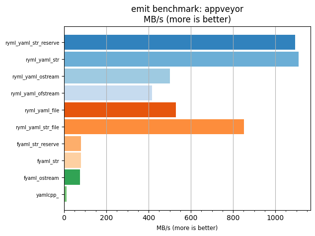
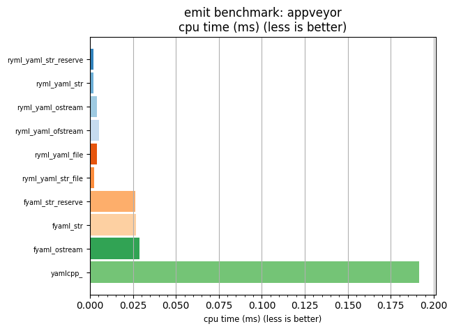

## emit benchmark: appveyor

<p>Data type benchmark results:</p>
<ul>
   <li><pre><a href='#ryml-bm-emit-appveyor-ryml_yaml_str_reserve'>ryml_yaml_str_reserve</a></pre></li> </ul>


<br/>
<br/>

---

<a id="ryml-bm-emit-appveyor-ryml_yaml_str_reserve"/>

### emit benchmark: appveyor

* Interactive html graphs
  * [MB/s](./ryml-bm-emit-appveyor-mega_bytes_per_second.html)
  * [CPU time](./ryml-bm-emit-appveyor-cpu_time_ms.html)

[](./ryml-bm-emit-appveyor-mega_bytes_per_second.png)
[](./ryml-bm-emit-appveyor-cpu_time_ms.png)

```
+--------------------------------------------------------------------------------------------------+
|                                     emit benchmark: appveyor                                     |
+-----------------------+---------+---------+----------+---------------+-------------+-------------+
| function              |    MB/s | MB/s(x) |  MB/s(%) | cpu time (ms) | cpu time(x) | cpu time(%) |
+-----------------------+---------+---------+----------+---------------+-------------+-------------+
| ryml_yaml_str_reserve | 1092.94 |  98.35x | 9734.98% |          0.00 |       0.01x |     -98.98% |
| ryml_yaml_str         | 1111.12 |  99.99x | 9898.50% |          0.00 |       0.01x |     -99.00% |
| ryml_yaml_ostream     |  500.02 |  45.00x | 4399.52% |          0.00 |       0.02x |     -97.78% |
| ryml_yaml_ofstream    |  416.15 |  37.45x | 3644.78% |          0.01 |       0.03x |     -97.33% |
| ryml_yaml_file        |  529.05 |  47.61x | 4660.72% |          0.00 |       0.02x |     -97.90% |
| ryml_yaml_str_file    |  852.44 |  76.71x | 7570.83% |          0.00 |       0.01x |     -98.70% |
| fyaml_str_reserve     |   80.18 |   7.22x |  621.52% |          0.03 |       0.14x |     -86.14% |
| fyaml_str             |   79.87 |   7.19x |  618.75% |          0.03 |       0.14x |     -86.09% |
| fyaml_ostream         |   74.42 |   6.70x |  569.69% |          0.03 |       0.15x |     -85.07% |
| yamlcpp_              |   11.11 |   1.00x |    0.00% |          0.19 |       1.00x |       0.00% |
+-----------------------+---------+---------+----------+---------------+-------------+-------------+
```

