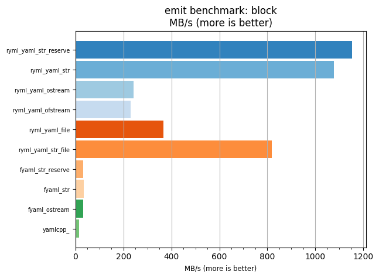
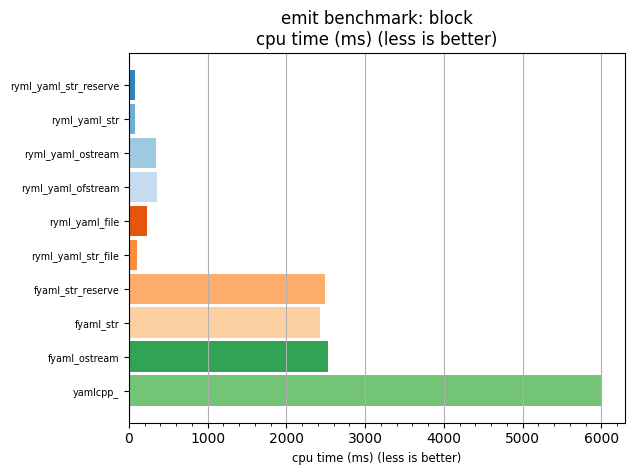

## emit benchmark: block

<p>Data type benchmark results:</p>
<ul>
   <li><pre><a href='#ryml-bm-emit-block-ryml_yaml_str_reserve'>ryml_yaml_str_reserve</a></pre></li> </ul>


<br/>
<br/>

---

<a id="ryml-bm-emit-block-ryml_yaml_str_reserve"/>

### emit benchmark: block

* Interactive html graphs
  * [MB/s](./ryml-bm-emit-block-mega_bytes_per_second.html)
  * [CPU time](./ryml-bm-emit-block-cpu_time_ms.html)

[](./ryml-bm-emit-block-mega_bytes_per_second.png)
[](./ryml-bm-emit-block-cpu_time_ms.png)

```
+--------------------------------------------------------------------------------------------------+
|                                      emit benchmark: block                                       |
+-----------------------+---------+---------+----------+---------------+-------------+-------------+
| function              |    MB/s | MB/s(x) |  MB/s(%) | cpu time (ms) | cpu time(x) | cpu time(%) |
+-----------------------+---------+---------+----------+---------------+-------------+-------------+
| ryml_yaml_str_reserve | 1154.18 |  84.78x | 8377.59% |         70.77 |       0.01x |     -98.82% |
| ryml_yaml_str         | 1078.12 |  79.19x | 7818.88% |         75.76 |       0.01x |     -98.74% |
| ryml_yaml_ostream     |  241.61 |  17.75x | 1674.62% |        338.08 |       0.06x |     -94.36% |
| ryml_yaml_ofstream    |  230.77 |  16.95x | 1595.01% |        353.96 |       0.06x |     -94.10% |
| ryml_yaml_file        |  365.36 |  26.84x | 2583.58% |        223.57 |       0.04x |     -96.27% |
| ryml_yaml_str_file    |  819.04 |  60.16x | 5915.89% |         99.73 |       0.02x |     -98.34% |
| fyaml_str_reserve     |   32.82 |   2.41x |  141.03% |       2489.15 |       0.41x |     -58.51% |
| fyaml_str             |   33.62 |   2.47x |  146.94% |       2429.58 |       0.40x |     -59.50% |
| fyaml_ostream         |   32.37 |   2.38x |  137.77% |       2523.31 |       0.42x |     -57.94% |
| yamlcpp_              |   13.61 |   1.00x |    0.00% |       5999.67 |       1.00x |       0.00% |
+-----------------------+---------+---------+----------+---------------+-------------+-------------+
```

