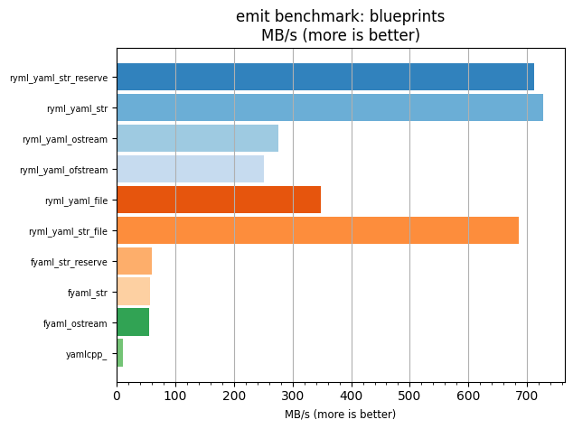
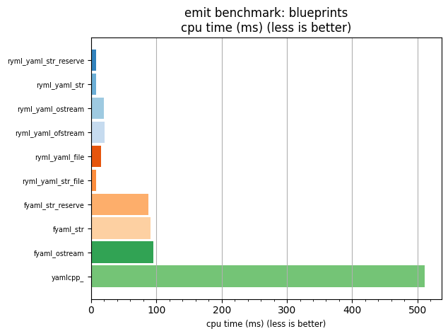

## emit benchmark: blueprints

<p>Data type benchmark results:</p>
<ul>
   <li><pre><a href='#ryml-bm-emit-blueprints-ryml_yaml_str_reserve'>ryml_yaml_str_reserve</a></pre></li> </ul>


<br/>
<br/>

---

<a id="ryml-bm-emit-blueprints-ryml_yaml_str_reserve"/>

### emit benchmark: blueprints

* Interactive html graphs
  * [MB/s](./ryml-bm-emit-blueprints-mega_bytes_per_second.html)
  * [CPU time](./ryml-bm-emit-blueprints-cpu_time_ms.html)

[](./ryml-bm-emit-blueprints-mega_bytes_per_second.png)
[](./ryml-bm-emit-blueprints-cpu_time_ms.png)

```
+--------------------------------------------------------------------------------------------------+
|                                    emit benchmark: blueprints                                    |
+-----------------------+---------+---------+----------+---------------+-------------+-------------+
| function              |    MB/s | MB/s(x) |  MB/s(%) | cpu time (ms) | cpu time(x) | cpu time(%) |
+-----------------------+---------+---------+----------+---------------+-------------+-------------+
| ryml_yaml_str_reserve |  711.72 |  69.38x | 6837.93% |          7.37 |       0.01x |     -98.56% |
| ryml_yaml_str         |  727.90 |  70.96x | 6995.63% |          7.21 |       0.01x |     -98.59% |
| ryml_yaml_ostream     |  276.27 |  26.93x | 2593.12% |         18.99 |       0.04x |     -96.29% |
| ryml_yaml_ofstream    |  251.52 |  24.52x | 2351.84% |         20.86 |       0.04x |     -95.92% |
| ryml_yaml_file        |  349.03 |  34.02x | 3302.37% |         15.03 |       0.03x |     -97.06% |
| ryml_yaml_str_file    |  685.34 |  66.81x | 6580.75% |          7.66 |       0.01x |     -98.50% |
| fyaml_str_reserve     |   59.50 |   5.80x |  480.02% |         88.17 |       0.17x |     -82.76% |
| fyaml_str             |   57.40 |   5.60x |  459.51% |         91.40 |       0.18x |     -82.13% |
| fyaml_ostream         |   54.84 |   5.35x |  434.55% |         95.67 |       0.19x |     -81.29% |
| yamlcpp_              |   10.26 |   1.00x |    0.00% |        511.41 |       1.00x |       0.00% |
+-----------------------+---------+---------+----------+---------------+-------------+-------------+
```

