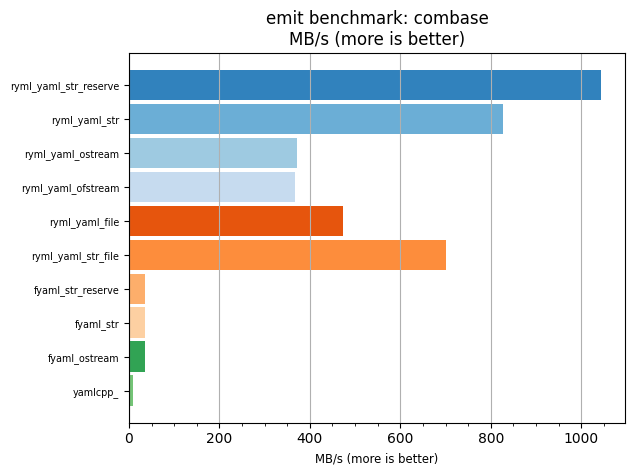
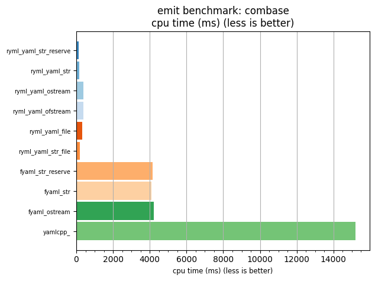

## emit benchmark: combase

<p>Data type benchmark results:</p>
<ul>
   <li><pre><a href='#ryml-bm-emit-combase-ryml_yaml_str_reserve'>ryml_yaml_str_reserve</a></pre></li> </ul>


<br/>
<br/>

---

<a id="ryml-bm-emit-combase-ryml_yaml_str_reserve"/>

### emit benchmark: combase

* Interactive html graphs
  * [MB/s](./ryml-bm-emit-combase-mega_bytes_per_second.html)
  * [CPU time](./ryml-bm-emit-combase-cpu_time_ms.html)

[](./ryml-bm-emit-combase-mega_bytes_per_second.png)
[](./ryml-bm-emit-combase-cpu_time_ms.png)

```
+---------------------------------------------------------------------------------------------------+
|                                      emit benchmark: combase                                      |
+-----------------------+---------+---------+-----------+---------------+-------------+-------------+
| function              |    MB/s | MB/s(x) |   MB/s(%) | cpu time (ms) | cpu time(x) | cpu time(%) |
+-----------------------+---------+---------+-----------+---------------+-------------+-------------+
| ryml_yaml_str_reserve | 1044.52 | 108.28x | 10727.63% |        140.46 |       0.01x |     -99.08% |
| ryml_yaml_str         |  826.87 |  85.71x |  8471.40% |        177.43 |       0.01x |     -98.83% |
| ryml_yaml_ostream     |  371.54 |  38.51x |  3751.43% |        394.88 |       0.03x |     -97.40% |
| ryml_yaml_ofstream    |  366.81 |  38.02x |  3702.35% |        399.98 |       0.03x |     -97.37% |
| ryml_yaml_file        |  473.24 |  49.06x |  4805.67% |        310.02 |       0.02x |     -97.96% |
| ryml_yaml_str_file    |  700.84 |  72.65x |  7164.97% |        209.34 |       0.01x |     -98.62% |
| fyaml_str_reserve     |   35.33 |   3.66x |   266.21% |       4152.95 |       0.27x |     -72.69% |
| fyaml_str             |   35.74 |   3.70x |   270.43% |       4105.59 |       0.27x |     -73.00% |
| fyaml_ostream         |   34.70 |   3.60x |   259.66% |       4228.63 |       0.28x |     -72.20% |
| yamlcpp_              |    9.65 |   1.00x |     0.00% |      15208.51 |       1.00x |       0.00% |
+-----------------------+---------+---------+-----------+---------------+-------------+-------------+
```

