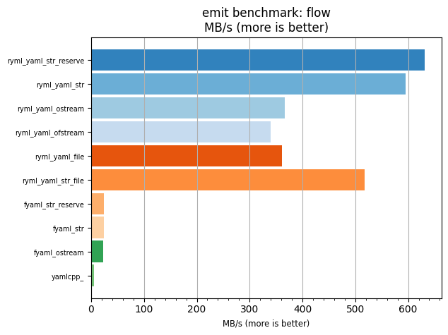
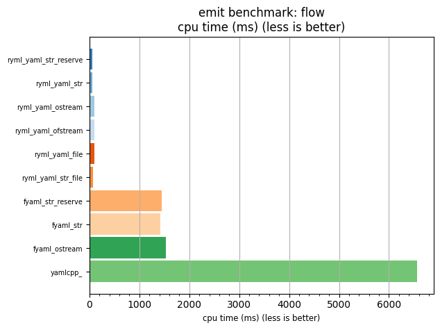

## emit benchmark: flow

<p>Data type benchmark results:</p>
<ul>
   <li><pre><a href='#ryml-bm-emit-flow-ryml_yaml_str_reserve'>ryml_yaml_str_reserve</a></pre></li> </ul>


<br/>
<br/>

---

<a id="ryml-bm-emit-flow-ryml_yaml_str_reserve"/>

### emit benchmark: flow

* Interactive html graphs
  * [MB/s](./ryml-bm-emit-flow-mega_bytes_per_second.html)
  * [CPU time](./ryml-bm-emit-flow-cpu_time_ms.html)

[](./ryml-bm-emit-flow-mega_bytes_per_second.png)
[](./ryml-bm-emit-flow-cpu_time_ms.png)

```
+---------------------------------------------------------------------------------------------------+
|                                        emit benchmark: flow                                       |
+-----------------------+---------+---------+-----------+---------------+-------------+-------------+
| function              |    MB/s | MB/s(x) |   MB/s(%) | cpu time (ms) | cpu time(x) | cpu time(%) |
+-----------------------+---------+---------+-----------+---------------+-------------+-------------+
| ryml_yaml_str_reserve |  631.80 | 119.80x | 11880.33% |         54.83 |       0.01x |     -99.17% |
| ryml_yaml_str         |  595.75 | 112.97x | 11196.72% |         58.15 |       0.01x |     -99.11% |
| ryml_yaml_ostream     |  366.94 |  69.58x |  6857.90% |         94.41 |       0.01x |     -98.56% |
| ryml_yaml_ofstream    |  340.39 |  64.55x |  6354.57% |        101.78 |       0.02x |     -98.45% |
| ryml_yaml_file        |  360.72 |  68.40x |  6740.13% |         96.04 |       0.01x |     -98.54% |
| ryml_yaml_str_file    |  517.43 |  98.12x |  9711.52% |         66.95 |       0.01x |     -98.98% |
| fyaml_str_reserve     |   24.00 |   4.55x |   355.05% |       1443.62 |       0.22x |     -78.02% |
| fyaml_str             |   24.42 |   4.63x |   363.11% |       1418.51 |       0.22x |     -78.41% |
| fyaml_ostream         |   22.68 |   4.30x |   330.00% |       1527.72 |       0.23x |     -76.74% |
| yamlcpp_              |    5.27 |   1.00x |     0.00% |       6569.22 |       1.00x |       0.00% |
+-----------------------+---------+---------+-----------+---------------+-------------+-------------+
```

