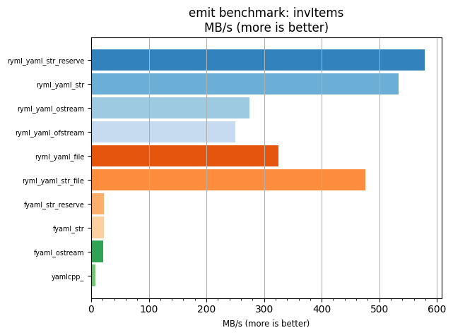
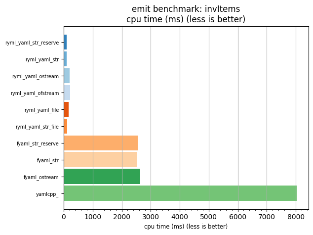

## emit benchmark: invItems

<p>Data type benchmark results:</p>
<ul>
   <li><pre><a href='#ryml-bm-emit-invItems-ryml_yaml_str_reserve'>ryml_yaml_str_reserve</a></pre></li> </ul>


<br/>
<br/>

---

<a id="ryml-bm-emit-invItems-ryml_yaml_str_reserve"/>

### emit benchmark: invItems

* Interactive html graphs
  * [MB/s](./ryml-bm-emit-invItems-mega_bytes_per_second.html)
  * [CPU time](./ryml-bm-emit-invItems-cpu_time_ms.html)

[](./ryml-bm-emit-invItems-mega_bytes_per_second.png)
[](./ryml-bm-emit-invItems-cpu_time_ms.png)

```
+--------------------------------------------------------------------------------------------------+
|                                     emit benchmark: invItems                                     |
+-----------------------+---------+---------+----------+---------------+-------------+-------------+
| function              |    MB/s | MB/s(x) |  MB/s(%) | cpu time (ms) | cpu time(x) | cpu time(%) |
+-----------------------+---------+---------+----------+---------------+-------------+-------------+
| ryml_yaml_str_reserve |  579.29 |  83.46x | 8245.58% |         96.29 |       0.01x |     -98.80% |
| ryml_yaml_str         |  533.06 |  76.80x | 7579.66% |        104.64 |       0.01x |     -98.70% |
| ryml_yaml_ostream     |  274.49 |  39.55x | 3854.50% |        203.22 |       0.03x |     -97.47% |
| ryml_yaml_ofstream    |  250.48 |  36.09x | 3508.64% |        222.70 |       0.03x |     -97.23% |
| ryml_yaml_file        |  324.99 |  46.82x | 4582.07% |        171.64 |       0.02x |     -97.86% |
| ryml_yaml_str_file    |  476.09 |  68.59x | 6758.94% |        117.17 |       0.01x |     -98.54% |
| fyaml_str_reserve     |   21.84 |   3.15x |  214.59% |       2554.55 |       0.32x |     -68.21% |
| fyaml_str             |   21.93 |   3.16x |  215.99% |       2543.18 |       0.32x |     -68.35% |
| fyaml_ostream         |   21.08 |   3.04x |  203.73% |       2645.83 |       0.33x |     -67.08% |
| yamlcpp_              |    6.94 |   1.00x |    0.00% |       8036.29 |       1.00x |       0.00% |
+-----------------------+---------+---------+----------+---------------+-------------+-------------+
```

