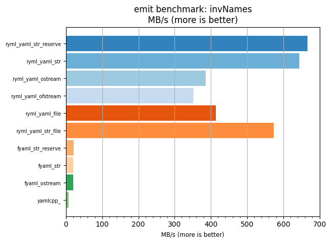
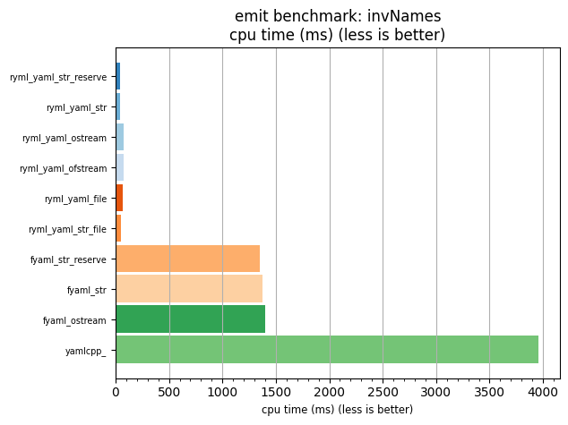

## emit benchmark: invNames

<p>Data type benchmark results:</p>
<ul>
   <li><pre><a href='#ryml-bm-emit-invNames-ryml_yaml_str_reserve'>ryml_yaml_str_reserve</a></pre></li> </ul>


<br/>
<br/>

---

<a id="ryml-bm-emit-invNames-ryml_yaml_str_reserve"/>

### emit benchmark: invNames

* Interactive html graphs
  * [MB/s](./ryml-bm-emit-invNames-mega_bytes_per_second.html)
  * [CPU time](./ryml-bm-emit-invNames-cpu_time_ms.html)

[](./ryml-bm-emit-invNames-mega_bytes_per_second.png)
[](./ryml-bm-emit-invNames-cpu_time_ms.png)

```
+--------------------------------------------------------------------------------------------------+
|                                     emit benchmark: invNames                                     |
+-----------------------+---------+---------+----------+---------------+-------------+-------------+
| function              |    MB/s | MB/s(x) |  MB/s(%) | cpu time (ms) | cpu time(x) | cpu time(%) |
+-----------------------+---------+---------+----------+---------------+-------------+-------------+
| ryml_yaml_str_reserve |  667.30 |  95.38x | 9438.13% |         41.52 |       0.01x |     -98.95% |
| ryml_yaml_str         |  644.72 |  92.15x | 9115.36% |         42.98 |       0.01x |     -98.91% |
| ryml_yaml_ostream     |  385.25 |  55.07x | 5406.65% |         71.92 |       0.02x |     -98.18% |
| ryml_yaml_ofstream    |  352.16 |  50.34x | 4933.69% |         78.68 |       0.02x |     -98.01% |
| ryml_yaml_file        |  414.32 |  59.22x | 5822.17% |         66.87 |       0.02x |     -98.31% |
| ryml_yaml_str_file    |  574.07 |  82.05x | 8105.48% |         48.27 |       0.01x |     -98.78% |
| fyaml_str_reserve     |   20.54 |   2.94x |  193.63% |       1348.78 |       0.34x |     -65.94% |
| fyaml_str             |   20.18 |   2.88x |  188.48% |       1372.84 |       0.35x |     -65.34% |
| fyaml_ostream         |   19.76 |   2.82x |  182.47% |       1402.06 |       0.35x |     -64.60% |
| yamlcpp_              |    7.00 |   1.00x |    0.00% |       3960.40 |       1.00x |       0.00% |
+-----------------------+---------+---------+----------+---------------+-------------+-------------+
```

