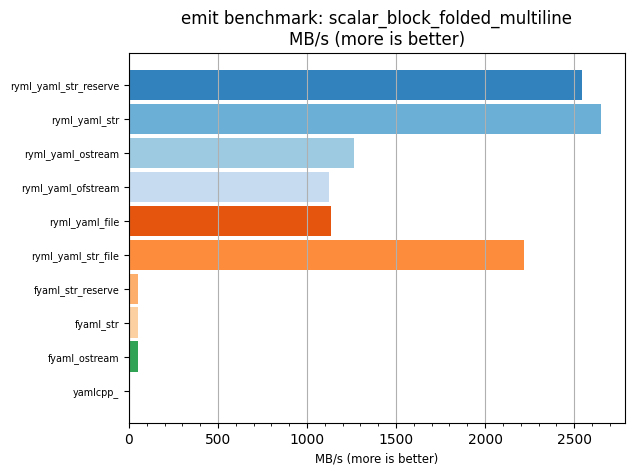
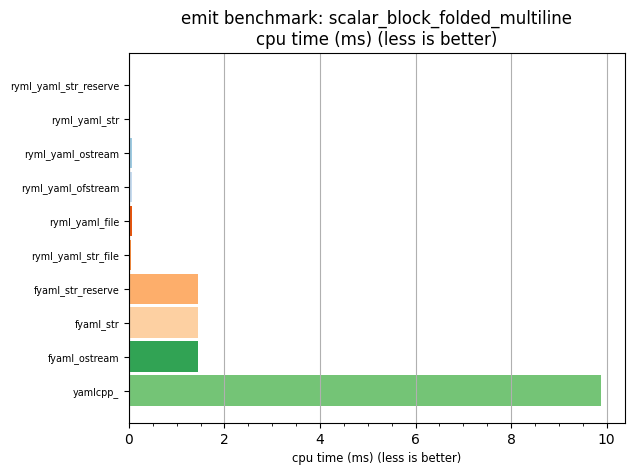

## emit benchmark: scalar_block_folded_multiline

<p>Data type benchmark results:</p>
<ul>
   <li><pre><a href='#ryml-bm-emit-scalar_block_folded_multiline-ryml_yaml_str_reserve'>ryml_yaml_str_reserve</a></pre></li> </ul>


<br/>
<br/>

---

<a id="ryml-bm-emit-scalar_block_folded_multiline-ryml_yaml_str_reserve"/>

### emit benchmark: scalar_block_folded_multiline

* Interactive html graphs
  * [MB/s](./ryml-bm-emit-scalar_block_folded_multiline-mega_bytes_per_second.html)
  * [CPU time](./ryml-bm-emit-scalar_block_folded_multiline-cpu_time_ms.html)

[](./ryml-bm-emit-scalar_block_folded_multiline-mega_bytes_per_second.png)
[](./ryml-bm-emit-scalar_block_folded_multiline-cpu_time_ms.png)

```
+---------------------------------------------------------------------------------------------------+
|                           emit benchmark: scalar_block_folded_multiline                           |
+-----------------------+---------+---------+-----------+---------------+-------------+-------------+
| function              |    MB/s | MB/s(x) |   MB/s(%) | cpu time (ms) | cpu time(x) | cpu time(%) |
+-----------------------+---------+---------+-----------+---------------+-------------+-------------+
| ryml_yaml_str_reserve | 2542.99 | 346.59x | 34558.77% |          0.03 |       0.00x |     -99.71% |
| ryml_yaml_str         | 2652.84 | 361.56x | 36055.90% |          0.03 |       0.00x |     -99.72% |
| ryml_yaml_ostream     | 1262.27 | 172.04x | 17103.66% |          0.06 |       0.01x |     -99.42% |
| ryml_yaml_ofstream    | 1122.38 | 152.97x | 15197.01% |          0.06 |       0.01x |     -99.35% |
| ryml_yaml_file        | 1133.64 | 154.51x | 15350.60% |          0.06 |       0.01x |     -99.35% |
| ryml_yaml_str_file    | 2220.67 | 302.66x | 30165.88% |          0.03 |       0.00x |     -99.67% |
| fyaml_str_reserve     |   50.53 |   6.89x |   588.71% |          1.44 |       0.15x |     -85.48% |
| fyaml_str             |   50.48 |   6.88x |   588.02% |          1.44 |       0.15x |     -85.47% |
| fyaml_ostream         |   50.51 |   6.88x |   588.40% |          1.44 |       0.15x |     -85.47% |
| yamlcpp_              |    7.34 |   1.00x |     0.00% |          9.89 |       1.00x |       0.00% |
+-----------------------+---------+---------+-----------+---------------+-------------+-------------+
```

