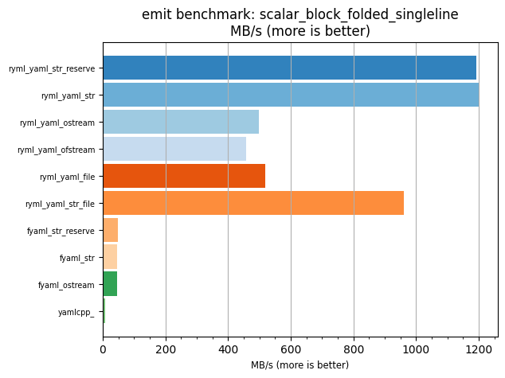
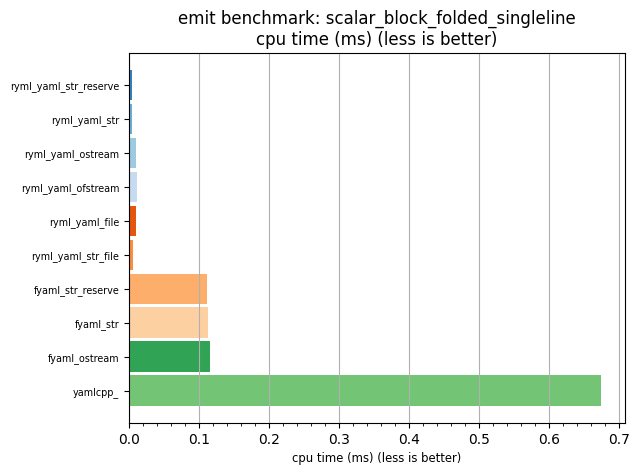

## emit benchmark: scalar_block_folded_singleline

<p>Data type benchmark results:</p>
<ul>
   <li><pre><a href='#ryml-bm-emit-scalar_block_folded_singleline-ryml_yaml_str_reserve'>ryml_yaml_str_reserve</a></pre></li> </ul>


<br/>
<br/>

---

<a id="ryml-bm-emit-scalar_block_folded_singleline-ryml_yaml_str_reserve"/>

### emit benchmark: scalar_block_folded_singleline

* Interactive html graphs
  * [MB/s](./ryml-bm-emit-scalar_block_folded_singleline-mega_bytes_per_second.html)
  * [CPU time](./ryml-bm-emit-scalar_block_folded_singleline-cpu_time_ms.html)

[](./ryml-bm-emit-scalar_block_folded_singleline-mega_bytes_per_second.png)
[](./ryml-bm-emit-scalar_block_folded_singleline-cpu_time_ms.png)

```
+---------------------------------------------------------------------------------------------------+
|                           emit benchmark: scalar_block_folded_singleline                          |
+-----------------------+---------+---------+-----------+---------------+-------------+-------------+
| function              |    MB/s | MB/s(x) |   MB/s(%) | cpu time (ms) | cpu time(x) | cpu time(%) |
+-----------------------+---------+---------+-----------+---------------+-------------+-------------+
| ryml_yaml_str_reserve | 1193.24 | 152.99x | 15198.64% |          0.00 |       0.01x |     -99.35% |
| ryml_yaml_str         | 1200.66 | 153.94x | 15293.80% |          0.00 |       0.01x |     -99.35% |
| ryml_yaml_ostream     |  497.34 |  63.76x |  6276.46% |          0.01 |       0.02x |     -98.43% |
| ryml_yaml_ofstream    |  457.62 |  58.67x |  5767.24% |          0.01 |       0.02x |     -98.30% |
| ryml_yaml_file        |  518.49 |  66.48x |  6547.63% |          0.01 |       0.02x |     -98.50% |
| ryml_yaml_str_file    |  961.94 | 123.33x | 12233.09% |          0.01 |       0.01x |     -99.19% |
| fyaml_str_reserve     |   47.29 |   6.06x |   506.33% |          0.11 |       0.16x |     -83.51% |
| fyaml_str             |   46.67 |   5.98x |   498.39% |          0.11 |       0.17x |     -83.29% |
| fyaml_ostream         |   45.56 |   5.84x |   484.18% |          0.12 |       0.17x |     -82.88% |
| yamlcpp_              |    7.80 |   1.00x |     0.00% |          0.67 |       1.00x |       0.00% |
+-----------------------+---------+---------+-----------+---------------+-------------+-------------+
```

