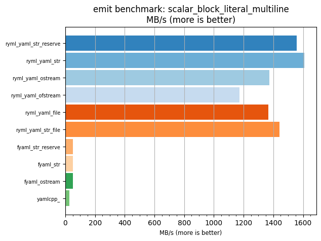
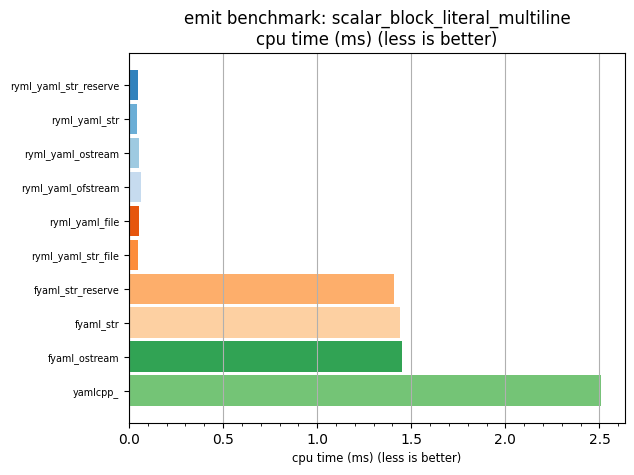

## emit benchmark: scalar_block_literal_multiline

<p>Data type benchmark results:</p>
<ul>
   <li><pre><a href='#ryml-bm-emit-scalar_block_literal_multiline-ryml_yaml_str_reserve'>ryml_yaml_str_reserve</a></pre></li> </ul>


<br/>
<br/>

---

<a id="ryml-bm-emit-scalar_block_literal_multiline-ryml_yaml_str_reserve"/>

### emit benchmark: scalar_block_literal_multiline

* Interactive html graphs
  * [MB/s](./ryml-bm-emit-scalar_block_literal_multiline-mega_bytes_per_second.html)
  * [CPU time](./ryml-bm-emit-scalar_block_literal_multiline-cpu_time_ms.html)

[](./ryml-bm-emit-scalar_block_literal_multiline-mega_bytes_per_second.png)
[](./ryml-bm-emit-scalar_block_literal_multiline-cpu_time_ms.png)

```
+--------------------------------------------------------------------------------------------------+
|                          emit benchmark: scalar_block_literal_multiline                          |
+-----------------------+---------+---------+----------+---------------+-------------+-------------+
| function              |    MB/s | MB/s(x) |  MB/s(%) | cpu time (ms) | cpu time(x) | cpu time(%) |
+-----------------------+---------+---------+----------+---------------+-------------+-------------+
| ryml_yaml_str_reserve | 1559.00 |  53.92x | 5291.71% |          0.05 |       0.02x |     -98.15% |
| ryml_yaml_str         | 1609.72 |  55.67x | 5467.11% |          0.05 |       0.02x |     -98.20% |
| ryml_yaml_ostream     | 1373.04 |  47.49x | 4648.58% |          0.05 |       0.02x |     -97.89% |
| ryml_yaml_ofstream    | 1172.19 |  40.54x | 3953.94% |          0.06 |       0.02x |     -97.53% |
| ryml_yaml_file        | 1365.41 |  47.22x | 4622.18% |          0.05 |       0.02x |     -97.88% |
| ryml_yaml_str_file    | 1443.07 |  49.91x | 4890.77% |          0.05 |       0.02x |     -98.00% |
| fyaml_str_reserve     |   51.51 |   1.78x |   78.14% |          1.41 |       0.56x |     -43.87% |
| fyaml_str             |   50.34 |   1.74x |   74.09% |          1.44 |       0.57x |     -42.56% |
| fyaml_ostream         |   50.01 |   1.73x |   72.97% |          1.45 |       0.58x |     -42.19% |
| yamlcpp_              |   28.91 |   1.00x |    0.00% |          2.51 |       1.00x |       0.00% |
+-----------------------+---------+---------+----------+---------------+-------------+-------------+
```

