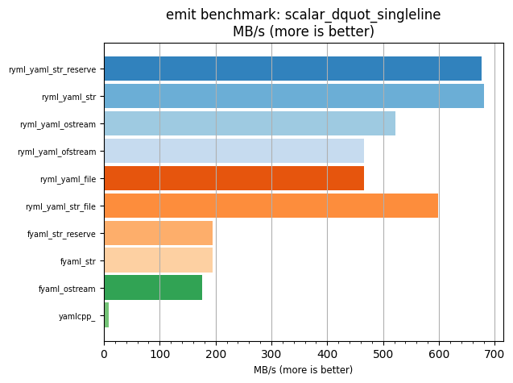
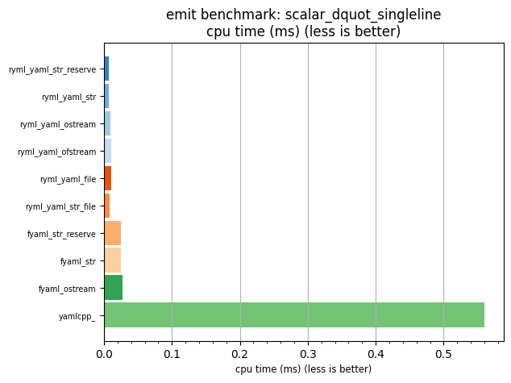

## emit benchmark: scalar_dquot_singleline

<p>Data type benchmark results:</p>
<ul>
   <li><pre><a href='#ryml-bm-emit-scalar_dquot_singleline-ryml_yaml_str_reserve'>ryml_yaml_str_reserve</a></pre></li> </ul>


<br/>
<br/>

---

<a id="ryml-bm-emit-scalar_dquot_singleline-ryml_yaml_str_reserve"/>

### emit benchmark: scalar_dquot_singleline

* Interactive html graphs
  * [MB/s](./ryml-bm-emit-scalar_dquot_singleline-mega_bytes_per_second.html)
  * [CPU time](./ryml-bm-emit-scalar_dquot_singleline-cpu_time_ms.html)

[](./ryml-bm-emit-scalar_dquot_singleline-mega_bytes_per_second.png)
[](./ryml-bm-emit-scalar_dquot_singleline-cpu_time_ms.png)

```
+--------------------------------------------------------------------------------------------------+
|                             emit benchmark: scalar_dquot_singleline                              |
+-----------------------+---------+---------+----------+---------------+-------------+-------------+
| function              |    MB/s | MB/s(x) |  MB/s(%) | cpu time (ms) | cpu time(x) | cpu time(%) |
+-----------------------+---------+---------+----------+---------------+-------------+-------------+
| ryml_yaml_str_reserve |  676.69 |  78.61x | 7760.93% |          0.01 |       0.01x |     -98.73% |
| ryml_yaml_str         |  681.18 |  79.13x | 7813.12% |          0.01 |       0.01x |     -98.74% |
| ryml_yaml_ostream     |  521.50 |  60.58x | 5958.09% |          0.01 |       0.02x |     -98.35% |
| ryml_yaml_ofstream    |  465.60 |  54.09x | 5308.70% |          0.01 |       0.02x |     -98.15% |
| ryml_yaml_file        |  465.65 |  54.09x | 5309.33% |          0.01 |       0.02x |     -98.15% |
| ryml_yaml_str_file    |  598.89 |  69.57x | 6857.12% |          0.01 |       0.01x |     -98.56% |
| fyaml_str_reserve     |  194.97 |  22.65x | 2164.96% |          0.02 |       0.04x |     -95.58% |
| fyaml_str             |  195.12 |  22.67x | 2166.70% |          0.02 |       0.04x |     -95.59% |
| fyaml_ostream         |  176.39 |  20.49x | 1949.07% |          0.03 |       0.05x |     -95.12% |
| yamlcpp_              |    8.61 |   1.00x |    0.00% |          0.56 |       1.00x |       0.00% |
+-----------------------+---------+---------+----------+---------------+-------------+-------------+
```

