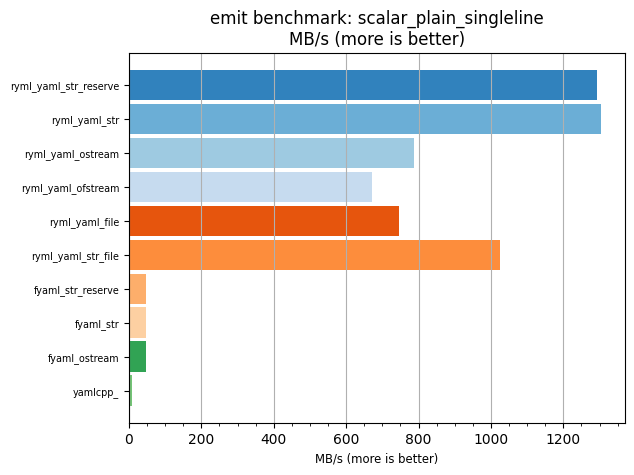
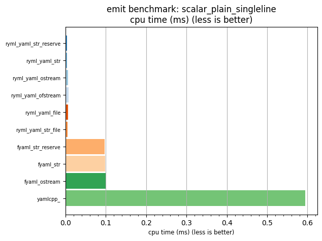

## emit benchmark: scalar_plain_singleline

<p>Data type benchmark results:</p>
<ul>
   <li><pre><a href='#ryml-bm-emit-scalar_plain_singleline-ryml_yaml_str_reserve'>ryml_yaml_str_reserve</a></pre></li> </ul>


<br/>
<br/>

---

<a id="ryml-bm-emit-scalar_plain_singleline-ryml_yaml_str_reserve"/>

### emit benchmark: scalar_plain_singleline

* Interactive html graphs
  * [MB/s](./ryml-bm-emit-scalar_plain_singleline-mega_bytes_per_second.html)
  * [CPU time](./ryml-bm-emit-scalar_plain_singleline-cpu_time_ms.html)

[](./ryml-bm-emit-scalar_plain_singleline-mega_bytes_per_second.png)
[](./ryml-bm-emit-scalar_plain_singleline-cpu_time_ms.png)

```
+---------------------------------------------------------------------------------------------------+
|                              emit benchmark: scalar_plain_singleline                              |
+-----------------------+---------+---------+-----------+---------------+-------------+-------------+
| function              |    MB/s | MB/s(x) |   MB/s(%) | cpu time (ms) | cpu time(x) | cpu time(%) |
+-----------------------+---------+---------+-----------+---------------+-------------+-------------+
| ryml_yaml_str_reserve | 1293.87 | 164.56x | 16355.79% |          0.00 |       0.01x |     -99.39% |
| ryml_yaml_str         | 1304.97 | 165.97x | 16496.95% |          0.00 |       0.01x |     -99.40% |
| ryml_yaml_ostream     |  787.19 | 100.12x |  9911.73% |          0.01 |       0.01x |     -99.00% |
| ryml_yaml_ofstream    |  670.73 |  85.31x |  8430.59% |          0.01 |       0.01x |     -98.83% |
| ryml_yaml_file        |  745.86 |  94.86x |  9386.07% |          0.01 |       0.01x |     -98.95% |
| ryml_yaml_str_file    | 1025.31 | 130.40x | 12940.19% |          0.00 |       0.01x |     -99.23% |
| fyaml_str_reserve     |   48.18 |   6.13x |   512.81% |          0.10 |       0.16x |     -83.68% |
| fyaml_str             |   47.54 |   6.05x |   504.60% |          0.10 |       0.17x |     -83.46% |
| fyaml_ostream         |   46.68 |   5.94x |   493.64% |          0.10 |       0.17x |     -83.15% |
| yamlcpp_              |    7.86 |   1.00x |     0.00% |          0.59 |       1.00x |       0.00% |
+-----------------------+---------+---------+-----------+---------------+-------------+-------------+
```

