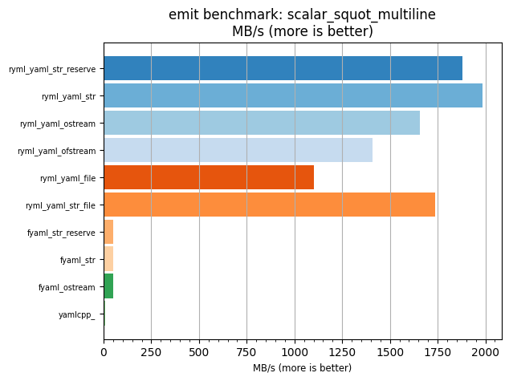
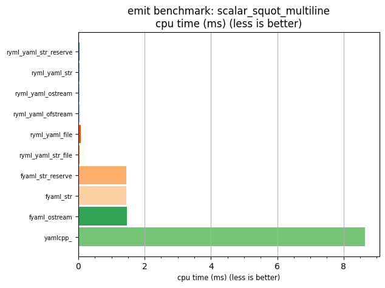

## emit benchmark: scalar_squot_multiline

<p>Data type benchmark results:</p>
<ul>
   <li><pre><a href='#ryml-bm-emit-scalar_squot_multiline-ryml_yaml_str_reserve'>ryml_yaml_str_reserve</a></pre></li> </ul>


<br/>
<br/>

---

<a id="ryml-bm-emit-scalar_squot_multiline-ryml_yaml_str_reserve"/>

### emit benchmark: scalar_squot_multiline

* Interactive html graphs
  * [MB/s](./ryml-bm-emit-scalar_squot_multiline-mega_bytes_per_second.html)
  * [CPU time](./ryml-bm-emit-scalar_squot_multiline-cpu_time_ms.html)

[](./ryml-bm-emit-scalar_squot_multiline-mega_bytes_per_second.png)
[](./ryml-bm-emit-scalar_squot_multiline-cpu_time_ms.png)

```
+---------------------------------------------------------------------------------------------------+
|                               emit benchmark: scalar_squot_multiline                              |
+-----------------------+---------+---------+-----------+---------------+-------------+-------------+
| function              |    MB/s | MB/s(x) |   MB/s(%) | cpu time (ms) | cpu time(x) | cpu time(%) |
+-----------------------+---------+---------+-----------+---------------+-------------+-------------+
| ryml_yaml_str_reserve | 1879.63 | 224.99x | 22399.17% |          0.04 |       0.00x |     -99.56% |
| ryml_yaml_str         | 1986.38 | 237.77x | 23676.96% |          0.04 |       0.00x |     -99.58% |
| ryml_yaml_ostream     | 1658.53 | 198.53x | 19752.62% |          0.04 |       0.01x |     -99.50% |
| ryml_yaml_ofstream    | 1407.52 | 168.48x | 16748.00% |          0.05 |       0.01x |     -99.41% |
| ryml_yaml_file        | 1103.64 | 132.11x | 13110.54% |          0.07 |       0.01x |     -99.24% |
| ryml_yaml_str_file    | 1738.84 | 208.14x | 20713.84% |          0.04 |       0.00x |     -99.52% |
| fyaml_str_reserve     |   49.70 |   5.95x |   494.95% |          1.45 |       0.17x |     -83.19% |
| fyaml_str             |   49.69 |   5.95x |   494.82% |          1.45 |       0.17x |     -83.19% |
| fyaml_ostream         |   49.57 |   5.93x |   493.39% |          1.46 |       0.17x |     -83.15% |
| yamlcpp_              |    8.35 |   1.00x |     0.00% |          8.65 |       1.00x |       0.00% |
+-----------------------+---------+---------+-----------+---------------+-------------+-------------+
```

