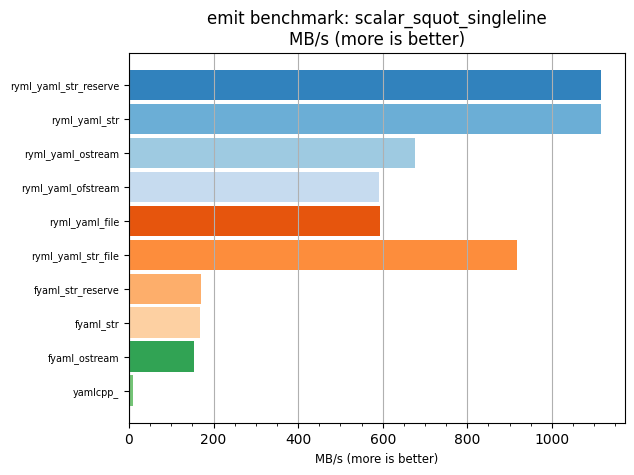
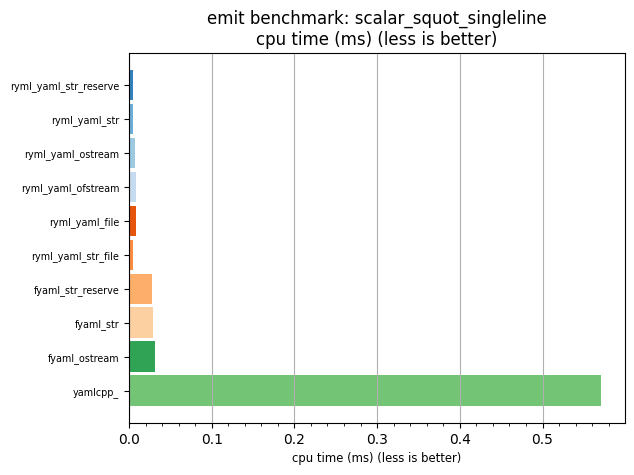

## emit benchmark: scalar_squot_singleline

<p>Data type benchmark results:</p>
<ul>
   <li><pre><a href='#ryml-bm-emit-scalar_squot_singleline-ryml_yaml_str_reserve'>ryml_yaml_str_reserve</a></pre></li> </ul>


<br/>
<br/>

---

<a id="ryml-bm-emit-scalar_squot_singleline-ryml_yaml_str_reserve"/>

### emit benchmark: scalar_squot_singleline

* Interactive html graphs
  * [MB/s](./ryml-bm-emit-scalar_squot_singleline-mega_bytes_per_second.html)
  * [CPU time](./ryml-bm-emit-scalar_squot_singleline-cpu_time_ms.html)

[](./ryml-bm-emit-scalar_squot_singleline-mega_bytes_per_second.png)
[](./ryml-bm-emit-scalar_squot_singleline-cpu_time_ms.png)

```
+---------------------------------------------------------------------------------------------------+
|                              emit benchmark: scalar_squot_singleline                              |
+-----------------------+---------+---------+-----------+---------------+-------------+-------------+
| function              |    MB/s | MB/s(x) |   MB/s(%) | cpu time (ms) | cpu time(x) | cpu time(%) |
+-----------------------+---------+---------+-----------+---------------+-------------+-------------+
| ryml_yaml_str_reserve | 1116.94 | 132.32x | 13132.18% |          0.00 |       0.01x |     -99.24% |
| ryml_yaml_str         | 1116.60 | 132.28x | 13128.12% |          0.00 |       0.01x |     -99.24% |
| ryml_yaml_ostream     |  676.10 |  80.10x |  7909.64% |          0.01 |       0.01x |     -98.75% |
| ryml_yaml_ofstream    |  590.83 |  70.00x |  6899.51% |          0.01 |       0.01x |     -98.57% |
| ryml_yaml_file        |  593.50 |  70.31x |  6931.11% |          0.01 |       0.01x |     -98.58% |
| ryml_yaml_str_file    |  917.80 | 108.73x | 10772.99% |          0.01 |       0.01x |     -99.08% |
| fyaml_str_reserve     |  171.44 |  20.31x |  1931.06% |          0.03 |       0.05x |     -95.08% |
| fyaml_str             |  169.05 |  20.03x |  1902.75% |          0.03 |       0.05x |     -95.01% |
| fyaml_ostream         |  153.55 |  18.19x |  1719.03% |          0.03 |       0.05x |     -94.50% |
| yamlcpp_              |    8.44 |   1.00x |     0.00% |          0.57 |       1.00x |       0.00% |
+-----------------------+---------+---------+-----------+---------------+-------------+-------------+
```

