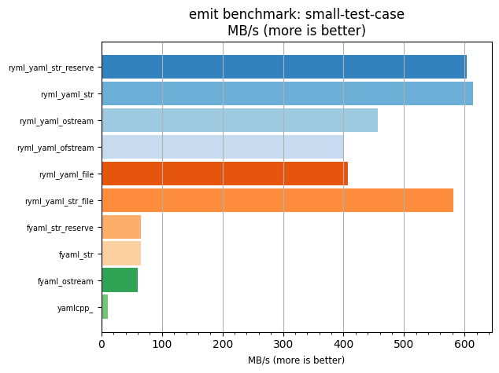
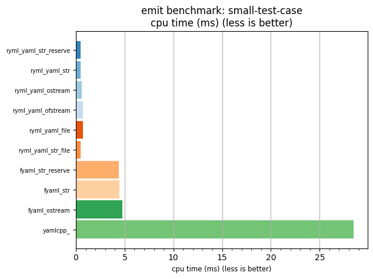

## emit benchmark: small-test-case

<p>Data type benchmark results:</p>
<ul>
   <li><pre><a href='#ryml-bm-emit-small-test-case-ryml_yaml_str_reserve'>ryml_yaml_str_reserve</a></pre></li> </ul>


<br/>
<br/>

---

<a id="ryml-bm-emit-small-test-case-ryml_yaml_str_reserve"/>

### emit benchmark: small-test-case

* Interactive html graphs
  * [MB/s](./ryml-bm-emit-small-test-case-mega_bytes_per_second.html)
  * [CPU time](./ryml-bm-emit-small-test-case-cpu_time_ms.html)

[](./ryml-bm-emit-small-test-case-mega_bytes_per_second.png)
[](./ryml-bm-emit-small-test-case-cpu_time_ms.png)

```
+--------------------------------------------------------------------------------------------------+
|                                 emit benchmark: small-test-case                                  |
+-----------------------+---------+---------+----------+---------------+-------------+-------------+
| function              |    MB/s | MB/s(x) |  MB/s(%) | cpu time (ms) | cpu time(x) | cpu time(%) |
+-----------------------+---------+---------+----------+---------------+-------------+-------------+
| ryml_yaml_str_reserve |  603.72 |  59.51x | 5851.04% |          0.48 |       0.02x |     -98.32% |
| ryml_yaml_str         |  614.44 |  60.57x | 5956.71% |          0.47 |       0.02x |     -98.35% |
| ryml_yaml_ostream     |  457.20 |  45.07x | 4406.75% |          0.63 |       0.02x |     -97.78% |
| ryml_yaml_ofstream    |  400.33 |  39.46x | 3846.21% |          0.72 |       0.03x |     -97.47% |
| ryml_yaml_file        |  407.68 |  40.19x | 3918.60% |          0.71 |       0.02x |     -97.51% |
| ryml_yaml_str_file    |  581.96 |  57.37x | 5636.52% |          0.50 |       0.02x |     -98.26% |
| fyaml_str_reserve     |   65.57 |   6.46x |  546.32% |          4.41 |       0.15x |     -84.53% |
| fyaml_str             |   64.98 |   6.41x |  540.56% |          4.45 |       0.16x |     -84.39% |
| fyaml_ostream         |   60.47 |   5.96x |  496.06% |          4.78 |       0.17x |     -83.22% |
| yamlcpp_              |   10.14 |   1.00x |    0.00% |         28.50 |       1.00x |       0.00% |
+-----------------------+---------+---------+----------+---------------+-------------+-------------+
```

