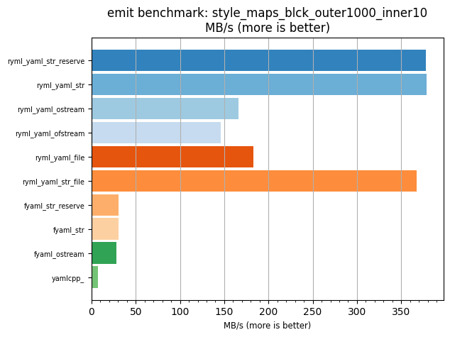
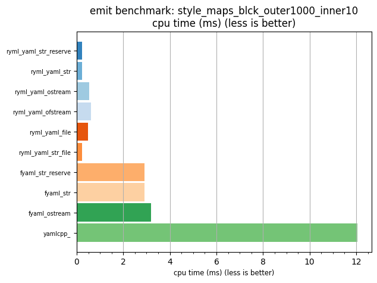

## emit benchmark: style_maps_blck_outer1000_inner10

<p>Data type benchmark results:</p>
<ul>
   <li><pre><a href='#ryml-bm-emit-style_maps_blck_outer1000_inner10-ryml_yaml_str_reserve'>ryml_yaml_str_reserve</a></pre></li> </ul>


<br/>
<br/>

---

<a id="ryml-bm-emit-style_maps_blck_outer1000_inner10-ryml_yaml_str_reserve"/>

### emit benchmark: style_maps_blck_outer1000_inner10

* Interactive html graphs
  * [MB/s](./ryml-bm-emit-style_maps_blck_outer1000_inner10-mega_bytes_per_second.html)
  * [CPU time](./ryml-bm-emit-style_maps_blck_outer1000_inner10-cpu_time_ms.html)

[](./ryml-bm-emit-style_maps_blck_outer1000_inner10-mega_bytes_per_second.png)
[](./ryml-bm-emit-style_maps_blck_outer1000_inner10-cpu_time_ms.png)

```
+--------------------------------------------------------------------------------------------------+
|                        emit benchmark: style_maps_blck_outer1000_inner10                         |
+-----------------------+---------+---------+----------+---------------+-------------+-------------+
| function              |    MB/s | MB/s(x) |  MB/s(%) | cpu time (ms) | cpu time(x) | cpu time(%) |
+-----------------------+---------+---------+----------+---------------+-------------+-------------+
| ryml_yaml_str_reserve |  377.62 |  51.22x | 5022.13% |          0.24 |       0.02x |     -98.05% |
| ryml_yaml_str         |  378.99 |  51.41x | 5040.69% |          0.23 |       0.02x |     -98.05% |
| ryml_yaml_ostream     |  165.90 |  22.50x | 2150.23% |          0.54 |       0.04x |     -95.56% |
| ryml_yaml_ofstream    |  145.90 |  19.79x | 1879.06% |          0.61 |       0.05x |     -94.95% |
| ryml_yaml_file        |  182.58 |  24.77x | 2376.53% |          0.49 |       0.04x |     -95.96% |
| ryml_yaml_str_file    |  367.35 |  49.83x | 4882.76% |          0.24 |       0.02x |     -97.99% |
| fyaml_str_reserve     |   30.55 |   4.14x |  314.43% |          2.91 |       0.24x |     -75.87% |
| fyaml_str             |   30.64 |   4.16x |  315.67% |          2.90 |       0.24x |     -75.94% |
| fyaml_ostream         |   27.91 |   3.79x |  278.52% |          3.19 |       0.26x |     -73.58% |
| yamlcpp_              |    7.37 |   1.00x |    0.00% |         12.06 |       1.00x |       0.00% |
+-----------------------+---------+---------+----------+---------------+-------------+-------------+
```

