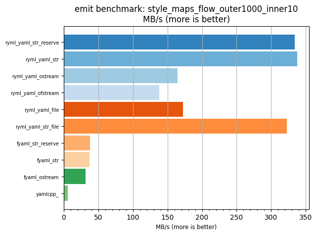
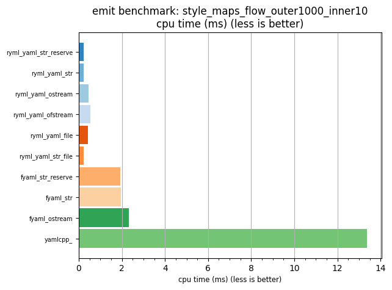

## emit benchmark: style_maps_flow_outer1000_inner10

<p>Data type benchmark results:</p>
<ul>
   <li><pre><a href='#ryml-bm-emit-style_maps_flow_outer1000_inner10-ryml_yaml_str_reserve'>ryml_yaml_str_reserve</a></pre></li> </ul>


<br/>
<br/>

---

<a id="ryml-bm-emit-style_maps_flow_outer1000_inner10-ryml_yaml_str_reserve"/>

### emit benchmark: style_maps_flow_outer1000_inner10

* Interactive html graphs
  * [MB/s](./ryml-bm-emit-style_maps_flow_outer1000_inner10-mega_bytes_per_second.html)
  * [CPU time](./ryml-bm-emit-style_maps_flow_outer1000_inner10-cpu_time_ms.html)

[](./ryml-bm-emit-style_maps_flow_outer1000_inner10-mega_bytes_per_second.png)
[](./ryml-bm-emit-style_maps_flow_outer1000_inner10-cpu_time_ms.png)

```
+--------------------------------------------------------------------------------------------------+
|                        emit benchmark: style_maps_flow_outer1000_inner10                         |
+-----------------------+---------+---------+----------+---------------+-------------+-------------+
| function              |    MB/s | MB/s(x) |  MB/s(%) | cpu time (ms) | cpu time(x) | cpu time(%) |
+-----------------------+---------+---------+----------+---------------+-------------+-------------+
| ryml_yaml_str_reserve |  334.04 |  61.30x | 6029.65% |          0.22 |       0.02x |     -98.37% |
| ryml_yaml_str         |  337.89 |  62.00x | 6100.39% |          0.22 |       0.02x |     -98.39% |
| ryml_yaml_ostream     |  164.44 |  30.18x | 2917.54% |          0.44 |       0.03x |     -96.69% |
| ryml_yaml_ofstream    |  137.95 |  25.31x | 2431.36% |          0.53 |       0.04x |     -96.05% |
| ryml_yaml_file        |  172.61 |  31.67x | 3067.36% |          0.42 |       0.03x |     -96.84% |
| ryml_yaml_str_file    |  322.45 |  59.17x | 5817.06% |          0.23 |       0.02x |     -98.31% |
| fyaml_str_reserve     |   37.71 |   6.92x |  592.07% |          1.93 |       0.14x |     -85.55% |
| fyaml_str             |   37.54 |   6.89x |  588.94% |          1.94 |       0.15x |     -85.48% |
| fyaml_ostream         |   31.46 |   5.77x |  477.38% |          2.32 |       0.17x |     -82.68% |
| yamlcpp_              |    5.45 |   1.00x |    0.00% |         13.38 |       1.00x |       0.00% |
+-----------------------+---------+---------+----------+---------------+-------------+-------------+
```

