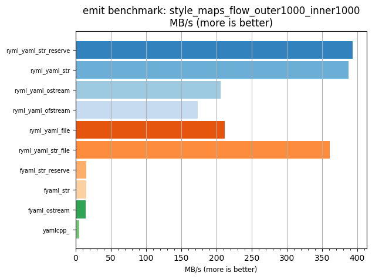
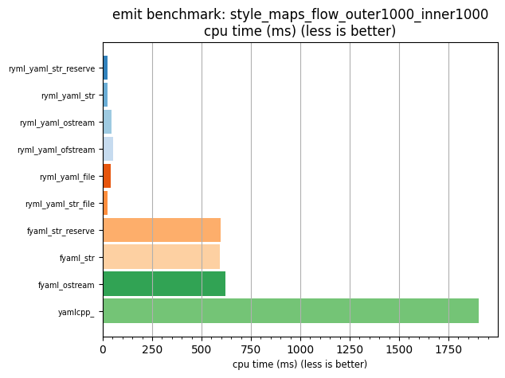

## emit benchmark: style_maps_flow_outer1000_inner1000

<p>Data type benchmark results:</p>
<ul>
   <li><pre><a href='#ryml-bm-emit-style_maps_flow_outer1000_inner1000-ryml_yaml_str_reserve'>ryml_yaml_str_reserve</a></pre></li> </ul>


<br/>
<br/>

---

<a id="ryml-bm-emit-style_maps_flow_outer1000_inner1000-ryml_yaml_str_reserve"/>

### emit benchmark: style_maps_flow_outer1000_inner1000

* Interactive html graphs
  * [MB/s](./ryml-bm-emit-style_maps_flow_outer1000_inner1000-mega_bytes_per_second.html)
  * [CPU time](./ryml-bm-emit-style_maps_flow_outer1000_inner1000-cpu_time_ms.html)

[](./ryml-bm-emit-style_maps_flow_outer1000_inner1000-mega_bytes_per_second.png)
[](./ryml-bm-emit-style_maps_flow_outer1000_inner1000-cpu_time_ms.png)

```
+--------------------------------------------------------------------------------------------------+
|                       emit benchmark: style_maps_flow_outer1000_inner1000                        |
+-----------------------+---------+---------+----------+---------------+-------------+-------------+
| function              |    MB/s | MB/s(x) |  MB/s(%) | cpu time (ms) | cpu time(x) | cpu time(%) |
+-----------------------+---------+---------+----------+---------------+-------------+-------------+
| ryml_yaml_str_reserve |  393.97 |  85.42x | 8442.18% |         22.30 |       0.01x |     -98.83% |
| ryml_yaml_str         |  388.07 |  84.14x | 8314.37% |         22.63 |       0.01x |     -98.81% |
| ryml_yaml_ostream     |  206.00 |  44.67x | 4366.53% |         42.64 |       0.02x |     -97.76% |
| ryml_yaml_ofstream    |  173.11 |  37.54x | 3653.52% |         50.74 |       0.03x |     -97.34% |
| ryml_yaml_file        |  211.79 |  45.92x | 4492.05% |         41.48 |       0.02x |     -97.82% |
| ryml_yaml_str_file    |  361.14 |  78.30x | 7730.35% |         24.32 |       0.01x |     -98.72% |
| fyaml_str_reserve     |   14.76 |   3.20x |  219.93% |        595.32 |       0.31x |     -68.74% |
| fyaml_str             |   14.79 |   3.21x |  220.68% |        593.92 |       0.31x |     -68.82% |
| fyaml_ostream         |   14.11 |   3.06x |  205.99% |        622.43 |       0.33x |     -67.32% |
| yamlcpp_              |    4.61 |   1.00x |    0.00% |       1904.59 |       1.00x |       0.00% |
+-----------------------+---------+---------+----------+---------------+-------------+-------------+
```

