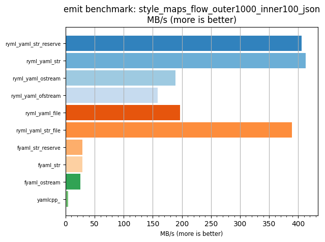
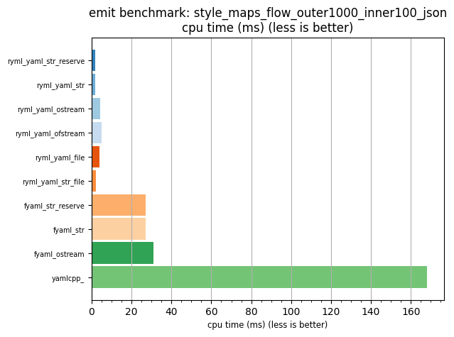

## emit benchmark: style_maps_flow_outer1000_inner100_json

<p>Data type benchmark results:</p>
<ul>
   <li><pre><a href='#ryml-bm-emit-style_maps_flow_outer1000_inner100_json-ryml_yaml_str_reserve'>ryml_yaml_str_reserve</a></pre></li> </ul>


<br/>
<br/>

---

<a id="ryml-bm-emit-style_maps_flow_outer1000_inner100_json-ryml_yaml_str_reserve"/>

### emit benchmark: style_maps_flow_outer1000_inner100_json

* Interactive html graphs
  * [MB/s](./ryml-bm-emit-style_maps_flow_outer1000_inner100_json-mega_bytes_per_second.html)
  * [CPU time](./ryml-bm-emit-style_maps_flow_outer1000_inner100_json-cpu_time_ms.html)

[](./ryml-bm-emit-style_maps_flow_outer1000_inner100_json-mega_bytes_per_second.png)
[](./ryml-bm-emit-style_maps_flow_outer1000_inner100_json-cpu_time_ms.png)

```
+--------------------------------------------------------------------------------------------------+
|                     emit benchmark: style_maps_flow_outer1000_inner100_json                      |
+-----------------------+---------+---------+----------+---------------+-------------+-------------+
| function              |    MB/s | MB/s(x) |  MB/s(%) | cpu time (ms) | cpu time(x) | cpu time(%) |
+-----------------------+---------+---------+----------+---------------+-------------+-------------+
| ryml_yaml_str_reserve |  405.84 |  87.20x | 8619.61% |          1.93 |       0.01x |     -98.85% |
| ryml_yaml_str         |  413.12 |  88.76x | 8776.16% |          1.90 |       0.01x |     -98.87% |
| ryml_yaml_ostream     |  189.31 |  40.68x | 3967.51% |          4.14 |       0.02x |     -97.54% |
| ryml_yaml_ofstream    |  158.56 |  34.07x | 3306.79% |          4.94 |       0.03x |     -97.06% |
| ryml_yaml_file        |  196.38 |  42.19x | 4119.39% |          3.99 |       0.02x |     -97.63% |
| ryml_yaml_str_file    |  389.33 |  83.65x | 8265.03% |          2.01 |       0.01x |     -98.80% |
| fyaml_str_reserve     |   28.95 |   6.22x |  522.07% |         27.04 |       0.16x |     -83.92% |
| fyaml_str             |   28.97 |   6.22x |  522.49% |         27.03 |       0.16x |     -83.94% |
| fyaml_ostream         |   25.19 |   5.41x |  441.23% |         31.08 |       0.18x |     -81.52% |
| yamlcpp_              |    4.65 |   1.00x |    0.00% |        168.23 |       1.00x |       0.00% |
+-----------------------+---------+---------+----------+---------------+-------------+-------------+
```

