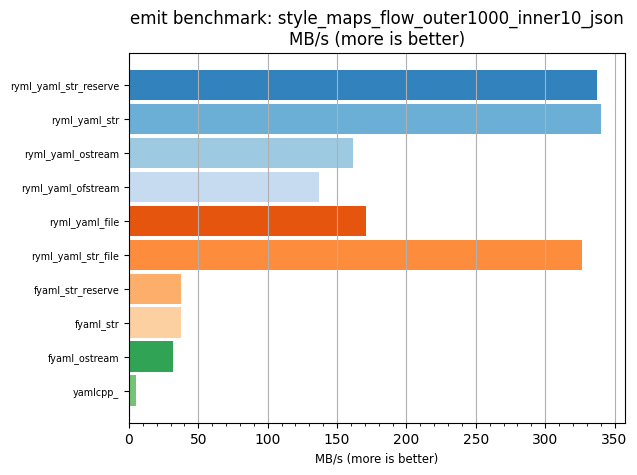
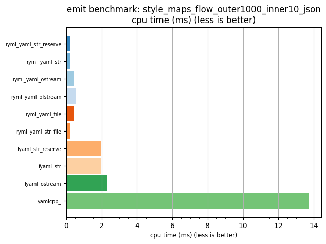

## emit benchmark: style_maps_flow_outer1000_inner10_json

<p>Data type benchmark results:</p>
<ul>
   <li><pre><a href='#ryml-bm-emit-style_maps_flow_outer1000_inner10_json-ryml_yaml_str_reserve'>ryml_yaml_str_reserve</a></pre></li> </ul>


<br/>
<br/>

---

<a id="ryml-bm-emit-style_maps_flow_outer1000_inner10_json-ryml_yaml_str_reserve"/>

### emit benchmark: style_maps_flow_outer1000_inner10_json

* Interactive html graphs
  * [MB/s](./ryml-bm-emit-style_maps_flow_outer1000_inner10_json-mega_bytes_per_second.html)
  * [CPU time](./ryml-bm-emit-style_maps_flow_outer1000_inner10_json-cpu_time_ms.html)

[](./ryml-bm-emit-style_maps_flow_outer1000_inner10_json-mega_bytes_per_second.png)
[](./ryml-bm-emit-style_maps_flow_outer1000_inner10_json-cpu_time_ms.png)

```
+--------------------------------------------------------------------------------------------------+
|                      emit benchmark: style_maps_flow_outer1000_inner10_json                      |
+-----------------------+---------+---------+----------+---------------+-------------+-------------+
| function              |    MB/s | MB/s(x) |  MB/s(%) | cpu time (ms) | cpu time(x) | cpu time(%) |
+-----------------------+---------+---------+----------+---------------+-------------+-------------+
| ryml_yaml_str_reserve |  337.60 |  63.66x | 6265.73% |          0.22 |       0.02x |     -98.43% |
| ryml_yaml_str         |  340.48 |  64.20x | 6320.08% |          0.21 |       0.02x |     -98.44% |
| ryml_yaml_ostream     |  161.71 |  30.49x | 2949.22% |          0.45 |       0.03x |     -96.72% |
| ryml_yaml_ofstream    |  136.87 |  25.81x | 2480.81% |          0.53 |       0.04x |     -96.13% |
| ryml_yaml_file        |  170.64 |  32.18x | 3117.61% |          0.43 |       0.03x |     -96.89% |
| ryml_yaml_str_file    |  326.50 |  61.57x | 6056.52% |          0.22 |       0.02x |     -98.38% |
| fyaml_str_reserve     |   37.59 |   7.09x |  608.88% |          1.94 |       0.14x |     -85.89% |
| fyaml_str             |   37.65 |   7.10x |  609.97% |          1.94 |       0.14x |     -85.91% |
| fyaml_ostream         |   31.56 |   5.95x |  495.09% |          2.31 |       0.17x |     -83.20% |
| yamlcpp_              |    5.30 |   1.00x |    0.00% |         13.75 |       1.00x |       0.00% |
+-----------------------+---------+---------+----------+---------------+-------------+-------------+
```

