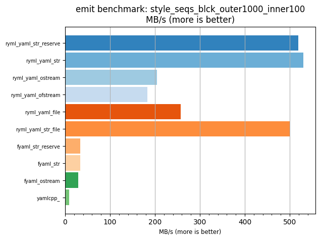
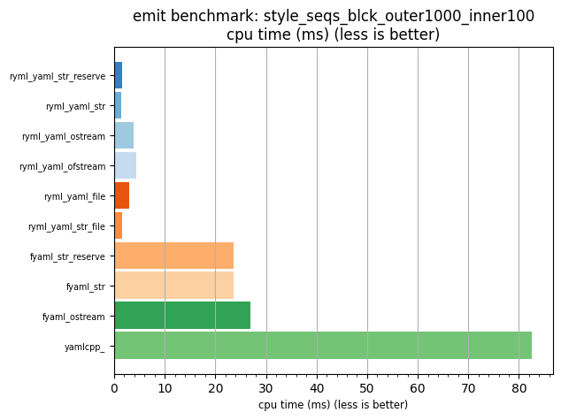

## emit benchmark: style_seqs_blck_outer1000_inner100

<p>Data type benchmark results:</p>
<ul>
   <li><pre><a href='#ryml-bm-emit-style_seqs_blck_outer1000_inner100-ryml_yaml_str_reserve'>ryml_yaml_str_reserve</a></pre></li> </ul>


<br/>
<br/>

---

<a id="ryml-bm-emit-style_seqs_blck_outer1000_inner100-ryml_yaml_str_reserve"/>

### emit benchmark: style_seqs_blck_outer1000_inner100

* Interactive html graphs
  * [MB/s](./ryml-bm-emit-style_seqs_blck_outer1000_inner100-mega_bytes_per_second.html)
  * [CPU time](./ryml-bm-emit-style_seqs_blck_outer1000_inner100-cpu_time_ms.html)

[](./ryml-bm-emit-style_seqs_blck_outer1000_inner100-mega_bytes_per_second.png)
[](./ryml-bm-emit-style_seqs_blck_outer1000_inner100-cpu_time_ms.png)

```
+--------------------------------------------------------------------------------------------------+
|                        emit benchmark: style_seqs_blck_outer1000_inner100                        |
+-----------------------+---------+---------+----------+---------------+-------------+-------------+
| function              |    MB/s | MB/s(x) |  MB/s(%) | cpu time (ms) | cpu time(x) | cpu time(%) |
+-----------------------+---------+---------+----------+---------------+-------------+-------------+
| ryml_yaml_str_reserve |  519.11 |  54.35x | 5334.71% |          1.52 |       0.02x |     -98.16% |
| ryml_yaml_str         |  530.62 |  55.55x | 5455.18% |          1.49 |       0.02x |     -98.20% |
| ryml_yaml_ostream     |  204.01 |  21.36x | 2035.79% |          3.87 |       0.05x |     -95.32% |
| ryml_yaml_ofstream    |  183.01 |  19.16x | 1815.95% |          4.31 |       0.05x |     -94.78% |
| ryml_yaml_file        |  257.68 |  26.98x | 2597.71% |          3.06 |       0.04x |     -96.29% |
| ryml_yaml_str_file    |  499.88 |  52.33x | 5133.32% |          1.58 |       0.02x |     -98.09% |
| fyaml_str_reserve     |   33.29 |   3.49x |  248.57% |         23.70 |       0.29x |     -71.31% |
| fyaml_str             |   33.31 |   3.49x |  248.73% |         23.69 |       0.29x |     -71.32% |
| fyaml_ostream         |   29.29 |   3.07x |  206.62% |         26.94 |       0.33x |     -67.39% |
| yamlcpp_              |    9.55 |   1.00x |    0.00% |         82.60 |       1.00x |       0.00% |
+-----------------------+---------+---------+----------+---------------+-------------+-------------+
```

