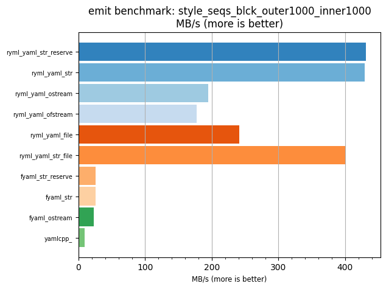
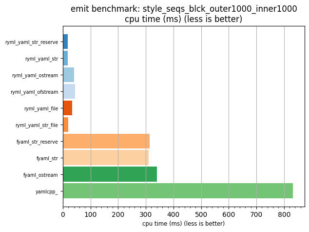

## emit benchmark: style_seqs_blck_outer1000_inner1000

<p>Data type benchmark results:</p>
<ul>
   <li><pre><a href='#ryml-bm-emit-style_seqs_blck_outer1000_inner1000-ryml_yaml_str_reserve'>ryml_yaml_str_reserve</a></pre></li> </ul>


<br/>
<br/>

---

<a id="ryml-bm-emit-style_seqs_blck_outer1000_inner1000-ryml_yaml_str_reserve"/>

### emit benchmark: style_seqs_blck_outer1000_inner1000

* Interactive html graphs
  * [MB/s](./ryml-bm-emit-style_seqs_blck_outer1000_inner1000-mega_bytes_per_second.html)
  * [CPU time](./ryml-bm-emit-style_seqs_blck_outer1000_inner1000-cpu_time_ms.html)

[](./ryml-bm-emit-style_seqs_blck_outer1000_inner1000-mega_bytes_per_second.png)
[](./ryml-bm-emit-style_seqs_blck_outer1000_inner1000-cpu_time_ms.png)

```
+--------------------------------------------------------------------------------------------------+
|                       emit benchmark: style_seqs_blck_outer1000_inner1000                        |
+-----------------------+---------+---------+----------+---------------+-------------+-------------+
| function              |    MB/s | MB/s(x) |  MB/s(%) | cpu time (ms) | cpu time(x) | cpu time(%) |
+-----------------------+---------+---------+----------+---------------+-------------+-------------+
| ryml_yaml_str_reserve |  431.48 |  45.54x | 4454.50% |         18.29 |       0.02x |     -97.80% |
| ryml_yaml_str         |  429.38 |  45.32x | 4432.28% |         18.38 |       0.02x |     -97.79% |
| ryml_yaml_ostream     |  194.87 |  20.57x | 1956.91% |         40.49 |       0.05x |     -95.14% |
| ryml_yaml_ofstream    |  177.63 |  18.75x | 1774.97% |         44.42 |       0.05x |     -94.67% |
| ryml_yaml_file        |  241.03 |  25.44x | 2444.23% |         32.73 |       0.04x |     -96.07% |
| ryml_yaml_str_file    |  400.86 |  42.31x | 4131.25% |         19.68 |       0.02x |     -97.64% |
| fyaml_str_reserve     |   25.17 |   2.66x |  165.63% |        313.52 |       0.38x |     -62.35% |
| fyaml_str             |   25.46 |   2.69x |  168.73% |        309.91 |       0.37x |     -62.79% |
| fyaml_ostream         |   23.22 |   2.45x |  145.10% |        339.79 |       0.41x |     -59.20% |
| yamlcpp_              |    9.47 |   1.00x |    0.00% |        832.83 |       1.00x |       0.00% |
+-----------------------+---------+---------+----------+---------------+-------------+-------------+
```

