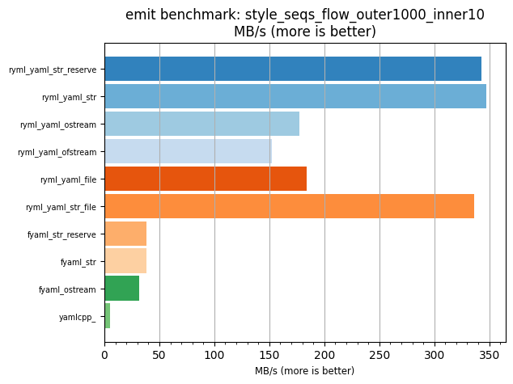
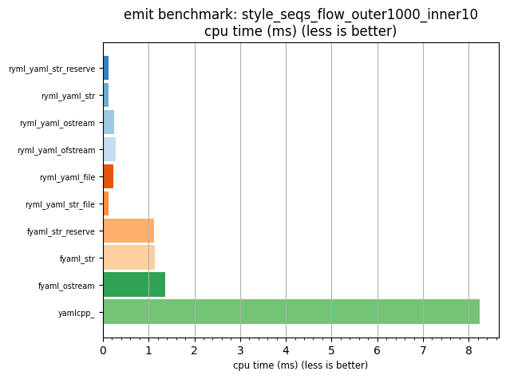

## emit benchmark: style_seqs_flow_outer1000_inner10

<p>Data type benchmark results:</p>
<ul>
   <li><pre><a href='#ryml-bm-emit-style_seqs_flow_outer1000_inner10-ryml_yaml_str_reserve'>ryml_yaml_str_reserve</a></pre></li> </ul>


<br/>
<br/>

---

<a id="ryml-bm-emit-style_seqs_flow_outer1000_inner10-ryml_yaml_str_reserve"/>

### emit benchmark: style_seqs_flow_outer1000_inner10

* Interactive html graphs
  * [MB/s](./ryml-bm-emit-style_seqs_flow_outer1000_inner10-mega_bytes_per_second.html)
  * [CPU time](./ryml-bm-emit-style_seqs_flow_outer1000_inner10-cpu_time_ms.html)

[](./ryml-bm-emit-style_seqs_flow_outer1000_inner10-mega_bytes_per_second.png)
[](./ryml-bm-emit-style_seqs_flow_outer1000_inner10-cpu_time_ms.png)

```
+--------------------------------------------------------------------------------------------------+
|                        emit benchmark: style_seqs_flow_outer1000_inner10                         |
+-----------------------+---------+---------+----------+---------------+-------------+-------------+
| function              |    MB/s | MB/s(x) |  MB/s(%) | cpu time (ms) | cpu time(x) | cpu time(%) |
+-----------------------+---------+---------+----------+---------------+-------------+-------------+
| ryml_yaml_str_reserve |  342.90 |  65.91x | 6490.73% |          0.13 |       0.02x |     -98.48% |
| ryml_yaml_str         |  347.55 |  66.80x | 6580.20% |          0.12 |       0.01x |     -98.50% |
| ryml_yaml_ostream     |  177.50 |  34.12x | 3311.69% |          0.24 |       0.03x |     -97.07% |
| ryml_yaml_ofstream    |  152.54 |  29.32x | 2831.99% |          0.28 |       0.03x |     -96.59% |
| ryml_yaml_file        |  183.83 |  35.33x | 3433.37% |          0.23 |       0.03x |     -97.17% |
| ryml_yaml_str_file    |  336.12 |  64.60x | 6360.39% |          0.13 |       0.02x |     -98.45% |
| fyaml_str_reserve     |   38.43 |   7.39x |  638.68% |          1.12 |       0.14x |     -86.46% |
| fyaml_str             |   38.01 |   7.31x |  630.63% |          1.13 |       0.14x |     -86.31% |
| fyaml_ostream         |   31.66 |   6.08x |  508.45% |          1.36 |       0.16x |     -83.56% |
| yamlcpp_              |    5.20 |   1.00x |    0.00% |          8.25 |       1.00x |       0.00% |
+-----------------------+---------+---------+----------+---------------+-------------+-------------+
```

