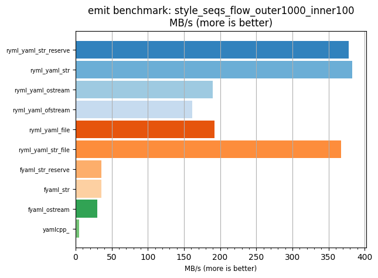
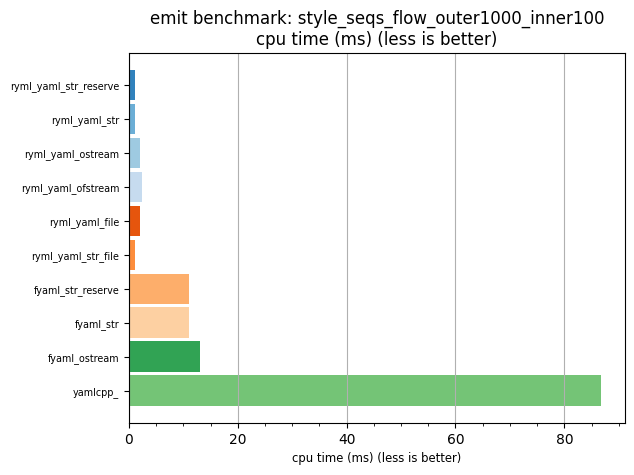

## emit benchmark: style_seqs_flow_outer1000_inner100

<p>Data type benchmark results:</p>
<ul>
   <li><pre><a href='#ryml-bm-emit-style_seqs_flow_outer1000_inner100-ryml_yaml_str_reserve'>ryml_yaml_str_reserve</a></pre></li> </ul>


<br/>
<br/>

---

<a id="ryml-bm-emit-style_seqs_flow_outer1000_inner100-ryml_yaml_str_reserve"/>

### emit benchmark: style_seqs_flow_outer1000_inner100

* Interactive html graphs
  * [MB/s](./ryml-bm-emit-style_seqs_flow_outer1000_inner100-mega_bytes_per_second.html)
  * [CPU time](./ryml-bm-emit-style_seqs_flow_outer1000_inner100-cpu_time_ms.html)

[](./ryml-bm-emit-style_seqs_flow_outer1000_inner100-mega_bytes_per_second.png)
[](./ryml-bm-emit-style_seqs_flow_outer1000_inner100-cpu_time_ms.png)

```
+--------------------------------------------------------------------------------------------------+
|                        emit benchmark: style_seqs_flow_outer1000_inner100                        |
+-----------------------+---------+---------+----------+---------------+-------------+-------------+
| function              |    MB/s | MB/s(x) |  MB/s(%) | cpu time (ms) | cpu time(x) | cpu time(%) |
+-----------------------+---------+---------+----------+---------------+-------------+-------------+
| ryml_yaml_str_reserve |  378.20 |  83.53x | 8253.48% |          1.04 |       0.01x |     -98.80% |
| ryml_yaml_str         |  383.13 |  84.62x | 8362.38% |          1.03 |       0.01x |     -98.82% |
| ryml_yaml_ostream     |  189.47 |  41.85x | 4084.95% |          2.07 |       0.02x |     -97.61% |
| ryml_yaml_ofstream    |  161.10 |  35.58x | 3458.39% |          2.44 |       0.03x |     -97.19% |
| ryml_yaml_file        |  192.01 |  42.41x | 4140.92% |          2.05 |       0.02x |     -97.64% |
| ryml_yaml_str_file    |  367.27 |  81.12x | 8011.96% |          1.07 |       0.01x |     -98.77% |
| fyaml_str_reserve     |   35.54 |   7.85x |  685.00% |         11.06 |       0.13x |     -87.26% |
| fyaml_str             |   35.37 |   7.81x |  681.12% |         11.11 |       0.13x |     -87.20% |
| fyaml_ostream         |   29.90 |   6.60x |  560.44% |         13.14 |       0.15x |     -84.86% |
| yamlcpp_              |    4.53 |   1.00x |    0.00% |         86.80 |       1.00x |       0.00% |
+-----------------------+---------+---------+----------+---------------+-------------+-------------+
```

