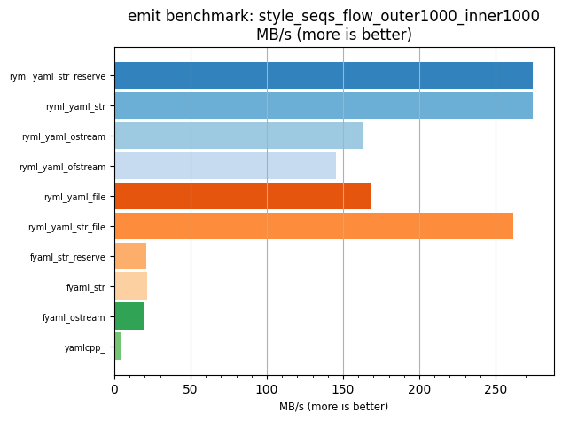
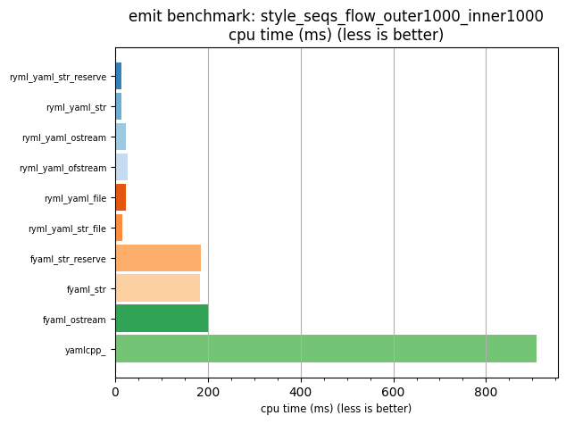

## emit benchmark: style_seqs_flow_outer1000_inner1000

<p>Data type benchmark results:</p>
<ul>
   <li><pre><a href='#ryml-bm-emit-style_seqs_flow_outer1000_inner1000-ryml_yaml_str_reserve'>ryml_yaml_str_reserve</a></pre></li> </ul>


<br/>
<br/>

---

<a id="ryml-bm-emit-style_seqs_flow_outer1000_inner1000-ryml_yaml_str_reserve"/>

### emit benchmark: style_seqs_flow_outer1000_inner1000

* Interactive html graphs
  * [MB/s](./ryml-bm-emit-style_seqs_flow_outer1000_inner1000-mega_bytes_per_second.html)
  * [CPU time](./ryml-bm-emit-style_seqs_flow_outer1000_inner1000-cpu_time_ms.html)

[](./ryml-bm-emit-style_seqs_flow_outer1000_inner1000-mega_bytes_per_second.png)
[](./ryml-bm-emit-style_seqs_flow_outer1000_inner1000-cpu_time_ms.png)

```
+--------------------------------------------------------------------------------------------------+
|                       emit benchmark: style_seqs_flow_outer1000_inner1000                        |
+-----------------------+---------+---------+----------+---------------+-------------+-------------+
| function              |    MB/s | MB/s(x) |  MB/s(%) | cpu time (ms) | cpu time(x) | cpu time(%) |
+-----------------------+---------+---------+----------+---------------+-------------+-------------+
| ryml_yaml_str_reserve |  274.24 |  64.06x | 6306.01% |         14.20 |       0.02x |     -98.44% |
| ryml_yaml_str         |  274.62 |  64.15x | 6314.94% |         14.18 |       0.02x |     -98.44% |
| ryml_yaml_ostream     |  163.53 |  38.20x | 3720.00% |         23.81 |       0.03x |     -97.38% |
| ryml_yaml_ofstream    |  145.18 |  33.91x | 3291.28% |         26.82 |       0.03x |     -97.05% |
| ryml_yaml_file        |  168.36 |  39.33x | 3832.79% |         23.13 |       0.03x |     -97.46% |
| ryml_yaml_str_file    |  261.74 |  61.14x | 6014.09% |         14.88 |       0.02x |     -98.36% |
| fyaml_str_reserve     |   21.02 |   4.91x |  390.92% |        185.29 |       0.20x |     -79.63% |
| fyaml_str             |   21.32 |   4.98x |  397.96% |        182.67 |       0.20x |     -79.92% |
| fyaml_ostream         |   19.38 |   4.53x |  352.63% |        200.96 |       0.22x |     -77.91% |
| yamlcpp_              |    4.28 |   1.00x |    0.00% |        909.61 |       1.00x |       0.00% |
+-----------------------+---------+---------+----------+---------------+-------------+-------------+
```

