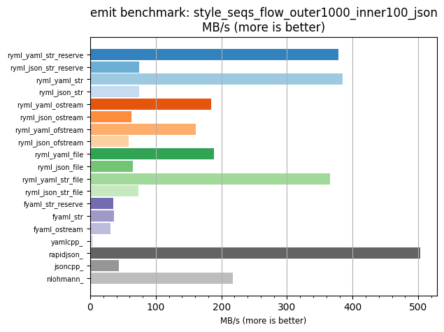
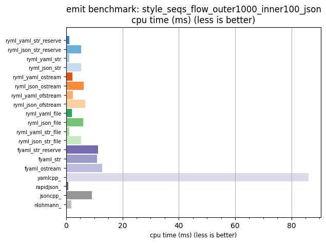

## emit benchmark: style_seqs_flow_outer1000_inner100_json

<p>Data type benchmark results:</p>
<ul>
   <li><pre><a href='#ryml-bm-emit-style_seqs_flow_outer1000_inner100_json-ryml_yaml_str_reserve'>ryml_yaml_str_reserve</a></pre></li> </ul>


<br/>
<br/>

---

<a id="ryml-bm-emit-style_seqs_flow_outer1000_inner100_json-ryml_yaml_str_reserve"/>

### emit benchmark: style_seqs_flow_outer1000_inner100_json

* Interactive html graphs
  * [MB/s](./ryml-bm-emit-style_seqs_flow_outer1000_inner100_json-mega_bytes_per_second.html)
  * [CPU time](./ryml-bm-emit-style_seqs_flow_outer1000_inner100_json-cpu_time_ms.html)

[](./ryml-bm-emit-style_seqs_flow_outer1000_inner100_json-mega_bytes_per_second.png)
[](./ryml-bm-emit-style_seqs_flow_outer1000_inner100_json-cpu_time_ms.png)

```
+---------------------------------------------------------------------------------------------------+
|                      emit benchmark: style_seqs_flow_outer1000_inner100_json                      |
+-----------------------+---------+---------+-----------+---------------+-------------+-------------+
| function              |    MB/s | MB/s(x) |   MB/s(%) | cpu time (ms) | cpu time(x) | cpu time(%) |
+-----------------------+---------+---------+-----------+---------------+-------------+-------------+
| ryml_yaml_str_reserve |  378.58 |  82.99x |  8198.97% |          1.04 |       0.01x |     -98.80% |
| ryml_json_str_reserve |   74.76 |  16.39x |  1538.78% |          5.26 |       0.06x |     -93.90% |
| ryml_yaml_str         |  384.61 |  84.31x |  8331.12% |          1.02 |       0.01x |     -98.81% |
| ryml_json_str         |   74.26 |  16.28x |  1527.91% |          5.29 |       0.06x |     -93.86% |
| ryml_yaml_ostream     |  184.58 |  40.46x |  3946.19% |          2.13 |       0.02x |     -97.53% |
| ryml_json_ostream     |   62.71 |  13.75x |  1274.57% |          6.27 |       0.07x |     -92.73% |
| ryml_yaml_ofstream    |  161.07 |  35.31x |  3430.86% |          2.44 |       0.03x |     -97.17% |
| ryml_json_ofstream    |   58.49 |  12.82x |  1182.14% |          6.72 |       0.08x |     -92.20% |
| ryml_yaml_file        |  188.84 |  41.40x |  4039.58% |          2.08 |       0.02x |     -97.58% |
| ryml_json_file        |   65.04 |  14.26x |  1325.77% |          6.04 |       0.07x |     -92.99% |
| ryml_yaml_str_file    |  366.00 |  80.23x |  7923.04% |          1.07 |       0.01x |     -98.75% |
| ryml_json_str_file    |   73.93 |  16.21x |  1520.72% |          5.32 |       0.06x |     -93.83% |
| fyaml_str_reserve     |   34.99 |   7.67x |   666.97% |         11.23 |       0.13x |     -86.96% |
| fyaml_str             |   36.05 |   7.90x |   690.24% |         10.90 |       0.13x |     -87.35% |
| fyaml_ostream         |   30.56 |   6.70x |   569.83% |         12.86 |       0.15x |     -85.07% |
| yamlcpp_              |    4.56 |   1.00x |     0.00% |         86.15 |       1.00x |       0.00% |
| rapidjson_            |  503.46 | 110.36x | 10936.45% |          0.78 |       0.01x |     -99.09% |
| jsoncpp_              |   43.39 |   9.51x |   851.21% |          9.06 |       0.11x |     -89.49% |
| nlohmann_             |  217.81 |  47.75x |  4674.70% |          1.80 |       0.02x |     -97.91% |
+-----------------------+---------+---------+-----------+---------------+-------------+-------------+
```

