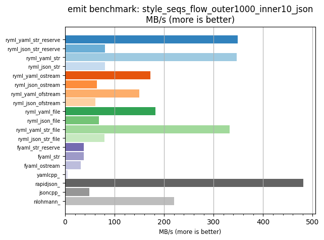
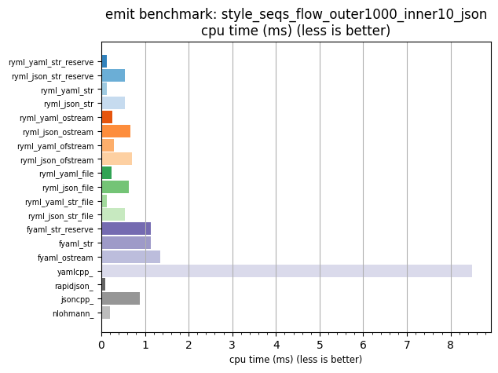

## emit benchmark: style_seqs_flow_outer1000_inner10_json

<p>Data type benchmark results:</p>
<ul>
   <li><pre><a href='#ryml-bm-emit-style_seqs_flow_outer1000_inner10_json-ryml_yaml_str_reserve'>ryml_yaml_str_reserve</a></pre></li> </ul>


<br/>
<br/>

---

<a id="ryml-bm-emit-style_seqs_flow_outer1000_inner10_json-ryml_yaml_str_reserve"/>

### emit benchmark: style_seqs_flow_outer1000_inner10_json

* Interactive html graphs
  * [MB/s](./ryml-bm-emit-style_seqs_flow_outer1000_inner10_json-mega_bytes_per_second.html)
  * [CPU time](./ryml-bm-emit-style_seqs_flow_outer1000_inner10_json-cpu_time_ms.html)

[](./ryml-bm-emit-style_seqs_flow_outer1000_inner10_json-mega_bytes_per_second.png)
[](./ryml-bm-emit-style_seqs_flow_outer1000_inner10_json-cpu_time_ms.png)

```
+--------------------------------------------------------------------------------------------------+
|                      emit benchmark: style_seqs_flow_outer1000_inner10_json                      |
+-----------------------+---------+---------+----------+---------------+-------------+-------------+
| function              |    MB/s | MB/s(x) |  MB/s(%) | cpu time (ms) | cpu time(x) | cpu time(%) |
+-----------------------+---------+---------+----------+---------------+-------------+-------------+
| ryml_yaml_str_reserve |  348.48 |  69.03x | 6803.27% |          0.12 |       0.01x |     -98.55% |
| ryml_json_str_reserve |   80.08 |  15.86x | 1486.27% |          0.54 |       0.06x |     -93.70% |
| ryml_yaml_str         |  346.87 |  68.71x | 6771.26% |          0.12 |       0.01x |     -98.54% |
| ryml_json_str         |   80.36 |  15.92x | 1491.90% |          0.53 |       0.06x |     -93.72% |
| ryml_yaml_ostream     |  172.47 |  34.17x | 3316.52% |          0.25 |       0.03x |     -97.07% |
| ryml_json_ostream     |   64.17 |  12.71x | 1171.11% |          0.67 |       0.08x |     -92.13% |
| ryml_yaml_ofstream    |  150.33 |  29.78x | 2877.91% |          0.29 |       0.03x |     -96.64% |
| ryml_json_ofstream    |   61.10 |  12.10x | 1110.30% |          0.70 |       0.08x |     -91.74% |
| ryml_yaml_file        |  182.49 |  36.15x | 3515.00% |          0.24 |       0.03x |     -97.23% |
| ryml_json_file        |   68.33 |  13.54x | 1253.58% |          0.63 |       0.07x |     -92.61% |
| ryml_yaml_str_file    |  332.35 |  65.84x | 6483.77% |          0.13 |       0.02x |     -98.48% |
| ryml_json_str_file    |   79.80 |  15.81x | 1480.88% |          0.54 |       0.06x |     -93.67% |
| fyaml_str_reserve     |   37.99 |   7.52x |  652.48% |          1.13 |       0.13x |     -86.71% |
| fyaml_str             |   37.99 |   7.53x |  652.57% |          1.13 |       0.13x |     -86.71% |
| fyaml_ostream         |   31.67 |   6.27x |  527.42% |          1.35 |       0.16x |     -84.06% |
| yamlcpp_              |    5.05 |   1.00x |    0.00% |          8.50 |       1.00x |       0.00% |
| rapidjson_            |  481.59 |  95.40x | 9440.02% |          0.09 |       0.01x |     -98.95% |
| jsoncpp_              |   48.75 |   9.66x |  865.81% |          0.88 |       0.10x |     -89.65% |
| nlohmann_             |  219.79 |  43.54x | 4254.00% |          0.20 |       0.02x |     -97.70% |
+-----------------------+---------+---------+----------+---------------+-------------+-------------+
```

