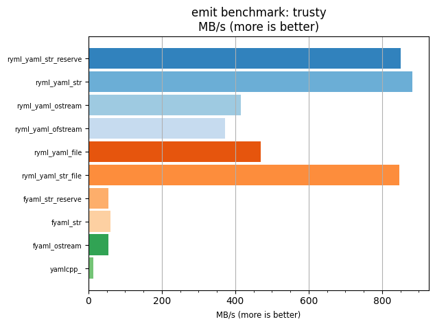
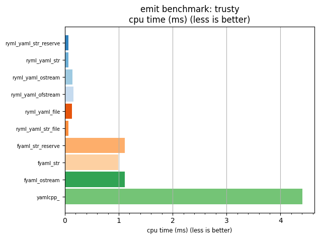

## emit benchmark: trusty

<p>Data type benchmark results:</p>
<ul>
   <li><pre><a href='#ryml-bm-emit-trusty-ryml_yaml_str_reserve'>ryml_yaml_str_reserve</a></pre></li> </ul>


<br/>
<br/>

---

<a id="ryml-bm-emit-trusty-ryml_yaml_str_reserve"/>

### emit benchmark: trusty

* Interactive html graphs
  * [MB/s](./ryml-bm-emit-trusty-mega_bytes_per_second.html)
  * [CPU time](./ryml-bm-emit-trusty-cpu_time_ms.html)

[](./ryml-bm-emit-trusty-mega_bytes_per_second.png)
[](./ryml-bm-emit-trusty-cpu_time_ms.png)

```
+--------------------------------------------------------------------------------------------------+
|                                      emit benchmark: trusty                                      |
+-----------------------+---------+---------+----------+---------------+-------------+-------------+
| function              |    MB/s | MB/s(x) |  MB/s(%) | cpu time (ms) | cpu time(x) | cpu time(%) |
+-----------------------+---------+---------+----------+---------------+-------------+-------------+
| ryml_yaml_str_reserve |  850.68 |  63.10x | 6210.03% |          0.07 |       0.02x |     -98.42% |
| ryml_yaml_str         |  883.28 |  65.52x | 6451.84% |          0.07 |       0.02x |     -98.47% |
| ryml_yaml_ostream     |  415.90 |  30.85x | 2984.97% |          0.14 |       0.03x |     -96.76% |
| ryml_yaml_ofstream    |  372.72 |  27.65x | 2664.72% |          0.16 |       0.04x |     -96.38% |
| ryml_yaml_file        |  469.96 |  34.86x | 3385.94% |          0.13 |       0.03x |     -97.13% |
| ryml_yaml_str_file    |  847.95 |  62.90x | 6189.73% |          0.07 |       0.02x |     -98.41% |
| fyaml_str_reserve     |   53.45 |   3.96x |  296.50% |          1.11 |       0.25x |     -74.78% |
| fyaml_str             |   60.02 |   4.45x |  345.22% |          0.99 |       0.22x |     -77.54% |
| fyaml_ostream         |   53.38 |   3.96x |  295.93% |          1.11 |       0.25x |     -74.74% |
| yamlcpp_              |   13.48 |   1.00x |    0.00% |          4.41 |       1.00x |       0.00% |
+-----------------------+---------+---------+----------+---------------+-------------+-------------+
```

