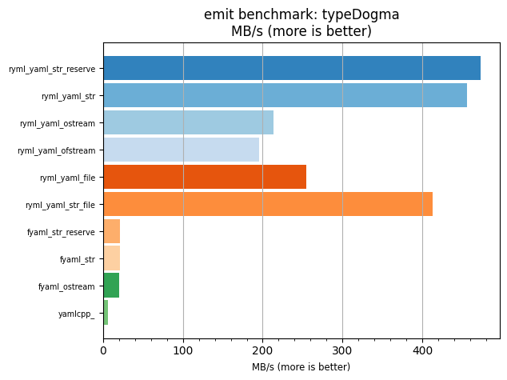
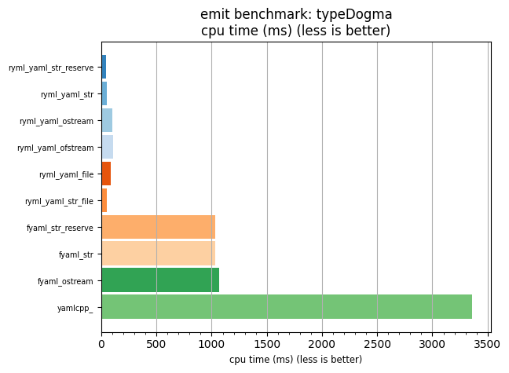

## emit benchmark: typeDogma

<p>Data type benchmark results:</p>
<ul>
   <li><pre><a href='#ryml-bm-emit-typeDogma-ryml_yaml_str_reserve'>ryml_yaml_str_reserve</a></pre></li> </ul>


<br/>
<br/>

---

<a id="ryml-bm-emit-typeDogma-ryml_yaml_str_reserve"/>

### emit benchmark: typeDogma

* Interactive html graphs
  * [MB/s](./ryml-bm-emit-typeDogma-mega_bytes_per_second.html)
  * [CPU time](./ryml-bm-emit-typeDogma-cpu_time_ms.html)

[](./ryml-bm-emit-typeDogma-mega_bytes_per_second.png)
[](./ryml-bm-emit-typeDogma-cpu_time_ms.png)

```
+--------------------------------------------------------------------------------------------------+
|                                    emit benchmark: typeDogma                                     |
+-----------------------+---------+---------+----------+---------------+-------------+-------------+
| function              |    MB/s | MB/s(x) |  MB/s(%) | cpu time (ms) | cpu time(x) | cpu time(%) |
+-----------------------+---------+---------+----------+---------------+-------------+-------------+
| ryml_yaml_str_reserve |  473.60 |  74.03x | 7302.86% |         45.42 |       0.01x |     -98.65% |
| ryml_yaml_str         |  456.02 |  71.28x | 7028.19% |         47.17 |       0.01x |     -98.60% |
| ryml_yaml_ostream     |  213.10 |  33.31x | 3231.03% |        100.93 |       0.03x |     -97.00% |
| ryml_yaml_ofstream    |  195.78 |  30.60x | 2960.28% |        109.86 |       0.03x |     -96.73% |
| ryml_yaml_file        |  254.92 |  39.85x | 3884.78% |         84.38 |       0.03x |     -97.49% |
| ryml_yaml_str_file    |  413.41 |  64.62x | 6362.04% |         52.03 |       0.02x |     -98.45% |
| fyaml_str_reserve     |   20.79 |   3.25x |  225.01% |       1034.49 |       0.31x |     -69.23% |
| fyaml_str             |   20.89 |   3.27x |  226.52% |       1029.69 |       0.31x |     -69.37% |
| fyaml_ostream         |   20.13 |   3.15x |  214.70% |       1068.37 |       0.32x |     -68.22% |
| yamlcpp_              |    6.40 |   1.00x |    0.00% |       3362.17 |       1.00x |       0.00% |
+-----------------------+---------+---------+----------+---------------+-------------+-------------+
```

