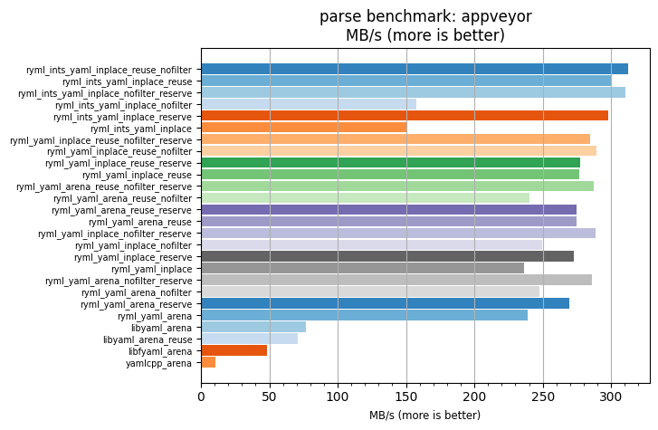
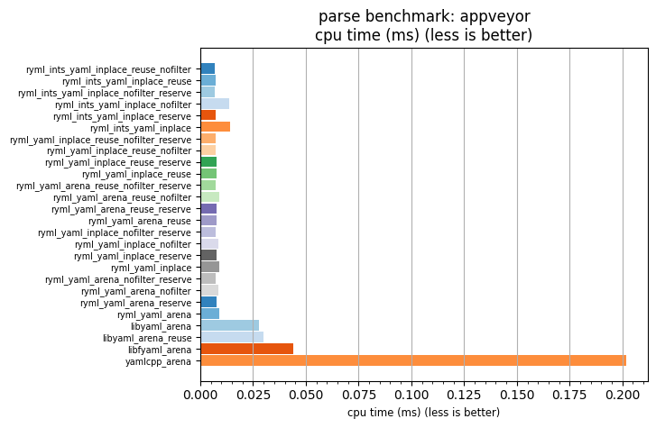

## parse benchmark: appveyor

<p>Data type benchmark results:</p>
<ul>
   <li><pre><a href='#ryml-bm-parse-appveyor-ryml_ints_yaml_inplace_reuse_nofilter'>ryml_ints_yaml_inplace_reuse_nofilter</a></pre></li> </ul>


<br/>
<br/>

---

<a id="ryml-bm-parse-appveyor-ryml_ints_yaml_inplace_reuse_nofilter"/>

### parse benchmark: appveyor

* Interactive html graphs
  * [MB/s](./ryml-bm-parse-appveyor-mega_bytes_per_second.html)
  * [CPU time](./ryml-bm-parse-appveyor-cpu_time_ms.html)

[](./ryml-bm-parse-appveyor-mega_bytes_per_second.png)
[](./ryml-bm-parse-appveyor-cpu_time_ms.png)

```
+---------------------------------------------------------------------------------------------------------------------+
|                                              parse benchmark: appveyor                                              |
+------------------------------------------+---------+---------+----------+---------------+-------------+-------------+
| function                                 |    MB/s | MB/s(x) |  MB/s(%) | cpu time (ms) | cpu time(x) | cpu time(%) |
+------------------------------------------+---------+---------+----------+---------------+-------------+-------------+
| ryml_ints_yaml_inplace_reuse_nofilter    |  312.69 |  29.65x | 2864.60% |          0.01 |       0.03x |     -96.63% |
| ryml_ints_yaml_inplace_reuse             |  299.77 |  28.42x | 2742.17% |          0.01 |       0.04x |     -96.48% |
| ryml_ints_yaml_inplace_nofilter_reserve  |  310.35 |  29.42x | 2842.48% |          0.01 |       0.03x |     -96.60% |
| ryml_ints_yaml_inplace_nofilter          |  157.34 |  14.92x | 1391.75% |          0.01 |       0.07x |     -93.30% |
| ryml_ints_yaml_inplace_reserve           |  297.61 |  28.22x | 2721.67% |          0.01 |       0.04x |     -96.46% |
| ryml_ints_yaml_inplace                   |  150.22 |  14.24x | 1324.29% |          0.01 |       0.07x |     -92.98% |
| ryml_yaml_inplace_reuse_nofilter_reserve |  284.48 |  26.97x | 2597.21% |          0.01 |       0.04x |     -96.29% |
| ryml_yaml_inplace_reuse_nofilter         |  289.08 |  27.41x | 2640.80% |          0.01 |       0.04x |     -96.35% |
| ryml_yaml_inplace_reuse_reserve          |  277.38 |  26.30x | 2529.90% |          0.01 |       0.04x |     -96.20% |
| ryml_yaml_inplace_reuse                  |  276.87 |  26.25x | 2525.07% |          0.01 |       0.04x |     -96.19% |
| ryml_yaml_arena_reuse_nofilter_reserve   |  287.54 |  27.26x | 2626.18% |          0.01 |       0.04x |     -96.33% |
| ryml_yaml_arena_reuse_nofilter           |  240.06 |  22.76x | 2176.01% |          0.01 |       0.04x |     -95.61% |
| ryml_yaml_arena_reuse_reserve            |  274.97 |  26.07x | 2506.98% |          0.01 |       0.04x |     -96.16% |
| ryml_yaml_arena_reuse                    |  274.62 |  26.04x | 2503.69% |          0.01 |       0.04x |     -96.16% |
| ryml_yaml_inplace_nofilter_reserve       |  288.34 |  27.34x | 2633.74% |          0.01 |       0.04x |     -96.34% |
| ryml_yaml_inplace_nofilter               |  249.24 |  23.63x | 2263.07% |          0.01 |       0.04x |     -95.77% |
| ryml_yaml_inplace_reserve                |  272.48 |  25.83x | 2483.44% |          0.01 |       0.04x |     -96.13% |
| ryml_yaml_inplace                        |  236.58 |  22.43x | 2143.04% |          0.01 |       0.04x |     -95.54% |
| ryml_yaml_arena_nofilter_reserve         |  285.67 |  27.08x | 2608.45% |          0.01 |       0.04x |     -96.31% |
| ryml_yaml_arena_nofilter                 |  247.58 |  23.47x | 2247.31% |          0.01 |       0.04x |     -95.74% |
| ryml_yaml_arena_reserve                  |  269.58 |  25.56x | 2455.95% |          0.01 |       0.04x |     -96.09% |
| ryml_yaml_arena                          |  238.67 |  22.63x | 2162.82% |          0.01 |       0.04x |     -95.58% |
| libyaml_arena                            |   77.04 |   7.30x |  630.39% |          0.03 |       0.14x |     -86.31% |
| libyaml_arena_reuse                      |   70.97 |   6.73x |  572.91% |          0.03 |       0.15x |     -85.14% |
| libfyaml_arena                           |   48.17 |   4.57x |  356.71% |          0.04 |       0.22x |     -78.10% |
| yamlcpp_arena                            |   10.55 |   1.00x |    0.00% |          0.20 |       1.00x |       0.00% |
+------------------------------------------+---------+---------+----------+---------------+-------------+-------------+
```

