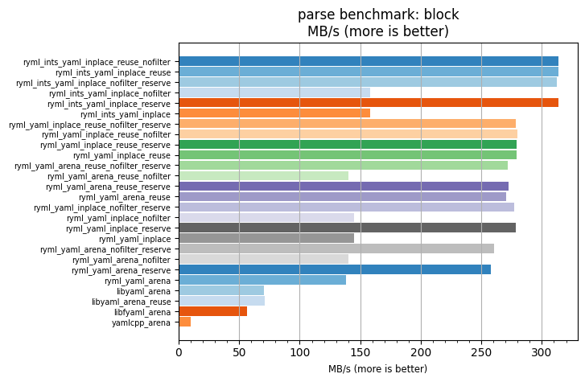
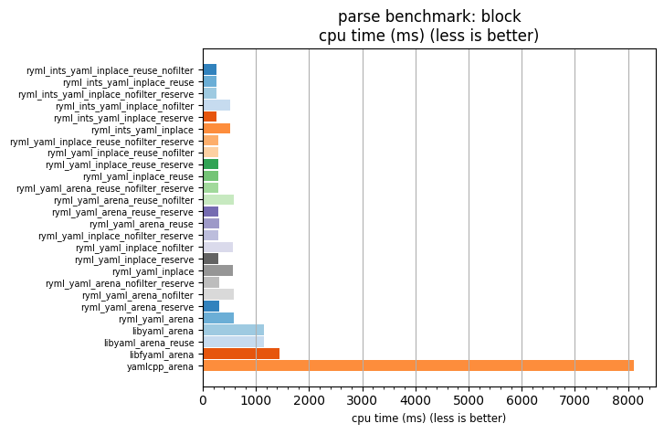

## parse benchmark: block

<p>Data type benchmark results:</p>
<ul>
   <li><pre><a href='#ryml-bm-parse-block-ryml_ints_yaml_inplace_reuse_nofilter'>ryml_ints_yaml_inplace_reuse_nofilter</a></pre></li> </ul>


<br/>
<br/>

---

<a id="ryml-bm-parse-block-ryml_ints_yaml_inplace_reuse_nofilter"/>

### parse benchmark: block

* Interactive html graphs
  * [MB/s](./ryml-bm-parse-block-mega_bytes_per_second.html)
  * [CPU time](./ryml-bm-parse-block-cpu_time_ms.html)

[](./ryml-bm-parse-block-mega_bytes_per_second.png)
[](./ryml-bm-parse-block-cpu_time_ms.png)

```
+---------------------------------------------------------------------------------------------------------------------+
|                                                parse benchmark: block                                               |
+------------------------------------------+---------+---------+----------+---------------+-------------+-------------+
| function                                 |    MB/s | MB/s(x) |  MB/s(%) | cpu time (ms) | cpu time(x) | cpu time(%) |
+------------------------------------------+---------+---------+----------+---------------+-------------+-------------+
| ryml_ints_yaml_inplace_reuse_nofilter    |  313.43 |  31.14x | 3014.39% |        260.61 |       0.03x |     -96.79% |
| ryml_ints_yaml_inplace_reuse             |  313.90 |  31.19x | 3019.08% |        260.21 |       0.03x |     -96.79% |
| ryml_ints_yaml_inplace_nofilter_reserve  |  312.45 |  31.05x | 3004.63% |        261.43 |       0.03x |     -96.78% |
| ryml_ints_yaml_inplace_nofilter          |  158.06 |  15.71x | 1470.50% |        516.80 |       0.06x |     -93.63% |
| ryml_ints_yaml_inplace_reserve           |  313.79 |  31.18x | 3017.93% |        260.31 |       0.03x |     -96.79% |
| ryml_ints_yaml_inplace                   |  158.18 |  15.72x | 1471.70% |        516.40 |       0.06x |     -93.64% |
| ryml_yaml_inplace_reuse_nofilter_reserve |  278.22 |  27.65x | 2664.52% |        293.59 |       0.04x |     -96.38% |
| ryml_yaml_inplace_reuse_nofilter         |  279.54 |  27.78x | 2677.66% |        292.20 |       0.04x |     -96.40% |
| ryml_yaml_inplace_reuse_reserve          |  279.18 |  27.74x | 2674.07% |        292.58 |       0.04x |     -96.40% |
| ryml_yaml_inplace_reuse                  |  279.17 |  27.74x | 2673.91% |        292.59 |       0.04x |     -96.39% |
| ryml_yaml_arena_reuse_nofilter_reserve   |  271.70 |  27.00x | 2599.68% |        300.64 |       0.04x |     -96.30% |
| ryml_yaml_arena_reuse_nofilter           |  139.98 |  13.91x | 1290.94% |        583.51 |       0.07x |     -92.81% |
| ryml_yaml_arena_reuse_reserve            |  272.30 |  27.06x | 2605.63% |        299.98 |       0.04x |     -96.30% |
| ryml_yaml_arena_reuse                    |  270.44 |  26.87x | 2587.17% |        302.04 |       0.04x |     -96.28% |
| ryml_yaml_inplace_nofilter_reserve       |  277.44 |  27.57x | 2656.70% |        294.42 |       0.04x |     -96.37% |
| ryml_yaml_inplace_nofilter               |  144.76 |  14.38x | 1338.43% |        564.25 |       0.07x |     -93.05% |
| ryml_yaml_inplace_reserve                |  278.13 |  27.64x | 2663.62% |        293.68 |       0.04x |     -96.38% |
| ryml_yaml_inplace                        |  145.15 |  14.42x | 1342.31% |        562.73 |       0.07x |     -93.07% |
| ryml_yaml_arena_nofilter_reserve         |  260.38 |  25.87x | 2487.19% |        313.71 |       0.04x |     -96.13% |
| ryml_yaml_arena_nofilter                 |  140.37 |  13.95x | 1294.75% |        581.92 |       0.07x |     -92.83% |
| ryml_yaml_arena_reserve                  |  257.71 |  25.61x | 2460.74% |        316.95 |       0.04x |     -96.09% |
| ryml_yaml_arena                          |  138.47 |  13.76x | 1275.89% |        589.90 |       0.07x |     -92.73% |
| libyaml_arena                            |   70.60 |   7.02x |  601.53% |       1156.95 |       0.14x |     -85.75% |
| libyaml_arena_reuse                      |   71.15 |   7.07x |  606.94% |       1148.08 |       0.14x |     -85.85% |
| libfyaml_arena                           |   56.24 |   5.59x |  458.85% |       1452.31 |       0.18x |     -82.11% |
| yamlcpp_arena                            |   10.06 |   1.00x |    0.00% |       8116.31 |       1.00x |       0.00% |
+------------------------------------------+---------+---------+----------+---------------+-------------+-------------+
```

