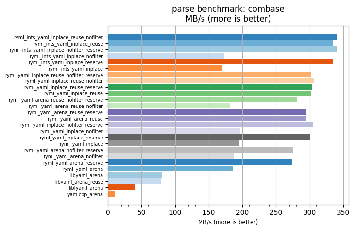
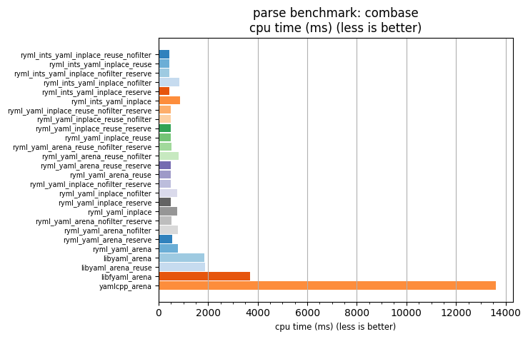

## parse benchmark: combase

<p>Data type benchmark results:</p>
<ul>
   <li><pre><a href='#ryml-bm-parse-combase-ryml_ints_yaml_inplace_reuse_nofilter'>ryml_ints_yaml_inplace_reuse_nofilter</a></pre></li> </ul>


<br/>
<br/>

---

<a id="ryml-bm-parse-combase-ryml_ints_yaml_inplace_reuse_nofilter"/>

### parse benchmark: combase

* Interactive html graphs
  * [MB/s](./ryml-bm-parse-combase-mega_bytes_per_second.html)
  * [CPU time](./ryml-bm-parse-combase-cpu_time_ms.html)

[](./ryml-bm-parse-combase-mega_bytes_per_second.png)
[](./ryml-bm-parse-combase-cpu_time_ms.png)

```
+---------------------------------------------------------------------------------------------------------------------+
|                                               parse benchmark: combase                                              |
+------------------------------------------+---------+---------+----------+---------------+-------------+-------------+
| function                                 |    MB/s | MB/s(x) |  MB/s(%) | cpu time (ms) | cpu time(x) | cpu time(%) |
+------------------------------------------+---------+---------+----------+---------------+-------------+-------------+
| ryml_ints_yaml_inplace_reuse_nofilter    |  340.99 |  31.65x | 3065.35% |        430.26 |       0.03x |     -96.84% |
| ryml_ints_yaml_inplace_reuse             |  335.25 |  31.12x | 3012.03% |        437.63 |       0.03x |     -96.79% |
| ryml_ints_yaml_inplace_nofilter_reserve  |  340.20 |  31.58x | 3058.00% |        431.26 |       0.03x |     -96.83% |
| ryml_ints_yaml_inplace_nofilter          |  172.41 |  16.00x | 1500.42% |        850.98 |       0.06x |     -93.75% |
| ryml_ints_yaml_inplace_reserve           |  334.01 |  31.01x | 3000.53% |        439.25 |       0.03x |     -96.77% |
| ryml_ints_yaml_inplace                   |  169.82 |  15.76x | 1476.41% |        863.94 |       0.06x |     -93.66% |
| ryml_yaml_inplace_reuse_nofilter_reserve |  302.61 |  28.09x | 2709.07% |        484.83 |       0.04x |     -96.44% |
| ryml_yaml_inplace_reuse_nofilter         |  306.10 |  28.41x | 2741.45% |        479.30 |       0.04x |     -96.48% |
| ryml_yaml_inplace_reuse_reserve          |  303.79 |  28.20x | 2719.98% |        482.95 |       0.04x |     -96.45% |
| ryml_yaml_inplace_reuse                  |  302.82 |  28.11x | 2711.02% |        484.49 |       0.04x |     -96.44% |
| ryml_yaml_arena_reuse_nofilter_reserve   |  280.84 |  26.07x | 2506.96% |        522.42 |       0.04x |     -96.16% |
| ryml_yaml_arena_reuse_nofilter           |  182.21 |  16.91x | 1591.42% |        805.19 |       0.06x |     -94.09% |
| ryml_yaml_arena_reuse_reserve            |  294.71 |  27.36x | 2635.74% |        497.82 |       0.04x |     -96.34% |
| ryml_yaml_arena_reuse                    |  294.89 |  27.37x | 2637.43% |        497.52 |       0.04x |     -96.35% |
| ryml_yaml_inplace_nofilter_reserve       |  304.49 |  28.27x | 2726.56% |        481.83 |       0.04x |     -96.46% |
| ryml_yaml_inplace_nofilter               |  197.07 |  18.29x | 1729.35% |        744.48 |       0.05x |     -94.53% |
| ryml_yaml_inplace_reserve                |  301.18 |  27.96x | 2695.79% |        487.13 |       0.04x |     -96.42% |
| ryml_yaml_inplace                        |  194.58 |  18.06x | 1706.29% |        753.99 |       0.06x |     -94.46% |
| ryml_yaml_arena_nofilter_reserve         |  275.58 |  25.58x | 2458.17% |        532.38 |       0.04x |     -96.09% |
| ryml_yaml_arena_nofilter                 |  187.40 |  17.40x | 1639.58% |        782.90 |       0.06x |     -94.25% |
| ryml_yaml_arena_reserve                  |  273.71 |  25.41x | 2440.80% |        536.02 |       0.04x |     -96.06% |
| ryml_yaml_arena                          |  185.83 |  17.25x | 1625.06% |        789.49 |       0.06x |     -94.20% |
| libyaml_arena                            |   79.83 |   7.41x |  641.09% |       1837.72 |       0.13x |     -86.51% |
| libyaml_arena_reuse                      |   78.65 |   7.30x |  630.06% |       1865.50 |       0.14x |     -86.30% |
| libfyaml_arena                           |   39.74 |   3.69x |  268.92% |       3691.64 |       0.27x |     -72.89% |
| yamlcpp_arena                            |   10.77 |   1.00x |    0.00% |      13619.18 |       1.00x |       0.00% |
+------------------------------------------+---------+---------+----------+---------------+-------------+-------------+
```

