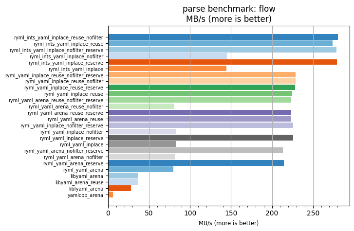
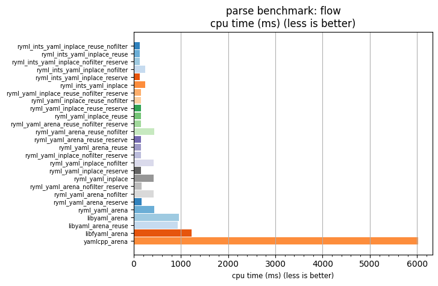

## parse benchmark: flow

<p>Data type benchmark results:</p>
<ul>
   <li><pre><a href='#ryml-bm-parse-flow-ryml_ints_yaml_inplace_reuse_nofilter'>ryml_ints_yaml_inplace_reuse_nofilter</a></pre></li> </ul>


<br/>
<br/>

---

<a id="ryml-bm-parse-flow-ryml_ints_yaml_inplace_reuse_nofilter"/>

### parse benchmark: flow

* Interactive html graphs
  * [MB/s](./ryml-bm-parse-flow-mega_bytes_per_second.html)
  * [CPU time](./ryml-bm-parse-flow-cpu_time_ms.html)

[](./ryml-bm-parse-flow-mega_bytes_per_second.png)
[](./ryml-bm-parse-flow-cpu_time_ms.png)

```
+---------------------------------------------------------------------------------------------------------------------+
|                                                parse benchmark: flow                                                |
+------------------------------------------+---------+---------+----------+---------------+-------------+-------------+
| function                                 |    MB/s | MB/s(x) |  MB/s(%) | cpu time (ms) | cpu time(x) | cpu time(%) |
+------------------------------------------+---------+---------+----------+---------------+-------------+-------------+
| ryml_ints_yaml_inplace_reuse_nofilter    |  280.68 |  48.83x | 4783.28% |        123.43 |       0.02x |     -97.95% |
| ryml_ints_yaml_inplace_reuse             |  273.88 |  47.65x | 4665.00% |        126.49 |       0.02x |     -97.90% |
| ryml_ints_yaml_inplace_nofilter_reserve  |  278.91 |  48.52x | 4752.49% |        124.21 |       0.02x |     -97.94% |
| ryml_ints_yaml_inplace_nofilter          |  145.21 |  25.26x | 2426.31% |        238.58 |       0.04x |     -96.04% |
| ryml_ints_yaml_inplace_reserve           |  279.26 |  48.59x | 4758.53% |        124.06 |       0.02x |     -97.94% |
| ryml_ints_yaml_inplace                   |  144.29 |  25.10x | 2410.30% |        240.10 |       0.04x |     -96.02% |
| ryml_yaml_inplace_reuse_nofilter_reserve |  228.53 |  39.76x | 3876.01% |        151.59 |       0.03x |     -97.48% |
| ryml_yaml_inplace_reuse_nofilter         |  228.67 |  39.78x | 3878.38% |        151.50 |       0.03x |     -97.49% |
| ryml_yaml_inplace_reuse_reserve          |  228.07 |  39.68x | 3868.05% |        151.90 |       0.03x |     -97.48% |
| ryml_yaml_inplace_reuse                  |  224.80 |  39.11x | 3811.16% |        154.11 |       0.03x |     -97.44% |
| ryml_yaml_arena_reuse_nofilter_reserve   |  223.23 |  38.84x | 3783.72% |        155.19 |       0.03x |     -97.43% |
| ryml_yaml_arena_reuse_nofilter           |   80.96 |  14.08x | 1308.49% |        427.93 |       0.07x |     -92.90% |
| ryml_yaml_arena_reuse_reserve            |  223.29 |  38.85x | 3784.72% |        155.15 |       0.03x |     -97.43% |
| ryml_yaml_arena_reuse                    |  223.54 |  38.89x | 3789.20% |        154.98 |       0.03x |     -97.43% |
| ryml_yaml_inplace_nofilter_reserve       |  226.00 |  39.32x | 3831.95% |        153.29 |       0.03x |     -97.46% |
| ryml_yaml_inplace_nofilter               |   83.32 |  14.50x | 1349.56% |        415.80 |       0.07x |     -93.10% |
| ryml_yaml_inplace_reserve                |  225.75 |  39.28x | 3827.64% |        153.46 |       0.03x |     -97.45% |
| ryml_yaml_inplace                        |   83.26 |  14.49x | 1348.58% |        416.09 |       0.07x |     -93.10% |
| ryml_yaml_arena_nofilter_reserve         |  213.51 |  37.15x | 3614.68% |        162.26 |       0.03x |     -97.31% |
| ryml_yaml_arena_nofilter                 |   81.38 |  14.16x | 1315.92% |        425.68 |       0.07x |     -92.94% |
| ryml_yaml_arena_reserve                  |  214.26 |  37.28x | 3627.77% |        161.69 |       0.03x |     -97.32% |
| ryml_yaml_arena                          |   79.89 |  13.90x | 1289.87% |        433.66 |       0.07x |     -92.81% |
| libyaml_arena                            |   36.43 |   6.34x |  533.72% |        951.10 |       0.16x |     -84.22% |
| libyaml_arena_reuse                      |   37.09 |   6.45x |  545.22% |        934.15 |       0.15x |     -84.50% |
| libfyaml_arena                           |   28.20 |   4.91x |  390.57% |       1228.65 |       0.20x |     -79.62% |
| yamlcpp_arena                            |    5.75 |   1.00x |    0.00% |       6027.34 |       1.00x |       0.00% |
+------------------------------------------+---------+---------+----------+---------------+-------------+-------------+
```

