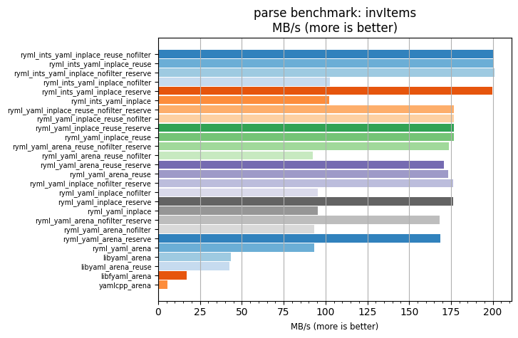
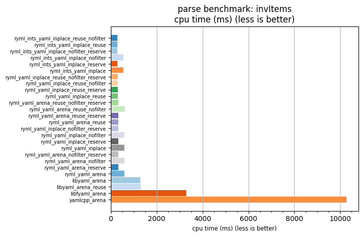

## parse benchmark: invItems

<p>Data type benchmark results:</p>
<ul>
   <li><pre><a href='#ryml-bm-parse-invItems-ryml_ints_yaml_inplace_reuse_nofilter'>ryml_ints_yaml_inplace_reuse_nofilter</a></pre></li> </ul>


<br/>
<br/>

---

<a id="ryml-bm-parse-invItems-ryml_ints_yaml_inplace_reuse_nofilter"/>

### parse benchmark: invItems

* Interactive html graphs
  * [MB/s](./ryml-bm-parse-invItems-mega_bytes_per_second.html)
  * [CPU time](./ryml-bm-parse-invItems-cpu_time_ms.html)

[](./ryml-bm-parse-invItems-mega_bytes_per_second.png)
[](./ryml-bm-parse-invItems-cpu_time_ms.png)

```
+---------------------------------------------------------------------------------------------------------------------+
|                                              parse benchmark: invItems                                              |
+------------------------------------------+---------+---------+----------+---------------+-------------+-------------+
| function                                 |    MB/s | MB/s(x) |  MB/s(%) | cpu time (ms) | cpu time(x) | cpu time(%) |
+------------------------------------------+---------+---------+----------+---------------+-------------+-------------+
| ryml_ints_yaml_inplace_reuse_nofilter    |  200.12 |  36.90x | 3589.61% |        278.74 |       0.03x |     -97.29% |
| ryml_ints_yaml_inplace_reuse             |  200.58 |  36.98x | 3598.01% |        278.11 |       0.03x |     -97.30% |
| ryml_ints_yaml_inplace_nofilter_reserve  |  201.16 |  37.09x | 3608.87% |        277.29 |       0.03x |     -97.30% |
| ryml_ints_yaml_inplace_nofilter          |  102.46 |  18.89x | 1789.06% |        544.42 |       0.05x |     -94.71% |
| ryml_ints_yaml_inplace_reserve           |  199.64 |  36.81x | 3580.78% |        279.41 |       0.03x |     -97.28% |
| ryml_ints_yaml_inplace                   |  102.22 |  18.85x | 1784.59% |        545.71 |       0.05x |     -94.69% |
| ryml_yaml_inplace_reuse_nofilter_reserve |  176.83 |  32.60x | 3160.13% |        315.46 |       0.03x |     -96.93% |
| ryml_yaml_inplace_reuse_nofilter         |  176.63 |  32.57x | 3156.52% |        315.81 |       0.03x |     -96.93% |
| ryml_yaml_inplace_reuse_reserve          |  176.77 |  32.59x | 3159.10% |        315.56 |       0.03x |     -96.93% |
| ryml_yaml_inplace_reuse                  |  176.81 |  32.60x | 3159.82% |        315.49 |       0.03x |     -96.93% |
| ryml_yaml_arena_reuse_nofilter_reserve   |  173.96 |  32.07x | 3107.31% |        320.66 |       0.03x |     -96.88% |
| ryml_yaml_arena_reuse_nofilter           |   92.22 |  17.00x | 1600.27% |        604.87 |       0.06x |     -94.12% |
| ryml_yaml_arena_reuse_reserve            |  170.57 |  31.45x | 3044.85% |        327.03 |       0.03x |     -96.82% |
| ryml_yaml_arena_reuse                    |  173.48 |  31.98x | 3098.37% |        321.55 |       0.03x |     -96.87% |
| ryml_yaml_inplace_nofilter_reserve       |  176.34 |  32.51x | 3151.17% |        316.33 |       0.03x |     -96.92% |
| ryml_yaml_inplace_nofilter               |   95.54 |  17.62x | 1661.52% |        583.84 |       0.06x |     -94.32% |
| ryml_yaml_inplace_reserve                |  176.16 |  32.48x | 3147.94% |        316.65 |       0.03x |     -96.92% |
| ryml_yaml_inplace                        |   95.49 |  17.61x | 1660.59% |        584.15 |       0.06x |     -94.32% |
| ryml_yaml_arena_nofilter_reserve         |  168.26 |  31.02x | 3002.15% |        331.53 |       0.03x |     -96.78% |
| ryml_yaml_arena_nofilter                 |   93.33 |  17.21x | 1620.76% |        597.67 |       0.06x |     -94.19% |
| ryml_yaml_arena_reserve                  |  168.51 |  31.07x | 3006.73% |        331.04 |       0.03x |     -96.78% |
| ryml_yaml_arena                          |   93.31 |  17.20x | 1620.36% |        597.81 |       0.06x |     -94.19% |
| libyaml_arena                            |   43.34 |   7.99x |  699.07% |       1287.05 |       0.13x |     -87.49% |
| libyaml_arena_reuse                      |   42.72 |   7.88x |  687.64% |       1305.74 |       0.13x |     -87.30% |
| libfyaml_arena                           |   16.94 |   3.12x |  212.30% |       3293.16 |       0.32x |     -67.98% |
| yamlcpp_arena                            |    5.42 |   1.00x |    0.00% |      10284.48 |       1.00x |       0.00% |
+------------------------------------------+---------+---------+----------+---------------+-------------+-------------+
```

