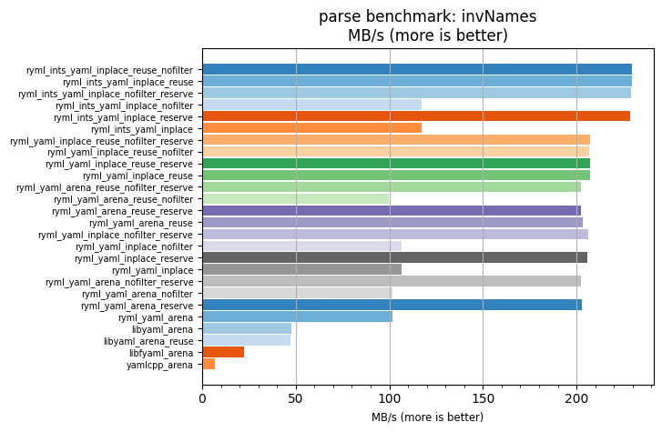
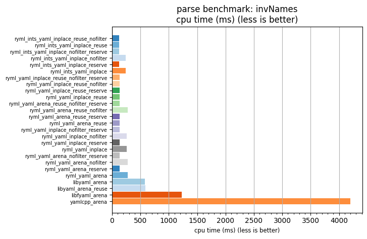

## parse benchmark: invNames

<p>Data type benchmark results:</p>
<ul>
   <li><pre><a href='#ryml-bm-parse-invNames-ryml_ints_yaml_inplace_reuse_nofilter'>ryml_ints_yaml_inplace_reuse_nofilter</a></pre></li> </ul>


<br/>
<br/>

---

<a id="ryml-bm-parse-invNames-ryml_ints_yaml_inplace_reuse_nofilter"/>

### parse benchmark: invNames

* Interactive html graphs
  * [MB/s](./ryml-bm-parse-invNames-mega_bytes_per_second.html)
  * [CPU time](./ryml-bm-parse-invNames-cpu_time_ms.html)

[](./ryml-bm-parse-invNames-mega_bytes_per_second.png)
[](./ryml-bm-parse-invNames-cpu_time_ms.png)

```
+---------------------------------------------------------------------------------------------------------------------+
|                                              parse benchmark: invNames                                              |
+------------------------------------------+---------+---------+----------+---------------+-------------+-------------+
| function                                 |    MB/s | MB/s(x) |  MB/s(%) | cpu time (ms) | cpu time(x) | cpu time(%) |
+------------------------------------------+---------+---------+----------+---------------+-------------+-------------+
| ryml_ints_yaml_inplace_reuse_nofilter    |  229.63 |  34.83x | 3382.77% |        120.66 |       0.03x |     -97.13% |
| ryml_ints_yaml_inplace_reuse             |  229.76 |  34.85x | 3384.78% |        120.59 |       0.03x |     -97.13% |
| ryml_ints_yaml_inplace_nofilter_reserve  |  229.07 |  34.74x | 3374.32% |        120.95 |       0.03x |     -97.12% |
| ryml_ints_yaml_inplace_nofilter          |  117.25 |  17.78x | 1678.38% |        236.30 |       0.06x |     -94.38% |
| ryml_ints_yaml_inplace_reserve           |  228.83 |  34.71x | 3370.62% |        121.08 |       0.03x |     -97.12% |
| ryml_ints_yaml_inplace                   |  117.32 |  17.79x | 1679.36% |        236.17 |       0.06x |     -94.38% |
| ryml_yaml_inplace_reuse_nofilter_reserve |  207.39 |  31.45x | 3045.49% |        133.60 |       0.03x |     -96.82% |
| ryml_yaml_inplace_reuse_nofilter         |  206.73 |  31.35x | 3035.49% |        134.02 |       0.03x |     -96.81% |
| ryml_yaml_inplace_reuse_reserve          |  207.33 |  31.45x | 3044.60% |        133.64 |       0.03x |     -96.82% |
| ryml_yaml_inplace_reuse                  |  207.32 |  31.44x | 3044.40% |        133.65 |       0.03x |     -96.82% |
| ryml_yaml_arena_reuse_nofilter_reserve   |  202.59 |  30.73x | 2972.59% |        136.77 |       0.03x |     -96.75% |
| ryml_yaml_arena_reuse_nofilter           |   99.59 |  15.11x | 1410.53% |        278.20 |       0.07x |     -93.38% |
| ryml_yaml_arena_reuse_reserve            |  202.19 |  30.67x | 2966.54% |        137.04 |       0.03x |     -96.74% |
| ryml_yaml_arena_reuse                    |  203.46 |  30.86x | 2985.80% |        136.18 |       0.03x |     -96.76% |
| ryml_yaml_inplace_nofilter_reserve       |  206.48 |  31.32x | 3031.61% |        134.19 |       0.03x |     -96.81% |
| ryml_yaml_inplace_nofilter               |  106.52 |  16.16x | 1515.52% |        260.12 |       0.06x |     -93.81% |
| ryml_yaml_inplace_reserve                |  205.72 |  31.20x | 3020.06% |        134.69 |       0.03x |     -96.79% |
| ryml_yaml_inplace                        |  106.57 |  16.16x | 1516.35% |        259.99 |       0.06x |     -93.81% |
| ryml_yaml_arena_nofilter_reserve         |  202.59 |  30.73x | 2972.57% |        136.77 |       0.03x |     -96.75% |
| ryml_yaml_arena_nofilter                 |  101.79 |  15.44x | 1443.85% |        272.20 |       0.06x |     -93.52% |
| ryml_yaml_arena_reserve                  |  202.64 |  30.73x | 2973.38% |        136.73 |       0.03x |     -96.75% |
| ryml_yaml_arena                          |  101.89 |  15.45x | 1445.28% |        271.95 |       0.06x |     -93.53% |
| libyaml_arena                            |   47.61 |   7.22x |  622.16% |        581.91 |       0.14x |     -86.15% |
| libyaml_arena_reuse                      |   47.00 |   7.13x |  612.82% |        589.54 |       0.14x |     -85.97% |
| libfyaml_arena                           |   22.62 |   3.43x |  243.06% |       1224.94 |       0.29x |     -70.85% |
| yamlcpp_arena                            |    6.59 |   1.00x |    0.00% |       4202.34 |       1.00x |       0.00% |
+------------------------------------------+---------+---------+----------+---------------+-------------+-------------+
```

