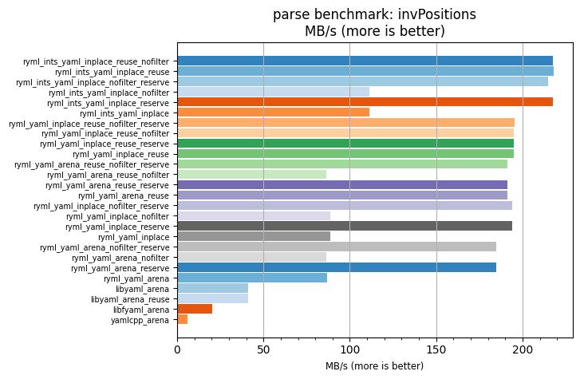
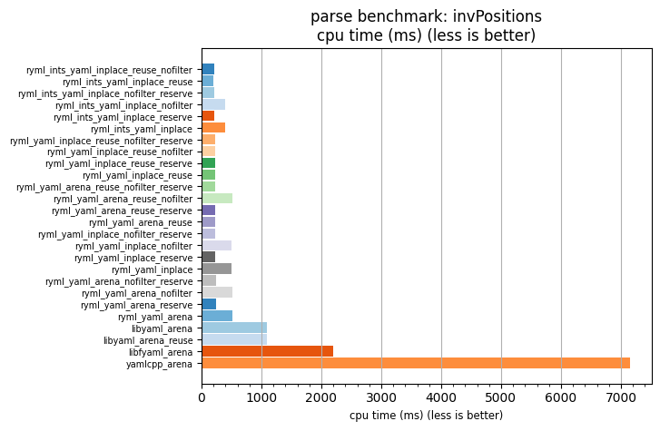

## parse benchmark: invPositions

<p>Data type benchmark results:</p>
<ul>
   <li><pre><a href='#ryml-bm-parse-invPositions-ryml_ints_yaml_inplace_reuse_nofilter'>ryml_ints_yaml_inplace_reuse_nofilter</a></pre></li> </ul>


<br/>
<br/>

---

<a id="ryml-bm-parse-invPositions-ryml_ints_yaml_inplace_reuse_nofilter"/>

### parse benchmark: invPositions

* Interactive html graphs
  * [MB/s](./ryml-bm-parse-invPositions-mega_bytes_per_second.html)
  * [CPU time](./ryml-bm-parse-invPositions-cpu_time_ms.html)

[](./ryml-bm-parse-invPositions-mega_bytes_per_second.png)
[](./ryml-bm-parse-invPositions-cpu_time_ms.png)

```
+---------------------------------------------------------------------------------------------------------------------+
|                                            parse benchmark: invPositions                                            |
+------------------------------------------+---------+---------+----------+---------------+-------------+-------------+
| function                                 |    MB/s | MB/s(x) |  MB/s(%) | cpu time (ms) | cpu time(x) | cpu time(%) |
+------------------------------------------+---------+---------+----------+---------------+-------------+-------------+
| ryml_ints_yaml_inplace_reuse_nofilter    |  217.66 |  34.89x | 3389.31% |        205.15 |       0.03x |     -97.13% |
| ryml_ints_yaml_inplace_reuse             |  218.21 |  34.98x | 3398.08% |        204.64 |       0.03x |     -97.14% |
| ryml_ints_yaml_inplace_nofilter_reserve  |  214.72 |  34.42x | 3342.09% |        207.97 |       0.03x |     -97.09% |
| ryml_ints_yaml_inplace_nofilter          |  111.14 |  17.82x | 1681.67% |        401.78 |       0.06x |     -94.39% |
| ryml_ints_yaml_inplace_reserve           |  217.49 |  34.87x | 3386.55% |        205.31 |       0.03x |     -97.13% |
| ryml_ints_yaml_inplace                   |  111.25 |  17.83x | 1683.38% |        401.39 |       0.06x |     -94.39% |
| ryml_yaml_inplace_reuse_nofilter_reserve |  195.32 |  31.31x | 3031.20% |        228.61 |       0.03x |     -96.81% |
| ryml_yaml_inplace_reuse_nofilter         |  194.96 |  31.25x | 3025.41% |        229.04 |       0.03x |     -96.80% |
| ryml_yaml_inplace_reuse_reserve          |  195.04 |  31.27x | 3026.74% |        228.94 |       0.03x |     -96.80% |
| ryml_yaml_inplace_reuse                  |  194.88 |  31.24x | 3024.06% |        229.14 |       0.03x |     -96.80% |
| ryml_yaml_arena_reuse_nofilter_reserve   |  191.44 |  30.69x | 2969.03% |        233.25 |       0.03x |     -96.74% |
| ryml_yaml_arena_reuse_nofilter           |   86.40 |  13.85x | 1285.01% |        516.85 |       0.07x |     -92.78% |
| ryml_yaml_arena_reuse_reserve            |  191.47 |  30.69x | 2969.36% |        233.22 |       0.03x |     -96.74% |
| ryml_yaml_arena_reuse                    |  191.12 |  30.64x | 2963.83% |        233.64 |       0.03x |     -96.74% |
| ryml_yaml_inplace_nofilter_reserve       |  194.23 |  31.14x | 3013.72% |        229.90 |       0.03x |     -96.79% |
| ryml_yaml_inplace_nofilter               |   88.54 |  14.19x | 1319.33% |        504.35 |       0.07x |     -92.95% |
| ryml_yaml_inplace_reserve                |  193.93 |  31.09x | 3008.84% |        230.26 |       0.03x |     -96.78% |
| ryml_yaml_inplace                        |   88.74 |  14.23x | 1322.63% |        503.18 |       0.07x |     -92.97% |
| ryml_yaml_arena_nofilter_reserve         |  184.92 |  29.64x | 2864.45% |        241.47 |       0.03x |     -96.63% |
| ryml_yaml_arena_nofilter                 |   86.52 |  13.87x | 1286.98% |        516.11 |       0.07x |     -92.79% |
| ryml_yaml_arena_reserve                  |  184.61 |  29.59x | 2859.43% |        241.88 |       0.03x |     -96.62% |
| ryml_yaml_arena                          |   86.71 |  13.90x | 1290.02% |        514.98 |       0.07x |     -92.81% |
| libyaml_arena                            |   41.13 |   6.59x |  559.34% |       1085.68 |       0.15x |     -84.83% |
| libyaml_arena_reuse                      |   40.97 |   6.57x |  556.74% |       1089.98 |       0.15x |     -84.77% |
| libfyaml_arena                           |   20.27 |   3.25x |  224.99% |       2202.63 |       0.31x |     -69.23% |
| yamlcpp_arena                            |    6.24 |   1.00x |    0.00% |       7158.36 |       1.00x |       0.00% |
+------------------------------------------+---------+---------+----------+---------------+-------------+-------------+
```

