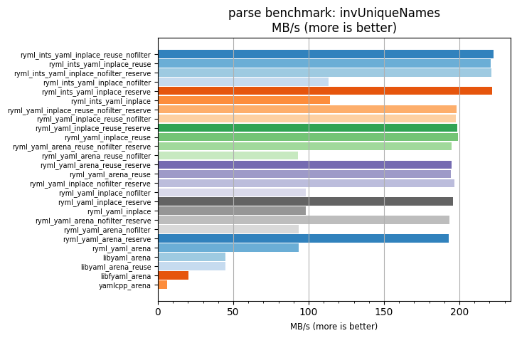
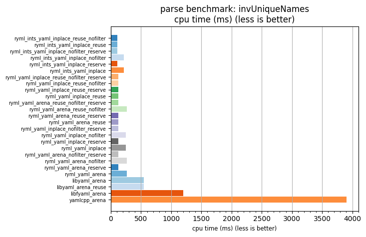

## parse benchmark: invUniqueNames

<p>Data type benchmark results:</p>
<ul>
   <li><pre><a href='#ryml-bm-parse-invUniqueNames-ryml_ints_yaml_inplace_reuse_nofilter'>ryml_ints_yaml_inplace_reuse_nofilter</a></pre></li> </ul>


<br/>
<br/>

---

<a id="ryml-bm-parse-invUniqueNames-ryml_ints_yaml_inplace_reuse_nofilter"/>

### parse benchmark: invUniqueNames

* Interactive html graphs
  * [MB/s](./ryml-bm-parse-invUniqueNames-mega_bytes_per_second.html)
  * [CPU time](./ryml-bm-parse-invUniqueNames-cpu_time_ms.html)

[](./ryml-bm-parse-invUniqueNames-mega_bytes_per_second.png)
[](./ryml-bm-parse-invUniqueNames-cpu_time_ms.png)

```
+---------------------------------------------------------------------------------------------------------------------+
|                                           parse benchmark: invUniqueNames                                           |
+------------------------------------------+---------+---------+----------+---------------+-------------+-------------+
| function                                 |    MB/s | MB/s(x) |  MB/s(%) | cpu time (ms) | cpu time(x) | cpu time(%) |
+------------------------------------------+---------+---------+----------+---------------+-------------+-------------+
| ryml_ints_yaml_inplace_reuse_nofilter    |  222.85 |  35.65x | 3464.77% |        109.61 |       0.03x |     -97.19% |
| ryml_ints_yaml_inplace_reuse             |  220.91 |  35.34x | 3433.78% |        110.57 |       0.03x |     -97.17% |
| ryml_ints_yaml_inplace_nofilter_reserve  |  221.48 |  35.43x | 3442.84% |        110.29 |       0.03x |     -97.18% |
| ryml_ints_yaml_inplace_nofilter          |  113.30 |  18.12x | 1712.41% |        215.58 |       0.06x |     -94.48% |
| ryml_ints_yaml_inplace_reserve           |  221.52 |  35.44x | 3443.53% |        110.26 |       0.03x |     -97.18% |
| ryml_ints_yaml_inplace                   |  114.23 |  18.27x | 1727.18% |        213.84 |       0.05x |     -94.53% |
| ryml_yaml_inplace_reuse_nofilter_reserve |  197.93 |  31.66x | 3066.21% |        123.40 |       0.03x |     -96.84% |
| ryml_yaml_inplace_reuse_nofilter         |  197.81 |  31.64x | 3064.18% |        123.48 |       0.03x |     -96.84% |
| ryml_yaml_inplace_reuse_reserve          |  198.80 |  31.80x | 3080.02% |        122.87 |       0.03x |     -96.86% |
| ryml_yaml_inplace_reuse                  |  198.93 |  31.82x | 3082.19% |        122.78 |       0.03x |     -96.86% |
| ryml_yaml_arena_reuse_nofilter_reserve   |  194.63 |  31.13x | 3013.34% |        125.50 |       0.03x |     -96.79% |
| ryml_yaml_arena_reuse_nofilter           |   93.00 |  14.88x | 1387.62% |        262.65 |       0.07x |     -93.28% |
| ryml_yaml_arena_reuse_reserve            |  194.94 |  31.18x | 3018.32% |        125.30 |       0.03x |     -96.79% |
| ryml_yaml_arena_reuse                    |  194.56 |  31.12x | 3012.18% |        125.55 |       0.03x |     -96.79% |
| ryml_yaml_inplace_nofilter_reserve       |  196.91 |  31.50x | 3049.80% |        124.05 |       0.03x |     -96.83% |
| ryml_yaml_inplace_nofilter               |   98.04 |  15.68x | 1468.24% |        249.15 |       0.06x |     -93.62% |
| ryml_yaml_inplace_reserve                |  195.61 |  31.29x | 3029.06% |        124.87 |       0.03x |     -96.80% |
| ryml_yaml_inplace                        |   97.95 |  15.67x | 1466.84% |        249.37 |       0.06x |     -93.62% |
| ryml_yaml_arena_nofilter_reserve         |  193.60 |  30.97x | 2996.80% |        126.17 |       0.03x |     -96.77% |
| ryml_yaml_arena_nofilter                 |   93.59 |  14.97x | 1397.06% |        260.99 |       0.07x |     -93.32% |
| ryml_yaml_arena_reserve                  |  192.91 |  30.86x | 2985.80% |        126.62 |       0.03x |     -96.76% |
| ryml_yaml_arena                          |   93.62 |  14.98x | 1397.57% |        260.91 |       0.07x |     -93.32% |
| libyaml_arena                            |   44.98 |   7.19x |  619.45% |        543.09 |       0.14x |     -86.10% |
| libyaml_arena_reuse                      |   44.88 |   7.18x |  617.87% |        544.29 |       0.14x |     -86.07% |
| libfyaml_arena                           |   20.41 |   3.26x |  226.42% |       1196.98 |       0.31x |     -69.36% |
| yamlcpp_arena                            |    6.25 |   1.00x |    0.00% |       3907.24 |       1.00x |       0.00% |
+------------------------------------------+---------+---------+----------+---------------+-------------+-------------+
```

