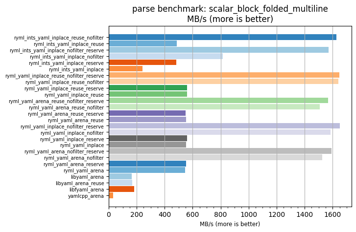
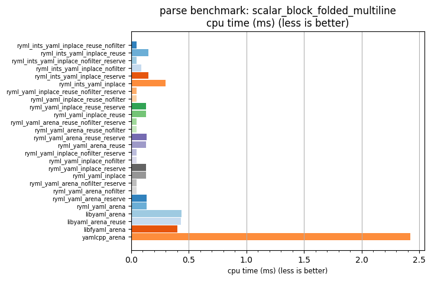

## parse benchmark: scalar_block_folded_multiline

<p>Data type benchmark results:</p>
<ul>
   <li><pre><a href='#ryml-bm-parse-scalar_block_folded_multiline-ryml_ints_yaml_inplace_reuse_nofilter'>ryml_ints_yaml_inplace_reuse_nofilter</a></pre></li> </ul>


<br/>
<br/>

---

<a id="ryml-bm-parse-scalar_block_folded_multiline-ryml_ints_yaml_inplace_reuse_nofilter"/>

### parse benchmark: scalar_block_folded_multiline

* Interactive html graphs
  * [MB/s](./ryml-bm-parse-scalar_block_folded_multiline-mega_bytes_per_second.html)
  * [CPU time](./ryml-bm-parse-scalar_block_folded_multiline-cpu_time_ms.html)

[](./ryml-bm-parse-scalar_block_folded_multiline-mega_bytes_per_second.png)
[](./ryml-bm-parse-scalar_block_folded_multiline-cpu_time_ms.png)

```
+---------------------------------------------------------------------------------------------------------------------+
|                                    parse benchmark: scalar_block_folded_multiline                                   |
+------------------------------------------+---------+---------+----------+---------------+-------------+-------------+
| function                                 |    MB/s | MB/s(x) |  MB/s(%) | cpu time (ms) | cpu time(x) | cpu time(%) |
+------------------------------------------+---------+---------+----------+---------------+-------------+-------------+
| ryml_ints_yaml_inplace_reuse_nofilter    | 1626.94 |  54.35x | 5335.18% |          0.04 |       0.02x |     -98.16% |
| ryml_ints_yaml_inplace_reuse             |  485.68 |  16.23x | 1522.53% |          0.15 |       0.06x |     -93.84% |
| ryml_ints_yaml_inplace_nofilter_reserve  | 1570.46 |  52.46x | 5146.48% |          0.05 |       0.02x |     -98.09% |
| ryml_ints_yaml_inplace_nofilter          |  816.51 |  27.28x | 2627.75% |          0.09 |       0.04x |     -96.33% |
| ryml_ints_yaml_inplace_reserve           |  482.88 |  16.13x | 1513.17% |          0.15 |       0.06x |     -93.80% |
| ryml_ints_yaml_inplace                   |  242.49 |   8.10x |  710.09% |          0.30 |       0.12x |     -87.66% |
| ryml_yaml_inplace_reuse_nofilter_reserve | 1647.11 |  55.03x | 5402.53% |          0.04 |       0.02x |     -98.18% |
| ryml_yaml_inplace_reuse_nofilter         | 1641.59 |  54.84x | 5384.11% |          0.04 |       0.02x |     -98.18% |
| ryml_yaml_inplace_reuse_reserve          |  558.74 |  18.67x | 1766.60% |          0.13 |       0.05x |     -94.64% |
| ryml_yaml_inplace_reuse                  |  560.36 |  18.72x | 1772.03% |          0.13 |       0.05x |     -94.66% |
| ryml_yaml_arena_reuse_nofilter_reserve   | 1567.96 |  52.38x | 5138.13% |          0.05 |       0.02x |     -98.09% |
| ryml_yaml_arena_reuse_nofilter           | 1507.33 |  50.36x | 4935.58% |          0.05 |       0.02x |     -98.01% |
| ryml_yaml_arena_reuse_reserve            |  549.81 |  18.37x | 1736.77% |          0.13 |       0.05x |     -94.56% |
| ryml_yaml_arena_reuse                    |  554.05 |  18.51x | 1750.92% |          0.13 |       0.05x |     -94.60% |
| ryml_yaml_inplace_nofilter_reserve       | 1652.74 |  55.21x | 5421.35% |          0.04 |       0.02x |     -98.19% |
| ryml_yaml_inplace_nofilter               | 1586.34 |  53.00x | 5199.53% |          0.05 |       0.02x |     -98.11% |
| ryml_yaml_inplace_reserve                |  561.27 |  18.75x | 1775.04% |          0.13 |       0.05x |     -94.67% |
| ryml_yaml_inplace                        |  554.58 |  18.53x | 1752.69% |          0.13 |       0.05x |     -94.60% |
| ryml_yaml_arena_nofilter_reserve         | 1590.34 |  53.13x | 5212.88% |          0.05 |       0.02x |     -98.12% |
| ryml_yaml_arena_nofilter                 | 1526.73 |  51.00x | 5000.40% |          0.05 |       0.02x |     -98.04% |
| ryml_yaml_arena_reserve                  |  553.19 |  18.48x | 1748.07% |          0.13 |       0.05x |     -94.59% |
| ryml_yaml_arena                          |  547.11 |  18.28x | 1727.73% |          0.13 |       0.05x |     -94.53% |
| libyaml_arena                            |  165.68 |   5.53x |  453.50% |          0.44 |       0.18x |     -81.93% |
| libyaml_arena_reuse                      |  168.58 |   5.63x |  463.19% |          0.43 |       0.18x |     -82.24% |
| libfyaml_arena                           |  181.15 |   6.05x |  505.16% |          0.40 |       0.17x |     -83.48% |
| yamlcpp_arena                            |   29.93 |   1.00x |    0.00% |          2.42 |       1.00x |       0.00% |
+------------------------------------------+---------+---------+----------+---------------+-------------+-------------+
```

