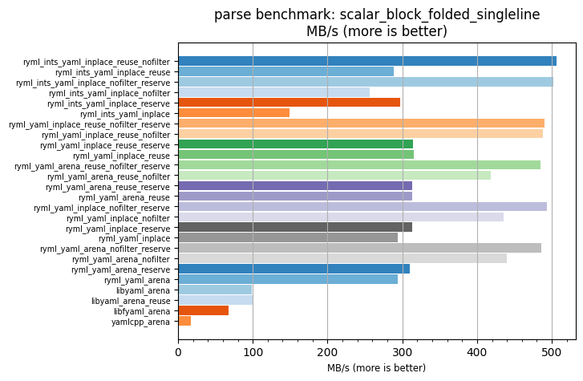
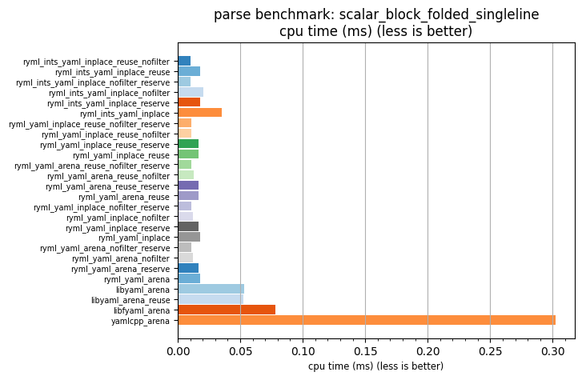

## parse benchmark: scalar_block_folded_singleline

<p>Data type benchmark results:</p>
<ul>
   <li><pre><a href='#ryml-bm-parse-scalar_block_folded_singleline-ryml_ints_yaml_inplace_reuse_nofilter'>ryml_ints_yaml_inplace_reuse_nofilter</a></pre></li> </ul>


<br/>
<br/>

---

<a id="ryml-bm-parse-scalar_block_folded_singleline-ryml_ints_yaml_inplace_reuse_nofilter"/>

### parse benchmark: scalar_block_folded_singleline

* Interactive html graphs
  * [MB/s](./ryml-bm-parse-scalar_block_folded_singleline-mega_bytes_per_second.html)
  * [CPU time](./ryml-bm-parse-scalar_block_folded_singleline-cpu_time_ms.html)

[](./ryml-bm-parse-scalar_block_folded_singleline-mega_bytes_per_second.png)
[](./ryml-bm-parse-scalar_block_folded_singleline-cpu_time_ms.png)

```
+---------------------------------------------------------------------------------------------------------------------+
|                                   parse benchmark: scalar_block_folded_singleline                                   |
+------------------------------------------+---------+---------+----------+---------------+-------------+-------------+
| function                                 |    MB/s | MB/s(x) |  MB/s(%) | cpu time (ms) | cpu time(x) | cpu time(%) |
+------------------------------------------+---------+---------+----------+---------------+-------------+-------------+
| ryml_ints_yaml_inplace_reuse_nofilter    |  506.71 |  29.16x | 2815.54% |          0.01 |       0.03x |     -96.57% |
| ryml_ints_yaml_inplace_reuse             |  288.80 |  16.62x | 1561.73% |          0.02 |       0.06x |     -93.98% |
| ryml_ints_yaml_inplace_nofilter_reserve  |  502.35 |  28.90x | 2790.48% |          0.01 |       0.03x |     -96.54% |
| ryml_ints_yaml_inplace_nofilter          |  256.68 |  14.77x | 1376.88% |          0.02 |       0.07x |     -93.23% |
| ryml_ints_yaml_inplace_reserve           |  296.94 |  17.09x | 1608.55% |          0.02 |       0.06x |     -94.15% |
| ryml_ints_yaml_inplace                   |  149.51 |   8.60x |  760.24% |          0.04 |       0.12x |     -88.38% |
| ryml_yaml_inplace_reuse_nofilter_reserve |  490.43 |  28.22x | 2721.87% |          0.01 |       0.04x |     -96.46% |
| ryml_yaml_inplace_reuse_nofilter         |  488.47 |  28.11x | 2710.62% |          0.01 |       0.04x |     -96.44% |
| ryml_yaml_inplace_reuse_reserve          |  314.38 |  18.09x | 1708.92% |          0.02 |       0.06x |     -94.47% |
| ryml_yaml_inplace_reuse                  |  315.63 |  18.16x | 1716.07% |          0.02 |       0.06x |     -94.49% |
| ryml_yaml_arena_reuse_nofilter_reserve   |  484.51 |  27.88x | 2687.78% |          0.01 |       0.04x |     -96.41% |
| ryml_yaml_arena_reuse_nofilter           |  418.63 |  24.09x | 2308.76% |          0.01 |       0.04x |     -95.85% |
| ryml_yaml_arena_reuse_reserve            |  313.70 |  18.05x | 1705.01% |          0.02 |       0.06x |     -94.46% |
| ryml_yaml_arena_reuse                    |  313.75 |  18.05x | 1705.30% |          0.02 |       0.06x |     -94.46% |
| ryml_yaml_inplace_nofilter_reserve       |  493.00 |  28.37x | 2736.69% |          0.01 |       0.04x |     -96.47% |
| ryml_yaml_inplace_nofilter               |  435.13 |  25.04x | 2403.71% |          0.01 |       0.04x |     -96.01% |
| ryml_yaml_inplace_reserve                |  313.31 |  18.03x | 1702.75% |          0.02 |       0.06x |     -94.45% |
| ryml_yaml_inplace                        |  293.76 |  16.90x | 1590.28% |          0.02 |       0.06x |     -94.08% |
| ryml_yaml_arena_nofilter_reserve         |  485.96 |  27.96x | 2696.17% |          0.01 |       0.04x |     -96.42% |
| ryml_yaml_arena_nofilter                 |  439.77 |  25.30x | 2430.36% |          0.01 |       0.04x |     -96.05% |
| ryml_yaml_arena_reserve                  |  310.51 |  17.87x | 1686.62% |          0.02 |       0.06x |     -94.40% |
| ryml_yaml_arena                          |  293.93 |  16.91x | 1591.23% |          0.02 |       0.06x |     -94.09% |
| libyaml_arena                            |   99.21 |   5.71x |  470.83% |          0.05 |       0.18x |     -82.48% |
| libyaml_arena_reuse                      |  100.24 |   5.77x |  476.75% |          0.05 |       0.17x |     -82.66% |
| libfyaml_arena                           |   67.45 |   3.88x |  288.07% |          0.08 |       0.26x |     -74.23% |
| yamlcpp_arena                            |   17.38 |   1.00x |    0.00% |          0.30 |       1.00x |       0.00% |
+------------------------------------------+---------+---------+----------+---------------+-------------+-------------+
```

