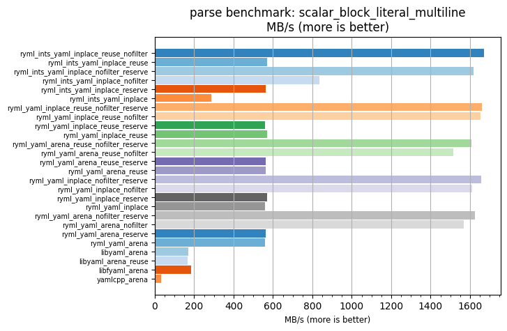
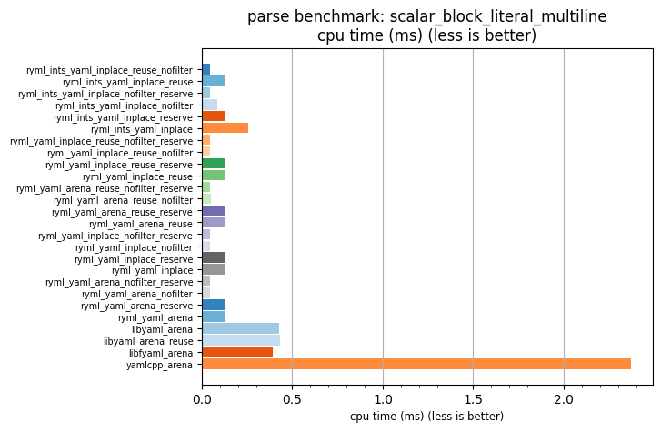

## parse benchmark: scalar_block_literal_multiline

<p>Data type benchmark results:</p>
<ul>
   <li><pre><a href='#ryml-bm-parse-scalar_block_literal_multiline-ryml_ints_yaml_inplace_reuse_nofilter'>ryml_ints_yaml_inplace_reuse_nofilter</a></pre></li> </ul>


<br/>
<br/>

---

<a id="ryml-bm-parse-scalar_block_literal_multiline-ryml_ints_yaml_inplace_reuse_nofilter"/>

### parse benchmark: scalar_block_literal_multiline

* Interactive html graphs
  * [MB/s](./ryml-bm-parse-scalar_block_literal_multiline-mega_bytes_per_second.html)
  * [CPU time](./ryml-bm-parse-scalar_block_literal_multiline-cpu_time_ms.html)

[](./ryml-bm-parse-scalar_block_literal_multiline-mega_bytes_per_second.png)
[](./ryml-bm-parse-scalar_block_literal_multiline-cpu_time_ms.png)

```
+---------------------------------------------------------------------------------------------------------------------+
|                                   parse benchmark: scalar_block_literal_multiline                                   |
+------------------------------------------+---------+---------+----------+---------------+-------------+-------------+
| function                                 |    MB/s | MB/s(x) |  MB/s(%) | cpu time (ms) | cpu time(x) | cpu time(%) |
+------------------------------------------+---------+---------+----------+---------------+-------------+-------------+
| ryml_ints_yaml_inplace_reuse_nofilter    | 1672.20 |  54.70x | 5369.96% |          0.04 |       0.02x |     -98.17% |
| ryml_ints_yaml_inplace_reuse             |  570.83 |  18.67x | 1767.26% |          0.13 |       0.05x |     -94.64% |
| ryml_ints_yaml_inplace_nofilter_reserve  | 1616.28 |  52.87x | 5187.02% |          0.04 |       0.02x |     -98.11% |
| ryml_ints_yaml_inplace_nofilter          |  836.04 |  27.35x | 2634.78% |          0.09 |       0.04x |     -96.34% |
| ryml_ints_yaml_inplace_reserve           |  561.52 |  18.37x | 1736.81% |          0.13 |       0.05x |     -94.56% |
| ryml_ints_yaml_inplace                   |  285.80 |   9.35x |  834.89% |          0.25 |       0.11x |     -89.30% |
| ryml_yaml_inplace_reuse_nofilter_reserve | 1659.42 |  54.28x | 5328.14% |          0.04 |       0.02x |     -98.16% |
| ryml_yaml_inplace_reuse_nofilter         | 1651.49 |  54.02x | 5302.20% |          0.04 |       0.02x |     -98.15% |
| ryml_yaml_inplace_reuse_reserve          |  559.70 |  18.31x | 1730.83% |          0.13 |       0.05x |     -94.54% |
| ryml_yaml_inplace_reuse                  |  571.17 |  18.68x | 1768.35% |          0.13 |       0.05x |     -94.65% |
| ryml_yaml_arena_reuse_nofilter_reserve   | 1606.22 |  52.54x | 5154.12% |          0.05 |       0.02x |     -98.10% |
| ryml_yaml_arena_reuse_nofilter           | 1514.26 |  49.53x | 4853.32% |          0.05 |       0.02x |     -97.98% |
| ryml_yaml_arena_reuse_reserve            |  562.48 |  18.40x | 1739.93% |          0.13 |       0.05x |     -94.57% |
| ryml_yaml_arena_reuse                    |  563.37 |  18.43x | 1742.84% |          0.13 |       0.05x |     -94.57% |
| ryml_yaml_inplace_nofilter_reserve       | 1655.53 |  54.15x | 5315.42% |          0.04 |       0.02x |     -98.15% |
| ryml_yaml_inplace_nofilter               | 1612.08 |  52.73x | 5173.30% |          0.05 |       0.02x |     -98.10% |
| ryml_yaml_inplace_reserve                |  571.22 |  18.69x | 1768.53% |          0.13 |       0.05x |     -94.65% |
| ryml_yaml_inplace                        |  561.10 |  18.35x | 1735.43% |          0.13 |       0.05x |     -94.55% |
| ryml_yaml_arena_nofilter_reserve         | 1624.24 |  53.13x | 5213.07% |          0.04 |       0.02x |     -98.12% |
| ryml_yaml_arena_nofilter                 | 1566.84 |  51.25x | 5025.31% |          0.05 |       0.02x |     -98.05% |
| ryml_yaml_arena_reserve                  |  564.58 |  18.47x | 1746.79% |          0.13 |       0.05x |     -94.59% |
| ryml_yaml_arena                          |  558.30 |  18.26x | 1726.27% |          0.13 |       0.05x |     -94.52% |
| libyaml_arena                            |  169.56 |   5.55x |  454.65% |          0.43 |       0.18x |     -81.97% |
| libyaml_arena_reuse                      |  167.72 |   5.49x |  448.63% |          0.43 |       0.18x |     -81.77% |
| libfyaml_arena                           |  185.13 |   6.06x |  505.59% |          0.39 |       0.17x |     -83.49% |
| yamlcpp_arena                            |   30.57 |   1.00x |    0.00% |          2.37 |       1.00x |       0.00% |
+------------------------------------------+---------+---------+----------+---------------+-------------+-------------+
```

