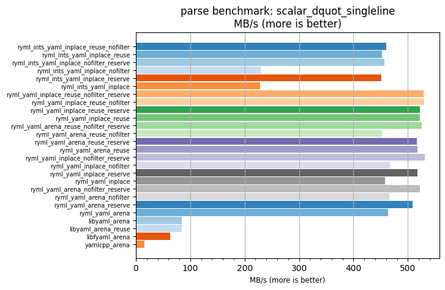
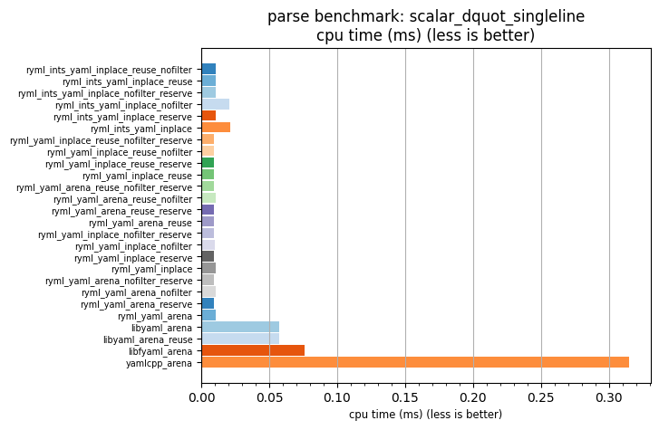

## parse benchmark: scalar_dquot_singleline

<p>Data type benchmark results:</p>
<ul>
   <li><pre><a href='#ryml-bm-parse-scalar_dquot_singleline-ryml_ints_yaml_inplace_reuse_nofilter'>ryml_ints_yaml_inplace_reuse_nofilter</a></pre></li> </ul>


<br/>
<br/>

---

<a id="ryml-bm-parse-scalar_dquot_singleline-ryml_ints_yaml_inplace_reuse_nofilter"/>

### parse benchmark: scalar_dquot_singleline

* Interactive html graphs
  * [MB/s](./ryml-bm-parse-scalar_dquot_singleline-mega_bytes_per_second.html)
  * [CPU time](./ryml-bm-parse-scalar_dquot_singleline-cpu_time_ms.html)

[](./ryml-bm-parse-scalar_dquot_singleline-mega_bytes_per_second.png)
[](./ryml-bm-parse-scalar_dquot_singleline-cpu_time_ms.png)

```
+---------------------------------------------------------------------------------------------------------------------+
|                                       parse benchmark: scalar_dquot_singleline                                      |
+------------------------------------------+---------+---------+----------+---------------+-------------+-------------+
| function                                 |    MB/s | MB/s(x) |  MB/s(%) | cpu time (ms) | cpu time(x) | cpu time(%) |
+------------------------------------------+---------+---------+----------+---------------+-------------+-------------+
| ryml_ints_yaml_inplace_reuse_nofilter    |  460.03 |  30.04x | 2903.55% |          0.01 |       0.03x |     -96.67% |
| ryml_ints_yaml_inplace_reuse             |  452.87 |  29.57x | 2856.81% |          0.01 |       0.03x |     -96.62% |
| ryml_ints_yaml_inplace_nofilter_reserve  |  456.83 |  29.83x | 2882.65% |          0.01 |       0.03x |     -96.65% |
| ryml_ints_yaml_inplace_nofilter          |  230.10 |  15.02x | 1402.32% |          0.02 |       0.07x |     -93.34% |
| ryml_ints_yaml_inplace_reserve           |  451.34 |  29.47x | 2846.80% |          0.01 |       0.03x |     -96.61% |
| ryml_ints_yaml_inplace                   |  228.21 |  14.90x | 1389.96% |          0.02 |       0.07x |     -93.29% |
| ryml_yaml_inplace_reuse_nofilter_reserve |  529.24 |  34.55x | 3355.43% |          0.01 |       0.03x |     -97.11% |
| ryml_yaml_inplace_reuse_nofilter         |  530.44 |  34.63x | 3363.23% |          0.01 |       0.03x |     -97.11% |
| ryml_yaml_inplace_reuse_reserve          |  522.64 |  34.12x | 3312.31% |          0.01 |       0.03x |     -97.07% |
| ryml_yaml_inplace_reuse                  |  522.67 |  34.13x | 3312.52% |          0.01 |       0.03x |     -97.07% |
| ryml_yaml_arena_reuse_nofilter_reserve   |  525.11 |  34.28x | 3328.42% |          0.01 |       0.03x |     -97.08% |
| ryml_yaml_arena_reuse_nofilter           |  452.37 |  29.54x | 2853.50% |          0.01 |       0.03x |     -96.61% |
| ryml_yaml_arena_reuse_reserve            |  517.06 |  33.76x | 3275.87% |          0.01 |       0.03x |     -97.04% |
| ryml_yaml_arena_reuse                    |  517.71 |  33.80x | 3280.15% |          0.01 |       0.03x |     -97.04% |
| ryml_yaml_inplace_nofilter_reserve       |  531.54 |  34.70x | 3370.39% |          0.01 |       0.03x |     -97.12% |
| ryml_yaml_inplace_nofilter               |  467.07 |  30.50x | 2949.50% |          0.01 |       0.03x |     -96.72% |
| ryml_yaml_inplace_reserve                |  517.82 |  33.81x | 3280.84% |          0.01 |       0.03x |     -97.04% |
| ryml_yaml_inplace                        |  457.47 |  29.87x | 2886.82% |          0.01 |       0.03x |     -96.65% |
| ryml_yaml_arena_nofilter_reserve         |  522.48 |  34.11x | 3311.27% |          0.01 |       0.03x |     -97.07% |
| ryml_yaml_arena_nofilter                 |  465.46 |  30.39x | 2938.97% |          0.01 |       0.03x |     -96.71% |
| ryml_yaml_arena_reserve                  |  509.11 |  33.24x | 3223.96% |          0.01 |       0.03x |     -96.99% |
| ryml_yaml_arena                          |  463.91 |  30.29x | 2928.87% |          0.01 |       0.03x |     -96.70% |
| libyaml_arena                            |   84.33 |   5.51x |  450.56% |          0.06 |       0.18x |     -81.84% |
| libyaml_arena_reuse                      |   84.39 |   5.51x |  451.00% |          0.06 |       0.18x |     -81.85% |
| libfyaml_arena                           |   63.18 |   4.13x |  312.50% |          0.08 |       0.24x |     -75.76% |
| yamlcpp_arena                            |   15.32 |   1.00x |    0.00% |          0.32 |       1.00x |       0.00% |
+------------------------------------------+---------+---------+----------+---------------+-------------+-------------+
```

