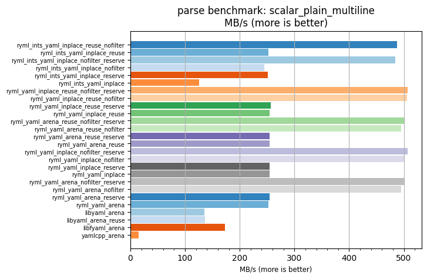
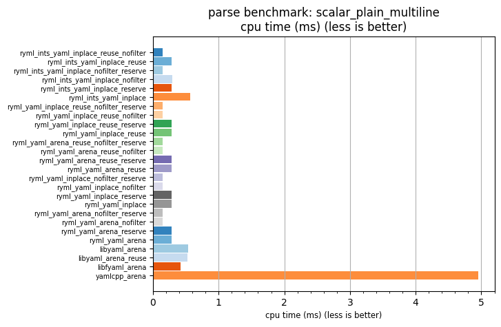

## parse benchmark: scalar_plain_multiline

<p>Data type benchmark results:</p>
<ul>
   <li><pre><a href='#ryml-bm-parse-scalar_plain_multiline-ryml_ints_yaml_inplace_reuse_nofilter'>ryml_ints_yaml_inplace_reuse_nofilter</a></pre></li> </ul>


<br/>
<br/>

---

<a id="ryml-bm-parse-scalar_plain_multiline-ryml_ints_yaml_inplace_reuse_nofilter"/>

### parse benchmark: scalar_plain_multiline

* Interactive html graphs
  * [MB/s](./ryml-bm-parse-scalar_plain_multiline-mega_bytes_per_second.html)
  * [CPU time](./ryml-bm-parse-scalar_plain_multiline-cpu_time_ms.html)

[](./ryml-bm-parse-scalar_plain_multiline-mega_bytes_per_second.png)
[](./ryml-bm-parse-scalar_plain_multiline-cpu_time_ms.png)

```
+---------------------------------------------------------------------------------------------------------------------+
|                                       parse benchmark: scalar_plain_multiline                                       |
+------------------------------------------+---------+---------+----------+---------------+-------------+-------------+
| function                                 |    MB/s | MB/s(x) |  MB/s(%) | cpu time (ms) | cpu time(x) | cpu time(%) |
+------------------------------------------+---------+---------+----------+---------------+-------------+-------------+
| ryml_ints_yaml_inplace_reuse_nofilter    |  488.03 |  33.58x | 3257.80% |          0.15 |       0.03x |     -97.02% |
| ryml_ints_yaml_inplace_reuse             |  252.10 |  17.35x | 1634.55% |          0.29 |       0.06x |     -94.23% |
| ryml_ints_yaml_inplace_nofilter_reserve  |  484.01 |  33.30x | 3230.13% |          0.15 |       0.03x |     -97.00% |
| ryml_ints_yaml_inplace_nofilter          |  244.69 |  16.84x | 1583.57% |          0.29 |       0.06x |     -94.06% |
| ryml_ints_yaml_inplace_reserve           |  251.36 |  17.29x | 1629.45% |          0.29 |       0.06x |     -94.22% |
| ryml_ints_yaml_inplace                   |  126.19 |   8.68x |  768.20% |          0.57 |       0.12x |     -88.48% |
| ryml_yaml_inplace_reuse_nofilter_reserve |  506.97 |  34.88x | 3388.11% |          0.14 |       0.03x |     -97.13% |
| ryml_yaml_inplace_reuse_nofilter         |  506.21 |  34.83x | 3382.88% |          0.14 |       0.03x |     -97.13% |
| ryml_yaml_inplace_reuse_reserve          |  256.36 |  17.64x | 1663.83% |          0.28 |       0.06x |     -94.33% |
| ryml_yaml_inplace_reuse                  |  255.06 |  17.55x | 1654.91% |          0.28 |       0.06x |     -94.30% |
| ryml_yaml_arena_reuse_nofilter_reserve   |  500.39 |  34.43x | 3342.89% |          0.14 |       0.03x |     -97.10% |
| ryml_yaml_arena_reuse_nofilter           |  495.19 |  34.07x | 3307.05% |          0.15 |       0.03x |     -97.06% |
| ryml_yaml_arena_reuse_reserve            |  254.59 |  17.52x | 1651.67% |          0.28 |       0.06x |     -94.29% |
| ryml_yaml_arena_reuse                    |  254.23 |  17.49x | 1649.18% |          0.28 |       0.06x |     -94.28% |
| ryml_yaml_inplace_nofilter_reserve       |  507.33 |  34.91x | 3390.59% |          0.14 |       0.03x |     -97.14% |
| ryml_yaml_inplace_nofilter               |  502.08 |  34.54x | 3354.49% |          0.14 |       0.03x |     -97.11% |
| ryml_yaml_inplace_reserve                |  254.50 |  17.51x | 1651.07% |          0.28 |       0.06x |     -94.29% |
| ryml_yaml_inplace                        |  254.13 |  17.49x | 1648.53% |          0.28 |       0.06x |     -94.28% |
| ryml_yaml_arena_nofilter_reserve         |  500.15 |  34.41x | 3341.21% |          0.14 |       0.03x |     -97.09% |
| ryml_yaml_arena_nofilter                 |  495.40 |  34.09x | 3308.50% |          0.15 |       0.03x |     -97.07% |
| ryml_yaml_arena_reserve                  |  254.33 |  17.50x | 1649.87% |          0.28 |       0.06x |     -94.29% |
| ryml_yaml_arena                          |  252.93 |  17.40x | 1640.27% |          0.28 |       0.06x |     -94.25% |
| libyaml_arena                            |  135.79 |   9.34x |  834.26% |          0.53 |       0.11x |     -89.30% |
| libyaml_arena_reuse                      |  136.82 |   9.41x |  841.36% |          0.53 |       0.11x |     -89.38% |
| libfyaml_arena                           |  172.62 |  11.88x | 1087.67% |          0.42 |       0.08x |     -91.58% |
| yamlcpp_arena                            |   14.53 |   1.00x |    0.00% |          4.96 |       1.00x |       0.00% |
+------------------------------------------+---------+---------+----------+---------------+-------------+-------------+
```

