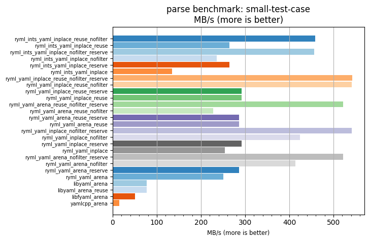
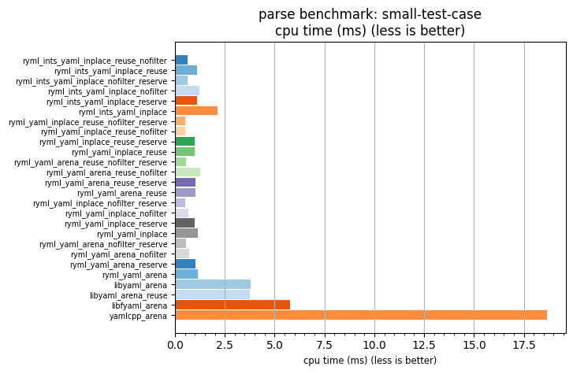

## parse benchmark: small-test-case

<p>Data type benchmark results:</p>
<ul>
   <li><pre><a href='#ryml-bm-parse-small-test-case-ryml_ints_yaml_inplace_reuse_nofilter'>ryml_ints_yaml_inplace_reuse_nofilter</a></pre></li> </ul>


<br/>
<br/>

---

<a id="ryml-bm-parse-small-test-case-ryml_ints_yaml_inplace_reuse_nofilter"/>

### parse benchmark: small-test-case

* Interactive html graphs
  * [MB/s](./ryml-bm-parse-small-test-case-mega_bytes_per_second.html)
  * [CPU time](./ryml-bm-parse-small-test-case-cpu_time_ms.html)

[](./ryml-bm-parse-small-test-case-mega_bytes_per_second.png)
[](./ryml-bm-parse-small-test-case-cpu_time_ms.png)

```
+---------------------------------------------------------------------------------------------------------------------+
|                                           parse benchmark: small-test-case                                          |
+------------------------------------------+---------+---------+----------+---------------+-------------+-------------+
| function                                 |    MB/s | MB/s(x) |  MB/s(%) | cpu time (ms) | cpu time(x) | cpu time(%) |
+------------------------------------------+---------+---------+----------+---------------+-------------+-------------+
| ryml_ints_yaml_inplace_reuse_nofilter    |  458.60 |  29.63x | 2862.55% |          0.63 |       0.03x |     -96.62% |
| ryml_ints_yaml_inplace_reuse             |  264.86 |  17.11x | 1611.03% |          1.09 |       0.06x |     -94.16% |
| ryml_ints_yaml_inplace_nofilter_reserve  |  456.41 |  29.48x | 2848.44% |          0.63 |       0.03x |     -96.61% |
| ryml_ints_yaml_inplace_nofilter          |  235.70 |  15.23x | 1422.61% |          1.23 |       0.07x |     -93.43% |
| ryml_ints_yaml_inplace_reserve           |  264.20 |  17.07x | 1606.77% |          1.09 |       0.06x |     -94.14% |
| ryml_ints_yaml_inplace                   |  134.90 |   8.71x |  771.47% |          2.14 |       0.11x |     -88.53% |
| ryml_yaml_inplace_reuse_nofilter_reserve |  542.89 |  35.07x | 3407.11% |          0.53 |       0.03x |     -97.15% |
| ryml_yaml_inplace_reuse_nofilter         |  541.51 |  34.98x | 3398.19% |          0.53 |       0.03x |     -97.14% |
| ryml_yaml_inplace_reuse_reserve          |  291.77 |  18.85x | 1784.83% |          0.99 |       0.05x |     -94.69% |
| ryml_yaml_inplace_reuse                  |  292.29 |  18.88x | 1788.19% |          0.99 |       0.05x |     -94.70% |
| ryml_yaml_arena_reuse_nofilter_reserve   |  521.76 |  33.71x | 3270.59% |          0.55 |       0.03x |     -97.03% |
| ryml_yaml_arena_reuse_nofilter           |  227.34 |  14.69x | 1368.64% |          1.27 |       0.07x |     -93.19% |
| ryml_yaml_arena_reuse_reserve            |  286.43 |  18.50x | 1750.37% |          1.01 |       0.05x |     -94.60% |
| ryml_yaml_arena_reuse                    |  286.44 |  18.50x | 1750.41% |          1.01 |       0.05x |     -94.60% |
| ryml_yaml_inplace_nofilter_reserve       |  541.30 |  34.97x | 3396.86% |          0.53 |       0.03x |     -97.14% |
| ryml_yaml_inplace_nofilter               |  424.15 |  27.40x | 2640.03% |          0.68 |       0.04x |     -96.35% |
| ryml_yaml_inplace_reserve                |  292.18 |  18.88x | 1787.52% |          0.99 |       0.05x |     -94.70% |
| ryml_yaml_inplace                        |  254.27 |  16.43x | 1542.61% |          1.14 |       0.06x |     -93.91% |
| ryml_yaml_arena_nofilter_reserve         |  521.57 |  33.69x | 3269.38% |          0.55 |       0.03x |     -97.03% |
| ryml_yaml_arena_nofilter                 |  414.04 |  26.75x | 2574.71% |          0.70 |       0.04x |     -96.26% |
| ryml_yaml_arena_reserve                  |  286.22 |  18.49x | 1748.99% |          1.01 |       0.05x |     -94.59% |
| ryml_yaml_arena                          |  250.19 |  16.16x | 1516.25% |          1.16 |       0.06x |     -93.81% |
| libyaml_arena                            |   76.47 |   4.94x |  394.03% |          3.78 |       0.20x |     -79.76% |
| libyaml_arena_reuse                      |   76.99 |   4.97x |  397.35% |          3.76 |       0.20x |     -79.89% |
| libfyaml_arena                           |   50.14 |   3.24x |  223.88% |          5.77 |       0.31x |     -69.12% |
| yamlcpp_arena                            |   15.48 |   1.00x |    0.00% |         18.68 |       1.00x |       0.00% |
+------------------------------------------+---------+---------+----------+---------------+-------------+-------------+
```

