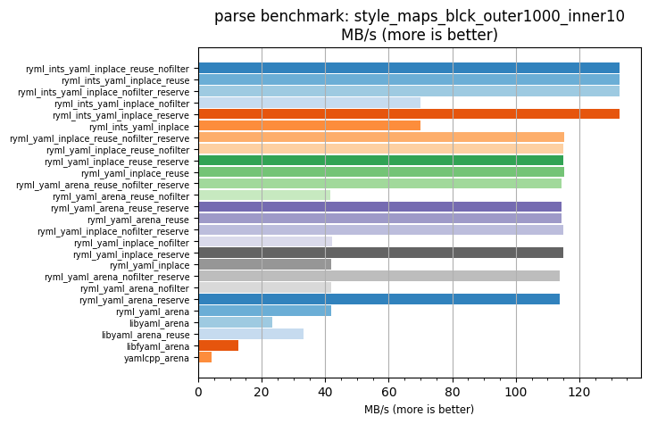
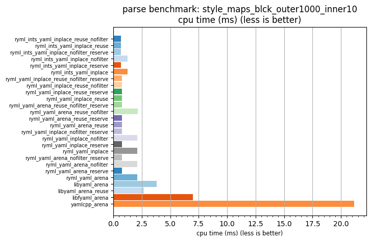

## parse benchmark: style_maps_blck_outer1000_inner10

<p>Data type benchmark results:</p>
<ul>
   <li><pre><a href='#ryml-bm-parse-style_maps_blck_outer1000_inner10-ryml_ints_yaml_inplace_reuse_nofilter'>ryml_ints_yaml_inplace_reuse_nofilter</a></pre></li> </ul>


<br/>
<br/>

---

<a id="ryml-bm-parse-style_maps_blck_outer1000_inner10-ryml_ints_yaml_inplace_reuse_nofilter"/>

### parse benchmark: style_maps_blck_outer1000_inner10

* Interactive html graphs
  * [MB/s](./ryml-bm-parse-style_maps_blck_outer1000_inner10-mega_bytes_per_second.html)
  * [CPU time](./ryml-bm-parse-style_maps_blck_outer1000_inner10-cpu_time_ms.html)

[](./ryml-bm-parse-style_maps_blck_outer1000_inner10-mega_bytes_per_second.png)
[](./ryml-bm-parse-style_maps_blck_outer1000_inner10-cpu_time_ms.png)

```
+---------------------------------------------------------------------------------------------------------------------+
|                                  parse benchmark: style_maps_blck_outer1000_inner10                                 |
+------------------------------------------+---------+---------+----------+---------------+-------------+-------------+
| function                                 |    MB/s | MB/s(x) |  MB/s(%) | cpu time (ms) | cpu time(x) | cpu time(%) |
+------------------------------------------+---------+---------+----------+---------------+-------------+-------------+
| ryml_ints_yaml_inplace_reuse_nofilter    |  132.56 |  31.57x | 3057.46% |          0.67 |       0.03x |     -96.83% |
| ryml_ints_yaml_inplace_reuse             |  132.67 |  31.60x | 3060.09% |          0.67 |       0.03x |     -96.84% |
| ryml_ints_yaml_inplace_nofilter_reserve  |  132.76 |  31.62x | 3062.19% |          0.67 |       0.03x |     -96.84% |
| ryml_ints_yaml_inplace_nofilter          |   70.00 |  16.67x | 1567.28% |          1.27 |       0.06x |     -94.00% |
| ryml_ints_yaml_inplace_reserve           |  132.53 |  31.57x | 3056.76% |          0.67 |       0.03x |     -96.83% |
| ryml_ints_yaml_inplace                   |   69.89 |  16.65x | 1564.63% |          1.27 |       0.06x |     -93.99% |
| ryml_yaml_inplace_reuse_nofilter_reserve |  115.10 |  27.42x | 2641.54% |          0.77 |       0.04x |     -96.35% |
| ryml_yaml_inplace_reuse_nofilter         |  114.98 |  27.39x | 2638.65% |          0.77 |       0.04x |     -96.35% |
| ryml_yaml_inplace_reuse_reserve          |  114.93 |  27.37x | 2637.47% |          0.77 |       0.04x |     -96.35% |
| ryml_yaml_inplace_reuse                  |  115.20 |  27.44x | 2643.96% |          0.77 |       0.04x |     -96.36% |
| ryml_yaml_arena_reuse_nofilter_reserve   |  114.31 |  27.23x | 2622.69% |          0.78 |       0.04x |     -96.33% |
| ryml_yaml_arena_reuse_nofilter           |   41.69 |   9.93x |  893.08% |          2.13 |       0.10x |     -89.93% |
| ryml_yaml_arena_reuse_reserve            |  114.43 |  27.26x | 2625.71% |          0.78 |       0.04x |     -96.33% |
| ryml_yaml_arena_reuse                    |  114.34 |  27.24x | 2623.52% |          0.78 |       0.04x |     -96.33% |
| ryml_yaml_inplace_nofilter_reserve       |  114.92 |  27.37x | 2637.25% |          0.77 |       0.04x |     -96.35% |
| ryml_yaml_inplace_nofilter               |   42.05 |  10.02x |  901.58% |          2.11 |       0.10x |     -90.02% |
| ryml_yaml_inplace_reserve                |  114.84 |  27.35x | 2635.46% |          0.77 |       0.04x |     -96.34% |
| ryml_yaml_inplace                        |   41.88 |   9.98x |  897.51% |          2.12 |       0.10x |     -89.98% |
| ryml_yaml_arena_nofilter_reserve         |  113.95 |  27.14x | 2614.34% |          0.78 |       0.04x |     -96.32% |
| ryml_yaml_arena_nofilter                 |   41.82 |   9.96x |  896.05% |          2.13 |       0.10x |     -89.96% |
| ryml_yaml_arena_reserve                  |  113.96 |  27.14x | 2614.43% |          0.78 |       0.04x |     -96.32% |
| ryml_yaml_arena                          |   41.89 |   9.98x |  897.76% |          2.12 |       0.10x |     -89.98% |
| libyaml_arena                            |   23.31 |   5.55x |  455.34% |          3.81 |       0.18x |     -81.99% |
| libyaml_arena_reuse                      |   33.10 |   7.88x |  688.30% |          2.69 |       0.13x |     -87.31% |
| libfyaml_arena                           |   12.74 |   3.03x |  203.38% |          6.98 |       0.33x |     -67.04% |
| yamlcpp_arena                            |    4.20 |   1.00x |    0.00% |         21.18 |       1.00x |       0.00% |
+------------------------------------------+---------+---------+----------+---------------+-------------+-------------+
```

