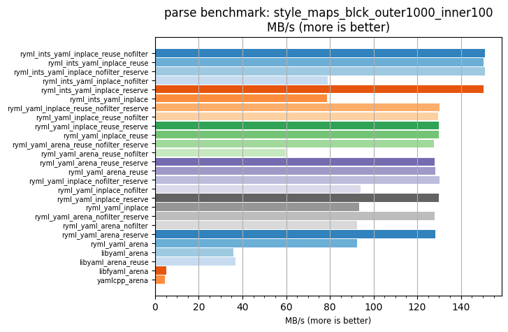
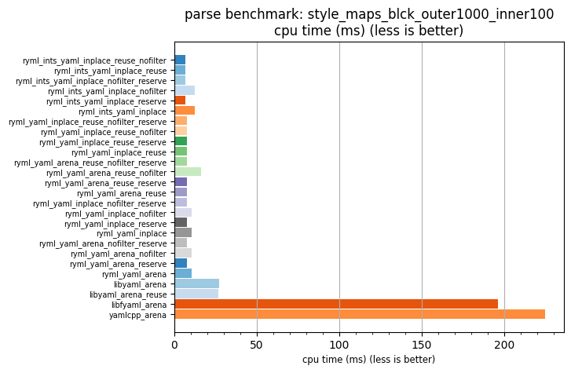

## parse benchmark: style_maps_blck_outer1000_inner100

<p>Data type benchmark results:</p>
<ul>
   <li><pre><a href='#ryml-bm-parse-style_maps_blck_outer1000_inner100-ryml_ints_yaml_inplace_reuse_nofilter'>ryml_ints_yaml_inplace_reuse_nofilter</a></pre></li> </ul>


<br/>
<br/>

---

<a id="ryml-bm-parse-style_maps_blck_outer1000_inner100-ryml_ints_yaml_inplace_reuse_nofilter"/>

### parse benchmark: style_maps_blck_outer1000_inner100

* Interactive html graphs
  * [MB/s](./ryml-bm-parse-style_maps_blck_outer1000_inner100-mega_bytes_per_second.html)
  * [CPU time](./ryml-bm-parse-style_maps_blck_outer1000_inner100-cpu_time_ms.html)

[](./ryml-bm-parse-style_maps_blck_outer1000_inner100-mega_bytes_per_second.png)
[](./ryml-bm-parse-style_maps_blck_outer1000_inner100-cpu_time_ms.png)

```
+---------------------------------------------------------------------------------------------------------------------+
|                                 parse benchmark: style_maps_blck_outer1000_inner100                                 |
+------------------------------------------+---------+---------+----------+---------------+-------------+-------------+
| function                                 |    MB/s | MB/s(x) |  MB/s(%) | cpu time (ms) | cpu time(x) | cpu time(%) |
+------------------------------------------+---------+---------+----------+---------------+-------------+-------------+
| ryml_ints_yaml_inplace_reuse_nofilter    |  151.06 |  34.70x | 3369.73% |          6.48 |       0.03x |     -97.12% |
| ryml_ints_yaml_inplace_reuse             |  150.32 |  34.53x | 3352.65% |          6.51 |       0.03x |     -97.10% |
| ryml_ints_yaml_inplace_nofilter_reserve  |  151.10 |  34.71x | 3370.70% |          6.48 |       0.03x |     -97.12% |
| ryml_ints_yaml_inplace_nofilter          |   78.97 |  18.14x | 1713.83% |         12.40 |       0.06x |     -94.49% |
| ryml_ints_yaml_inplace_reserve           |  150.47 |  34.56x | 3356.17% |          6.51 |       0.03x |     -97.11% |
| ryml_ints_yaml_inplace                   |   78.81 |  18.10x | 1710.11% |         12.42 |       0.06x |     -94.48% |
| ryml_yaml_inplace_reuse_nofilter_reserve |  130.05 |  29.87x | 2887.24% |          7.53 |       0.03x |     -96.65% |
| ryml_yaml_inplace_reuse_nofilter         |  129.68 |  29.79x | 2878.61% |          7.55 |       0.03x |     -96.64% |
| ryml_yaml_inplace_reuse_reserve          |  129.94 |  29.85x | 2884.74% |          7.53 |       0.03x |     -96.65% |
| ryml_yaml_inplace_reuse                  |  130.03 |  29.87x | 2886.65% |          7.53 |       0.03x |     -96.65% |
| ryml_yaml_arena_reuse_nofilter_reserve   |  127.48 |  29.28x | 2828.11% |          7.68 |       0.03x |     -96.58% |
| ryml_yaml_arena_reuse_nofilter           |   59.88 |  13.75x | 1275.33% |         16.35 |       0.07x |     -92.73% |
| ryml_yaml_arena_reuse_reserve            |  127.86 |  29.37x | 2836.75% |          7.66 |       0.03x |     -96.59% |
| ryml_yaml_arena_reuse                    |  128.39 |  29.49x | 2849.01% |          7.63 |       0.03x |     -96.61% |
| ryml_yaml_inplace_nofilter_reserve       |  130.12 |  29.89x | 2888.78% |          7.52 |       0.03x |     -96.65% |
| ryml_yaml_inplace_nofilter               |   93.94 |  21.58x | 2057.78% |         10.42 |       0.05x |     -95.37% |
| ryml_yaml_inplace_reserve                |  129.94 |  29.85x | 2884.69% |          7.53 |       0.03x |     -96.65% |
| ryml_yaml_inplace                        |   93.33 |  21.44x | 2043.69% |         10.49 |       0.05x |     -95.34% |
| ryml_yaml_arena_nofilter_reserve         |  128.05 |  29.41x | 2841.13% |          7.65 |       0.03x |     -96.60% |
| ryml_yaml_arena_nofilter                 |   92.57 |  21.26x | 2026.33% |         10.58 |       0.05x |     -95.30% |
| ryml_yaml_arena_reserve                  |  128.20 |  29.45x | 2844.56% |          7.64 |       0.03x |     -96.60% |
| ryml_yaml_arena                          |   92.52 |  21.25x | 2025.10% |         10.58 |       0.05x |     -95.29% |
| libyaml_arena                            |   35.84 |   8.23x |  723.16% |         27.32 |       0.12x |     -87.85% |
| libyaml_arena_reuse                      |   36.69 |   8.43x |  742.72% |         26.68 |       0.12x |     -88.13% |
| libfyaml_arena                           |    5.00 |   1.15x |   14.76% |        195.95 |       0.87x |     -12.86% |
| yamlcpp_arena                            |    4.35 |   1.00x |    0.00% |        224.87 |       1.00x |       0.00% |
+------------------------------------------+---------+---------+----------+---------------+-------------+-------------+
```

