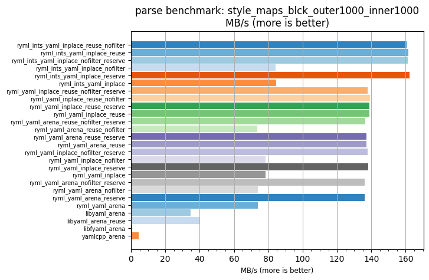
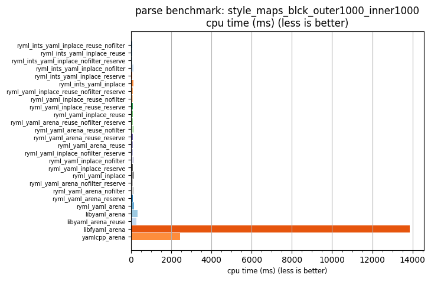

## parse benchmark: style_maps_blck_outer1000_inner1000

<p>Data type benchmark results:</p>
<ul>
   <li><pre><a href='#ryml-bm-parse-style_maps_blck_outer1000_inner1000-ryml_ints_yaml_inplace_reuse_nofilter'>ryml_ints_yaml_inplace_reuse_nofilter</a></pre></li> </ul>


<br/>
<br/>

---

<a id="ryml-bm-parse-style_maps_blck_outer1000_inner1000-ryml_ints_yaml_inplace_reuse_nofilter"/>

### parse benchmark: style_maps_blck_outer1000_inner1000

* Interactive html graphs
  * [MB/s](./ryml-bm-parse-style_maps_blck_outer1000_inner1000-mega_bytes_per_second.html)
  * [CPU time](./ryml-bm-parse-style_maps_blck_outer1000_inner1000-cpu_time_ms.html)

[](./ryml-bm-parse-style_maps_blck_outer1000_inner1000-mega_bytes_per_second.png)
[](./ryml-bm-parse-style_maps_blck_outer1000_inner1000-cpu_time_ms.png)

```
+---------------------------------------------------------------------------------------------------------------------+
|                                 parse benchmark: style_maps_blck_outer1000_inner1000                                |
+------------------------------------------+---------+---------+----------+---------------+-------------+-------------+
| function                                 |    MB/s | MB/s(x) |  MB/s(%) | cpu time (ms) | cpu time(x) | cpu time(%) |
+------------------------------------------+---------+---------+----------+---------------+-------------+-------------+
| ryml_ints_yaml_inplace_reuse_nofilter    |  160.39 |  36.17x | 3517.18% |         67.21 |       0.03x |     -97.24% |
| ryml_ints_yaml_inplace_reuse             |  161.41 |  36.40x | 3540.03% |         66.79 |       0.03x |     -97.25% |
| ryml_ints_yaml_inplace_nofilter_reserve  |  161.27 |  36.37x | 3537.00% |         66.84 |       0.03x |     -97.25% |
| ryml_ints_yaml_inplace_nofilter          |   84.24 |  19.00x | 1799.76% |        127.97 |       0.05x |     -94.74% |
| ryml_ints_yaml_inplace_reserve           |  162.37 |  36.62x | 3561.82% |         66.39 |       0.03x |     -97.27% |
| ryml_ints_yaml_inplace                   |   84.71 |  19.10x | 1810.49% |        127.25 |       0.05x |     -94.77% |
| ryml_yaml_inplace_reuse_nofilter_reserve |  137.81 |  31.08x | 3007.90% |         78.22 |       0.03x |     -96.78% |
| ryml_yaml_inplace_reuse_nofilter         |  139.23 |  31.40x | 3039.90% |         77.43 |       0.03x |     -96.82% |
| ryml_yaml_inplace_reuse_reserve          |  138.78 |  31.30x | 3029.79% |         77.68 |       0.03x |     -96.80% |
| ryml_yaml_inplace_reuse                  |  138.75 |  31.29x | 3029.10% |         77.69 |       0.03x |     -96.80% |
| ryml_yaml_arena_reuse_nofilter_reserve   |  136.38 |  30.76x | 2975.65% |         79.04 |       0.03x |     -96.75% |
| ryml_yaml_arena_reuse_nofilter           |   73.57 |  16.59x | 1559.16% |        146.53 |       0.06x |     -93.97% |
| ryml_yaml_arena_reuse_reserve            |  137.00 |  30.90x | 2989.53% |         78.69 |       0.03x |     -96.76% |
| ryml_yaml_arena_reuse                    |  137.13 |  30.93x | 2992.51% |         78.61 |       0.03x |     -96.77% |
| ryml_yaml_inplace_nofilter_reserve       |  137.98 |  31.12x | 3011.64% |         78.13 |       0.03x |     -96.79% |
| ryml_yaml_inplace_nofilter               |   78.36 |  17.67x | 1667.16% |        137.57 |       0.06x |     -94.34% |
| ryml_yaml_inplace_reserve                |  138.10 |  31.14x | 3014.41% |         78.06 |       0.03x |     -96.79% |
| ryml_yaml_inplace                        |   78.51 |  17.70x | 1670.46% |        137.32 |       0.06x |     -94.35% |
| ryml_yaml_arena_nofilter_reserve         |  136.19 |  30.71x | 2971.43% |         79.15 |       0.03x |     -96.74% |
| ryml_yaml_arena_nofilter                 |   73.90 |  16.67x | 1566.60% |        145.87 |       0.06x |     -94.00% |
| ryml_yaml_arena_reserve                  |  136.04 |  30.68x | 2967.92% |         79.24 |       0.03x |     -96.74% |
| ryml_yaml_arena                          |   73.75 |  16.63x | 1563.31% |        146.16 |       0.06x |     -93.99% |
| libyaml_arena                            |   34.82 |   7.85x |  685.20% |        309.62 |       0.13x |     -87.26% |
| libyaml_arena_reuse                      |   40.27 |   9.08x |  808.19% |        267.69 |       0.11x |     -88.99% |
| libfyaml_arena                           |    0.78 |   0.18x |  -82.47% |      13872.21 |       5.71x |     470.61% |
| yamlcpp_arena                            |    4.43 |   1.00x |    0.00% |       2431.11 |       1.00x |       0.00% |
+------------------------------------------+---------+---------+----------+---------------+-------------+-------------+
```

