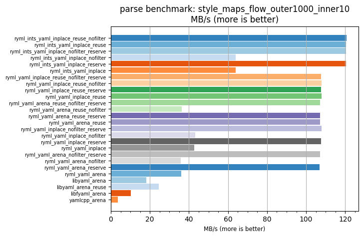
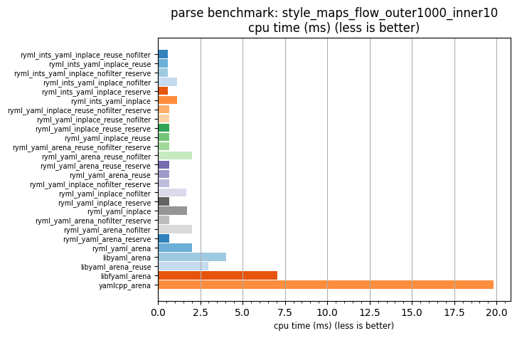

## parse benchmark: style_maps_flow_outer1000_inner10

<p>Data type benchmark results:</p>
<ul>
   <li><pre><a href='#ryml-bm-parse-style_maps_flow_outer1000_inner10-ryml_ints_yaml_inplace_reuse_nofilter'>ryml_ints_yaml_inplace_reuse_nofilter</a></pre></li> </ul>


<br/>
<br/>

---

<a id="ryml-bm-parse-style_maps_flow_outer1000_inner10-ryml_ints_yaml_inplace_reuse_nofilter"/>

### parse benchmark: style_maps_flow_outer1000_inner10

* Interactive html graphs
  * [MB/s](./ryml-bm-parse-style_maps_flow_outer1000_inner10-mega_bytes_per_second.html)
  * [CPU time](./ryml-bm-parse-style_maps_flow_outer1000_inner10-cpu_time_ms.html)

[](./ryml-bm-parse-style_maps_flow_outer1000_inner10-mega_bytes_per_second.png)
[](./ryml-bm-parse-style_maps_flow_outer1000_inner10-cpu_time_ms.png)

```
+---------------------------------------------------------------------------------------------------------------------+
|                                  parse benchmark: style_maps_flow_outer1000_inner10                                 |
+------------------------------------------+---------+---------+----------+---------------+-------------+-------------+
| function                                 |    MB/s | MB/s(x) |  MB/s(%) | cpu time (ms) | cpu time(x) | cpu time(%) |
+------------------------------------------+---------+---------+----------+---------------+-------------+-------------+
| ryml_ints_yaml_inplace_reuse_nofilter    |  120.77 |  32.86x | 3185.60% |          0.60 |       0.03x |     -96.96% |
| ryml_ints_yaml_inplace_reuse             |  120.53 |  32.79x | 3179.15% |          0.60 |       0.03x |     -96.95% |
| ryml_ints_yaml_inplace_nofilter_reserve  |  120.51 |  32.79x | 3178.62% |          0.60 |       0.03x |     -96.95% |
| ryml_ints_yaml_inplace_nofilter          |   63.85 |  17.37x | 1637.13% |          1.14 |       0.06x |     -94.24% |
| ryml_ints_yaml_inplace_reserve           |  120.53 |  32.79x | 3179.29% |          0.60 |       0.03x |     -96.95% |
| ryml_ints_yaml_inplace                   |   63.86 |  17.37x | 1637.46% |          1.14 |       0.06x |     -94.24% |
| ryml_yaml_inplace_reuse_nofilter_reserve |  107.64 |  29.28x | 2828.42% |          0.68 |       0.03x |     -96.59% |
| ryml_yaml_inplace_reuse_nofilter         |  107.77 |  29.32x | 2832.05% |          0.68 |       0.03x |     -96.59% |
| ryml_yaml_inplace_reuse_reserve          |  107.74 |  29.31x | 2831.07% |          0.68 |       0.03x |     -96.59% |
| ryml_yaml_inplace_reuse                  |  107.77 |  29.32x | 2831.91% |          0.68 |       0.03x |     -96.59% |
| ryml_yaml_arena_reuse_nofilter_reserve   |  107.17 |  29.16x | 2815.64% |          0.68 |       0.03x |     -96.57% |
| ryml_yaml_arena_reuse_nofilter           |   36.23 |   9.86x |  885.55% |          2.01 |       0.10x |     -89.85% |
| ryml_yaml_arena_reuse_reserve            |  107.06 |  29.13x | 2812.66% |          0.68 |       0.03x |     -96.57% |
| ryml_yaml_arena_reuse                    |  107.24 |  29.18x | 2817.56% |          0.68 |       0.03x |     -96.57% |
| ryml_yaml_inplace_nofilter_reserve       |  107.94 |  29.37x | 2836.51% |          0.68 |       0.03x |     -96.59% |
| ryml_yaml_inplace_nofilter               |   43.15 |  11.74x | 1074.05% |          1.69 |       0.09x |     -91.48% |
| ryml_yaml_inplace_reserve                |  107.72 |  29.31x | 2830.77% |          0.68 |       0.03x |     -96.59% |
| ryml_yaml_inplace                        |   42.69 |  11.61x | 1061.39% |          1.71 |       0.09x |     -91.39% |
| ryml_yaml_arena_nofilter_reserve         |  107.07 |  29.13x | 2812.93% |          0.68 |       0.03x |     -96.57% |
| ryml_yaml_arena_nofilter                 |   35.90 |   9.77x |  876.84% |          2.03 |       0.10x |     -89.76% |
| ryml_yaml_arena_reserve                  |  106.95 |  29.10x | 2809.79% |          0.68 |       0.03x |     -96.56% |
| ryml_yaml_arena                          |   36.01 |   9.80x |  879.58% |          2.02 |       0.10x |     -89.79% |
| libyaml_arena                            |   18.07 |   4.92x |  391.57% |          4.03 |       0.20x |     -79.66% |
| libyaml_arena_reuse                      |   24.58 |   6.69x |  568.77% |          2.97 |       0.15x |     -85.05% |
| libfyaml_arena                           |   10.32 |   2.81x |  180.73% |          7.06 |       0.36x |     -64.38% |
| yamlcpp_arena                            |    3.68 |   1.00x |    0.00% |         19.83 |       1.00x |       0.00% |
+------------------------------------------+---------+---------+----------+---------------+-------------+-------------+
```

