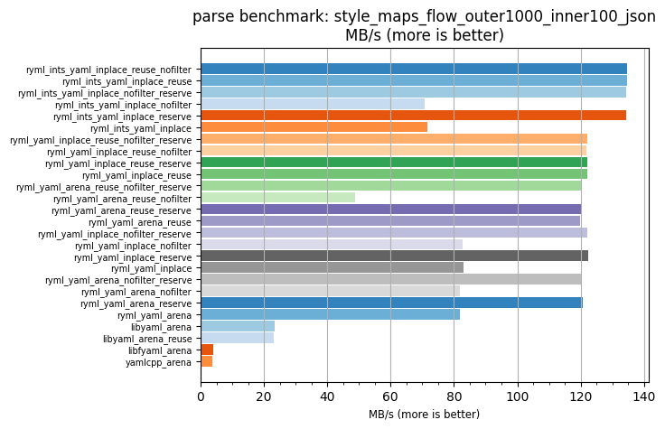
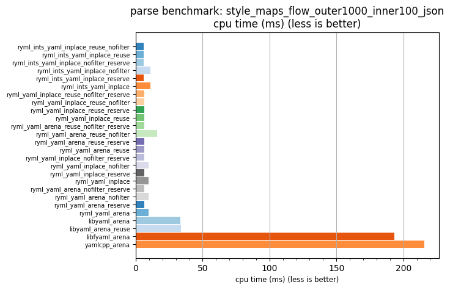

## parse benchmark: style_maps_flow_outer1000_inner100_json

<p>Data type benchmark results:</p>
<ul>
   <li><pre><a href='#ryml-bm-parse-style_maps_flow_outer1000_inner100_json-ryml_ints_yaml_inplace_reuse_nofilter'>ryml_ints_yaml_inplace_reuse_nofilter</a></pre></li> </ul>


<br/>
<br/>

---

<a id="ryml-bm-parse-style_maps_flow_outer1000_inner100_json-ryml_ints_yaml_inplace_reuse_nofilter"/>

### parse benchmark: style_maps_flow_outer1000_inner100_json

* Interactive html graphs
  * [MB/s](./ryml-bm-parse-style_maps_flow_outer1000_inner100_json-mega_bytes_per_second.html)
  * [CPU time](./ryml-bm-parse-style_maps_flow_outer1000_inner100_json-cpu_time_ms.html)

[](./ryml-bm-parse-style_maps_flow_outer1000_inner100_json-mega_bytes_per_second.png)
[](./ryml-bm-parse-style_maps_flow_outer1000_inner100_json-cpu_time_ms.png)

```
+---------------------------------------------------------------------------------------------------------------------+
|                               parse benchmark: style_maps_flow_outer1000_inner100_json                              |
+------------------------------------------+---------+---------+----------+---------------+-------------+-------------+
| function                                 |    MB/s | MB/s(x) |  MB/s(%) | cpu time (ms) | cpu time(x) | cpu time(%) |
+------------------------------------------+---------+---------+----------+---------------+-------------+-------------+
| ryml_ints_yaml_inplace_reuse_nofilter    |  134.75 |  37.15x | 3614.56% |          5.81 |       0.03x |     -97.31% |
| ryml_ints_yaml_inplace_reuse             |  134.57 |  37.10x | 3609.68% |          5.82 |       0.03x |     -97.30% |
| ryml_ints_yaml_inplace_nofilter_reserve  |  134.47 |  37.07x | 3606.73% |          5.82 |       0.03x |     -97.30% |
| ryml_ints_yaml_inplace_nofilter          |   70.67 |  19.48x | 1848.01% |         11.08 |       0.05x |     -94.87% |
| ryml_ints_yaml_inplace_reserve           |  134.49 |  37.07x | 3607.37% |          5.82 |       0.03x |     -97.30% |
| ryml_ints_yaml_inplace                   |   71.56 |  19.73x | 1872.59% |         10.94 |       0.05x |     -94.93% |
| ryml_yaml_inplace_reuse_nofilter_reserve |  122.04 |  33.64x | 3264.12% |          6.42 |       0.03x |     -97.03% |
| ryml_yaml_inplace_reuse_nofilter         |  121.75 |  33.56x | 3256.33% |          6.43 |       0.03x |     -97.02% |
| ryml_yaml_inplace_reuse_reserve          |  122.02 |  33.64x | 3263.80% |          6.42 |       0.03x |     -97.03% |
| ryml_yaml_inplace_reuse                  |  122.00 |  33.63x | 3262.99% |          6.42 |       0.03x |     -97.03% |
| ryml_yaml_arena_reuse_nofilter_reserve   |  120.34 |  33.17x | 3217.25% |          6.51 |       0.03x |     -96.99% |
| ryml_yaml_arena_reuse_nofilter           |   48.71 |  13.43x | 1242.78% |         16.07 |       0.07x |     -92.55% |
| ryml_yaml_arena_reuse_reserve            |  120.40 |  33.19x | 3219.00% |          6.50 |       0.03x |     -96.99% |
| ryml_yaml_arena_reuse                    |  119.89 |  33.05x | 3204.89% |          6.53 |       0.03x |     -96.97% |
| ryml_yaml_inplace_nofilter_reserve       |  122.21 |  33.69x | 3268.98% |          6.41 |       0.03x |     -97.03% |
| ryml_yaml_inplace_nofilter               |   82.66 |  22.79x | 2178.60% |          9.47 |       0.04x |     -95.61% |
| ryml_yaml_inplace_reserve                |  122.32 |  33.72x | 3271.83% |          6.40 |       0.03x |     -97.03% |
| ryml_yaml_inplace                        |   83.00 |  22.88x | 2188.07% |          9.43 |       0.04x |     -95.63% |
| ryml_yaml_arena_nofilter_reserve         |  120.18 |  33.13x | 3213.02% |          6.52 |       0.03x |     -96.98% |
| ryml_yaml_arena_nofilter                 |   81.85 |  22.56x | 2156.30% |          9.57 |       0.04x |     -95.57% |
| ryml_yaml_arena_reserve                  |  120.61 |  33.25x | 3224.84% |          6.49 |       0.03x |     -96.99% |
| ryml_yaml_arena                          |   82.00 |  22.60x | 2160.35% |          9.55 |       0.04x |     -95.58% |
| libyaml_arena                            |   23.41 |   6.45x |  545.31% |         33.45 |       0.15x |     -84.50% |
| libyaml_arena_reuse                      |   23.20 |   6.40x |  539.54% |         33.75 |       0.16x |     -84.36% |
| libfyaml_arena                           |    4.05 |   1.12x |   11.68% |        193.27 |       0.90x |     -10.46% |
| yamlcpp_arena                            |    3.63 |   1.00x |    0.00% |        215.85 |       1.00x |       0.00% |
+------------------------------------------+---------+---------+----------+---------------+-------------+-------------+
```

