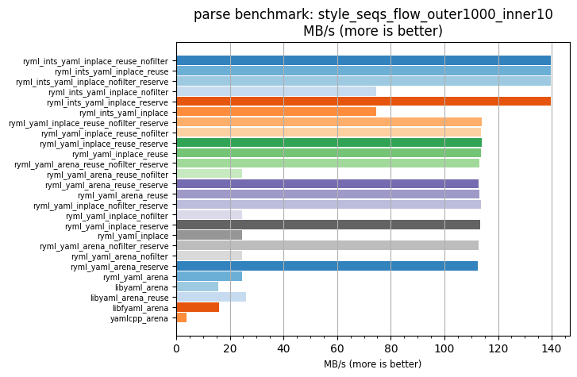
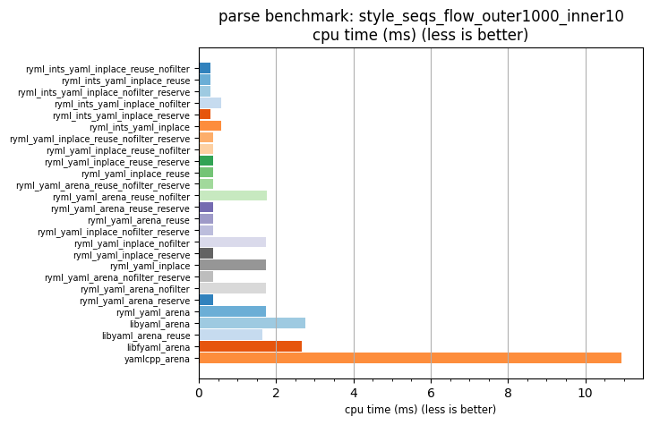

## parse benchmark: style_seqs_flow_outer1000_inner10

<p>Data type benchmark results:</p>
<ul>
   <li><pre><a href='#ryml-bm-parse-style_seqs_flow_outer1000_inner10-ryml_ints_yaml_inplace_reuse_nofilter'>ryml_ints_yaml_inplace_reuse_nofilter</a></pre></li> </ul>


<br/>
<br/>

---

<a id="ryml-bm-parse-style_seqs_flow_outer1000_inner10-ryml_ints_yaml_inplace_reuse_nofilter"/>

### parse benchmark: style_seqs_flow_outer1000_inner10

* Interactive html graphs
  * [MB/s](./ryml-bm-parse-style_seqs_flow_outer1000_inner10-mega_bytes_per_second.html)
  * [CPU time](./ryml-bm-parse-style_seqs_flow_outer1000_inner10-cpu_time_ms.html)

[](./ryml-bm-parse-style_seqs_flow_outer1000_inner10-mega_bytes_per_second.png)
[](./ryml-bm-parse-style_seqs_flow_outer1000_inner10-cpu_time_ms.png)

```
+---------------------------------------------------------------------------------------------------------------------+
|                                  parse benchmark: style_seqs_flow_outer1000_inner10                                 |
+------------------------------------------+---------+---------+----------+---------------+-------------+-------------+
| function                                 |    MB/s | MB/s(x) |  MB/s(%) | cpu time (ms) | cpu time(x) | cpu time(%) |
+------------------------------------------+---------+---------+----------+---------------+-------------+-------------+
| ryml_ints_yaml_inplace_reuse_nofilter    |  139.78 |  35.66x | 3465.66% |          0.31 |       0.03x |     -97.20% |
| ryml_ints_yaml_inplace_reuse             |  139.74 |  35.65x | 3464.69% |          0.31 |       0.03x |     -97.19% |
| ryml_ints_yaml_inplace_nofilter_reserve  |  139.71 |  35.64x | 3463.86% |          0.31 |       0.03x |     -97.19% |
| ryml_ints_yaml_inplace_nofilter          |   74.71 |  19.06x | 1805.82% |          0.57 |       0.05x |     -94.75% |
| ryml_ints_yaml_inplace_reserve           |  139.61 |  35.61x | 3461.44% |          0.31 |       0.03x |     -97.19% |
| ryml_ints_yaml_inplace                   |   74.71 |  19.06x | 1805.86% |          0.57 |       0.05x |     -94.75% |
| ryml_yaml_inplace_reuse_nofilter_reserve |  113.88 |  29.05x | 2805.08% |          0.38 |       0.03x |     -96.56% |
| ryml_yaml_inplace_reuse_nofilter         |  113.67 |  29.00x | 2799.75% |          0.38 |       0.03x |     -96.55% |
| ryml_yaml_inplace_reuse_reserve          |  113.86 |  29.04x | 2804.49% |          0.38 |       0.03x |     -96.56% |
| ryml_yaml_inplace_reuse                  |  113.76 |  29.02x | 2802.02% |          0.38 |       0.03x |     -96.55% |
| ryml_yaml_arena_reuse_nofilter_reserve   |  112.91 |  28.80x | 2780.22% |          0.38 |       0.03x |     -96.53% |
| ryml_yaml_arena_reuse_nofilter           |   24.49 |   6.25x |  524.78% |          1.75 |       0.16x |     -83.99% |
| ryml_yaml_arena_reuse_reserve            |  112.80 |  28.77x | 2777.44% |          0.38 |       0.03x |     -96.52% |
| ryml_yaml_arena_reuse                    |  113.02 |  28.83x | 2783.16% |          0.38 |       0.03x |     -96.53% |
| ryml_yaml_inplace_nofilter_reserve       |  113.69 |  29.00x | 2800.06% |          0.38 |       0.03x |     -96.55% |
| ryml_yaml_inplace_nofilter               |   24.67 |   6.29x |  529.21% |          1.74 |       0.16x |     -84.11% |
| ryml_yaml_inplace_reserve                |  113.41 |  28.93x | 2793.09% |          0.38 |       0.03x |     -96.54% |
| ryml_yaml_inplace                        |   24.53 |   6.26x |  525.70% |          1.75 |       0.16x |     -84.02% |
| ryml_yaml_arena_nofilter_reserve         |  112.63 |  28.73x | 2773.08% |          0.38 |       0.03x |     -96.52% |
| ryml_yaml_arena_nofilter                 |   24.59 |   6.27x |  527.24% |          1.74 |       0.16x |     -84.06% |
| ryml_yaml_arena_reserve                  |  112.38 |  28.67x | 2766.77% |          0.38 |       0.03x |     -96.51% |
| ryml_yaml_arena                          |   24.57 |   6.27x |  526.72% |          1.75 |       0.16x |     -84.04% |
| libyaml_arena                            |   15.58 |   3.97x |  297.43% |          2.75 |       0.25x |     -74.84% |
| libyaml_arena_reuse                      |   26.13 |   6.67x |  566.54% |          1.64 |       0.15x |     -85.00% |
| libfyaml_arena                           |   16.10 |   4.11x |  310.68% |          2.66 |       0.24x |     -75.65% |
| yamlcpp_arena                            |    3.92 |   1.00x |    0.00% |         10.94 |       1.00x |       0.00% |
+------------------------------------------+---------+---------+----------+---------------+-------------+-------------+
```

