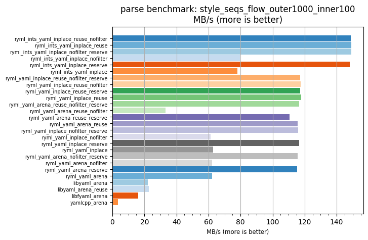
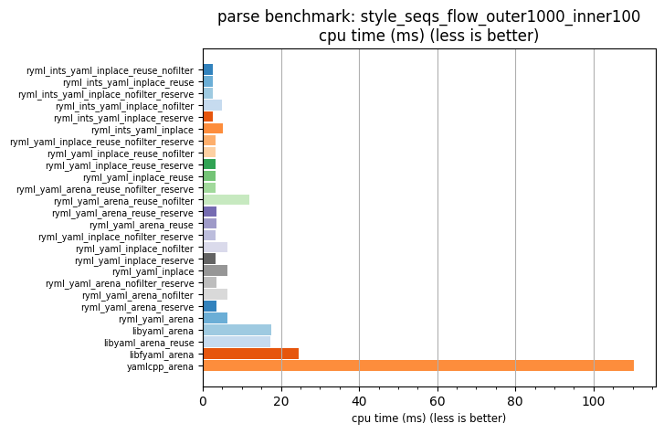

## parse benchmark: style_seqs_flow_outer1000_inner100

<p>Data type benchmark results:</p>
<ul>
   <li><pre><a href='#ryml-bm-parse-style_seqs_flow_outer1000_inner100-ryml_ints_yaml_inplace_reuse_nofilter'>ryml_ints_yaml_inplace_reuse_nofilter</a></pre></li> </ul>


<br/>
<br/>

---

<a id="ryml-bm-parse-style_seqs_flow_outer1000_inner100-ryml_ints_yaml_inplace_reuse_nofilter"/>

### parse benchmark: style_seqs_flow_outer1000_inner100

* Interactive html graphs
  * [MB/s](./ryml-bm-parse-style_seqs_flow_outer1000_inner100-mega_bytes_per_second.html)
  * [CPU time](./ryml-bm-parse-style_seqs_flow_outer1000_inner100-cpu_time_ms.html)

[](./ryml-bm-parse-style_seqs_flow_outer1000_inner100-mega_bytes_per_second.png)
[](./ryml-bm-parse-style_seqs_flow_outer1000_inner100-cpu_time_ms.png)

```
+---------------------------------------------------------------------------------------------------------------------+
|                                 parse benchmark: style_seqs_flow_outer1000_inner100                                 |
+------------------------------------------+---------+---------+----------+---------------+-------------+-------------+
| function                                 |    MB/s | MB/s(x) |  MB/s(%) | cpu time (ms) | cpu time(x) | cpu time(%) |
+------------------------------------------+---------+---------+----------+---------------+-------------+-------------+
| ryml_ints_yaml_inplace_reuse_nofilter    |  148.92 |  41.83x | 4083.47% |          2.64 |       0.02x |     -97.61% |
| ryml_ints_yaml_inplace_reuse             |  149.24 |  41.92x | 4092.27% |          2.63 |       0.02x |     -97.61% |
| ryml_ints_yaml_inplace_nofilter_reserve  |  149.05 |  41.87x | 4087.03% |          2.64 |       0.02x |     -97.61% |
| ryml_ints_yaml_inplace_nofilter          |   79.59 |  22.36x | 2135.91% |          4.94 |       0.04x |     -95.53% |
| ryml_ints_yaml_inplace_reserve           |  148.08 |  41.60x | 4059.72% |          2.65 |       0.02x |     -97.60% |
| ryml_ints_yaml_inplace                   |   78.01 |  21.91x | 2091.36% |          5.04 |       0.05x |     -95.44% |
| ryml_yaml_inplace_reuse_nofilter_reserve |  117.29 |  32.95x | 3194.75% |          3.35 |       0.03x |     -96.96% |
| ryml_yaml_inplace_reuse_nofilter         |  117.63 |  33.04x | 3204.38% |          3.34 |       0.03x |     -96.97% |
| ryml_yaml_inplace_reuse_reserve          |  117.08 |  32.89x | 3188.78% |          3.36 |       0.03x |     -96.96% |
| ryml_yaml_inplace_reuse                  |  117.80 |  33.09x | 3209.20% |          3.34 |       0.03x |     -96.98% |
| ryml_yaml_arena_reuse_nofilter_reserve   |  116.47 |  32.72x | 3171.83% |          3.37 |       0.03x |     -96.94% |
| ryml_yaml_arena_reuse_nofilter           |   33.13 |   9.31x |  830.77% |         11.86 |       0.11x |     -89.26% |
| ryml_yaml_arena_reuse_reserve            |  110.60 |  31.07x | 3006.75% |          3.55 |       0.03x |     -96.78% |
| ryml_yaml_arena_reuse                    |  115.66 |  32.49x | 3148.93% |          3.40 |       0.03x |     -96.92% |
| ryml_yaml_inplace_nofilter_reserve       |  116.05 |  32.60x | 3159.91% |          3.39 |       0.03x |     -96.93% |
| ryml_yaml_inplace_nofilter               |   61.43 |  17.26x | 1625.66% |          6.40 |       0.06x |     -94.21% |
| ryml_yaml_inplace_reserve                |  116.69 |  32.78x | 3178.06% |          3.37 |       0.03x |     -96.95% |
| ryml_yaml_inplace                        |   62.77 |  17.63x | 1663.42% |          6.26 |       0.06x |     -94.33% |
| ryml_yaml_arena_nofilter_reserve         |  115.56 |  32.46x | 3146.24% |          3.40 |       0.03x |     -96.92% |
| ryml_yaml_arena_nofilter                 |   62.27 |  17.49x | 1649.36% |          6.31 |       0.06x |     -94.28% |
| ryml_yaml_arena_reserve                  |  115.36 |  32.41x | 3140.55% |          3.41 |       0.03x |     -96.91% |
| ryml_yaml_arena                          |   62.30 |  17.50x | 1650.08% |          6.31 |       0.06x |     -94.29% |
| libyaml_arena                            |   22.28 |   6.26x |  525.89% |         17.64 |       0.16x |     -84.02% |
| libyaml_arena_reuse                      |   22.64 |   6.36x |  535.98% |         17.36 |       0.16x |     -84.28% |
| libfyaml_arena                           |   15.98 |   4.49x |  348.91% |         24.59 |       0.22x |     -77.72% |
| yamlcpp_arena                            |    3.56 |   1.00x |    0.00% |        110.40 |       1.00x |       0.00% |
+------------------------------------------+---------+---------+----------+---------------+-------------+-------------+
```

